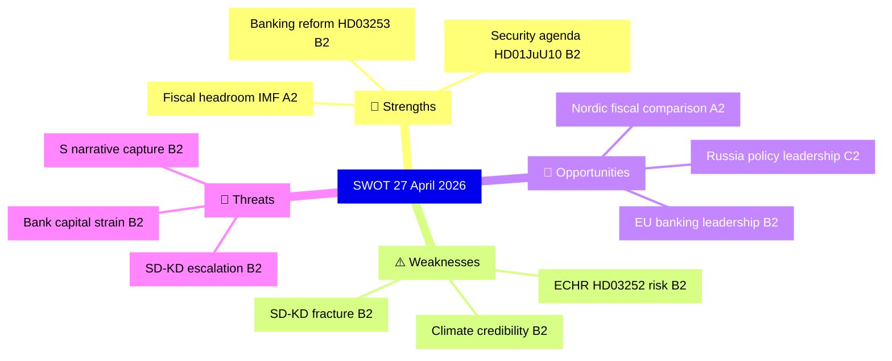

# SWOT Analysis — Swedish Political Landscape, Evening Analysis 2026-04-27

**Author**: James Pether Sörling
**Date**: 2026-04-27

---

## Strengths

| Strength | Evidence | Admiralty |
|----------|----------|-----------|
| Solid fiscal fundamentals enabling activist pre-election policy | Sweden GDP growth +2.1%, debt ~31% GDP (IMF WEO Apr-2026, NGDP_RPCH, GGXWDG_NGDP) — fiscal headroom supports HD01FiU48 without market risk | [A2] VERY HIGH |
| Tidö coalition demonstrating legislative discipline on security agenda | HD01JuU10 weapons law passed committee with coalition majority; HD03252 advancing | [B2] HIGH |
| Banking sector regulatory compliance ahead of EU peers | HD03253 (riksdagen.se) transposition of CRR3/CRD6 on schedule; Finansinspektionen retains supervisory primacy | [B2] HIGH |
| Opposition coordination visible rather than covert | S's structured interpellation campaign (5 simultaneous) is publicly documented — reduced uncertainty risk | [B1] HIGH |

## Weaknesses

| Weakness | Evidence | Admiralty |
|----------|----------|-----------|
| Climate policy credibility erosion | HD01FiU48 fuel-tax reversal contradicts 2021 climate roadmap; V+MP reservations filed (riksdagen.se committee record) | [B2] HIGH |
| Coalition coherence risk on energy | HD10448 — SD interpellates KD's Busch on wind power; partners using opposition instruments against each other [B2] HIGH | [B2] HIGH |
| Social insurance reform litigation risk | HD03252 prisoner benefits restriction faces ECHR Art. 8 / RF proportionality challenge; Lagrådet review pending | [B2] HIGH |
| Infrastructure investment credibility deficit | HD10449 (riksdagen.se) cites specific Södra stambanan line removal from Trafikverket plan — named route, named community impact | [B2] MEDIUM |

## Opportunities

| Opportunity | Evidence | Admiralty |
|-------------|----------|-----------|
| Banking reform completion strengthens EU standing | HD03253 positions Sweden as CRR3/CRD6 first-mover in non-Eurozone space; Finansinspektionen-ECB coordination framework | [B2] HIGH |
| Pre-election fiscal legitimacy via Nordic peer comparison | Sweden debt/GDP at ~31% vs EU average ~83% (IMF WEO Apr-2026, GGXWDG_NGDP) — government can credibly argue fiscal responsibility | [A2] VERY HIGH |
| Russia policy leadership via motion portfolio | HD11752, HD11753 position Sweden as EU security norm-setter on overflying and visa policy ahead of 2026 election | [C2] MEDIUM |
| Elderly care HD01SoU25 as electoral consensus opportunity | Cross-party demographic pressure on ageing population (65+ at 20.9%, SCB) may allow bipartisan framing | [B2] MEDIUM |

## Threats

| Threat | Evidence | Admiralty |
|--------|----------|-----------|
| SD-KD fracture on energy could expand | HD10448 energy interpellation: if Busch gives non-committal answer, SD may escalate energy criticism to vote-of-no-confidence territory | [B2] HIGH |
| Banking sector capital strain from output floor | HD03253 72.5% output floor will require capital raises from mortgage-heavy Swedish banks (Swedbank, SEB) in rising rate environment | [B2] HIGH |
| S accountability campaign creating narrative capture | Five simultaneous S interpellations targeting four ministers signals coordinated pre-election narrative: "incompetent Tidö government" | [B2] HIGH |
| Environmental litigation on water rights | HD11756 water rights motion signals emerging legal challenge to grandfathered industrial water permits — EU Water Framework Directive compliance risk | [C2] MEDIUM |

---

## TOWS Matrix

| | Strengths | Weaknesses |
|---|---|---|
| **Opportunities** | SO: Use fiscal headroom (IMF A2) + banking reform HD03253 to signal EU competence ahead of election | WO: Address climate credibility gap via Nordic peer comparison on carbon pricing neutralisation |
| **Threats** | ST: Use solid fiscal fundamentals to deflect S campaign narrative on economic incompetence | WT: Manage SD-KD energy fracture before it becomes electoral liability in rural constituencies |

---

## Mermaid: SWOT Priority Map

