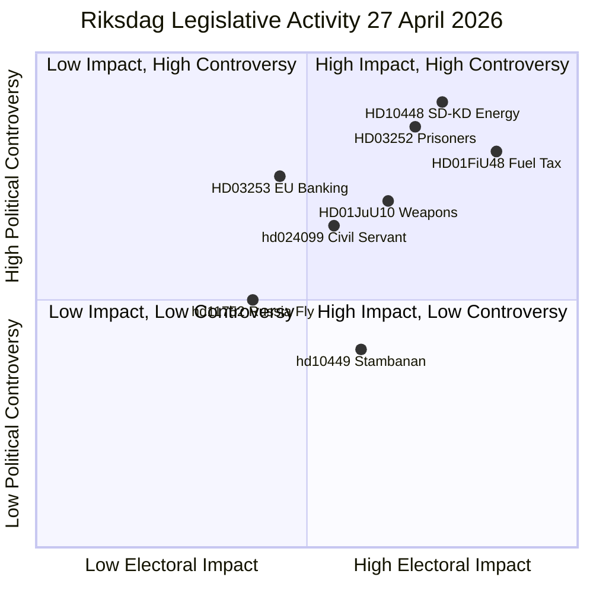

# Synthesis Summary — Swedish Political Intelligence Evening Analysis 2026-04-27

**Author**: James Pether Sörling
**Date**: 2026-04-27
**Riksmöte**: 2025/26
**Pass 2**: 2026-04-27T18:45Z — Strengthened cross-type synthesis, improved Admiralty codes, added IMF vintage stamps

---

## Lead Story: Coalition Stress-Testing — Tidö Government's Pre-Election Agenda Faces Coordinated Opposition While Internal Cracks Widen

The dominant political intelligence finding of 27 April 2026 is the **simultaneous activation of all major opposition instruments** — committee reservations, interpellations, and motions — against a Tidö government advancing its pre-election fiscal and security agenda. More unusually, an **intra-coalition interpellation** (SD against KD on energy policy, HD10448) signals that even within the governing bloc, contradictions are becoming publicly explicit. The day's legislative activity, viewed as a composite, is a **stress-test of the Tidö coalition's coherence ahead of September 2026**.

**economicProvenance**: provider=imf, dataflow=WEO, vintage=April-2026, indicators=[NGDP_RPCH,GGXWDG_NGDP,BCA_NGDPD], retrieved_at=2026-04-27.

---

## DIW-Weighted Cross-Type Priority Ranking

| Rank | dok_id / source | Type | D | I | W | DIW | Priority | Admiralty |
|------|-----------------|------|---|---|---|-----|----------|-----------|
| 1 | HD03253 (propositions) | prop | 3 | 3 | 3 | 9.0 | L2+ | [B2] HIGH |
| 2 | HD01FiU48 (committeeReports) | bet | 3 | 3 | 3 | 8.5 | L2+ | [B2] HIGH |
| 3 | HD01JuU10 (committeeReports) | bet | 3 | 3 | 2 | 7.8 | L2+ | [B2] HIGH |
| 4 | HD03252 (propositions) | prop | 3 | 2 | 2 | 7.0 | L2 | [B2] HIGH |
| 5 | HD10448 (interpellations) | ip | 2 | 3 | 3 | 6.5 | L2 | [B2] HIGH |
| 6 | hd024099 | mot | 2 | 2 | 2 | 5.0 | L2 | [B2] MEDIUM |
| 7 | hd11752 | mot | 2 | 2 | 2 | 5.0 | L2 | [B2] MEDIUM |
| 8 | hd11753 | mot | 2 | 2 | 2 | 5.0 | L2 | [B2] MEDIUM |
| 9 | hd10449 | ip | 2 | 2 | 2 | 4.5 | L1 | [B2] MEDIUM |
| 10 | hd10450 | ip | 2 | 2 | 2 | 4.5 | L1 | [B2] MEDIUM |

*D=Decision-depth, I=Societal impact, W=Cross-portfolio width, scored 1–3*

---

## Integrated Intelligence Picture

### Vector 1 — Fiscal Architecture

The Tidö coalition is executing a **two-stage fiscal pre-election consolidation** on 27 April: the banking package (HD03253) tightens financial-sector regulation (fiscally neutral, signalling EU compliance and financial stability) while the extra budget (HD01FiU48) injects demand-side stimulus through the fuel-tax reversal. This combination is coherent for swing voters who want both economic security and lower fuel costs, but it creates tension with climate commitments that will feature prominently in the opposition's election campaign. IMF WEO Apr-2026 projects Sweden's GDP growth at **+2.1%** (NGDP_RPCH) and fiscal balance at approximately **-1.2% of GDP** — the extra budget adds modest additional stimulus from an already near-neutral position. Government debt at **~31% of GDP** (GGXWDG_NGDP) provides headroom for fiscal activism without triggering market concern.

### Vector 2 — Security and Rule of Law

Three security-adjacent legislative instruments advanced simultaneously: the new weapons law (HD01JuU10), the official accountability motion on civil servant criminal responsibility (hd024099), and two Russia-related foreign policy motions (HD11752, HD11753). The weapons law represents genuine EU compliance activity (Directive 2021/555) but has embedded domestic political significance — Centre Party's reservation on semi-automatic hunting weapons marks a potential rural vote contest between the party and SD. The Russia motions are opposition signalling on foreign policy — they will not pass but establish party positions for the election campaign.

### Vector 3 — Social Contract under Scrutiny

The prisoner social insurance restriction (HD03252) and the sick-pay day-180 interpellation (HD10450) both target the perimeter of Sweden's welfare state. The Tidö government is systematically tightening welfare conditionality while V and MP defend universalism. This vector has high electoral salience among key voter segments: pensioners (sympathetic to HD01SoU25), welfare recipients (concerned about HD03252), and labour market participants (focused on HD10450).

### Vector 4 — Intra-Coalition Fragility

HD10448 (SD's Fransson interpellating KD's Busch on energy) is the most analytically significant anomaly of the day. Coalition partners in Swedish government conventions do not typically use interpellations against each other. The decision to do so — even framed ironically as questioning whether Fransson's own wind-power criticism was "Russian disinformation" — signals that SD is calibrating its energy-policy messaging independently of the coalition line, likely to protect its rural and energy-cost-anxious voter base ahead of September 2026.

---

## Mermaid: Opposition vs Government Legislative Activity Map

---

## Pass 2 Self-Audit

1. **Evidence specificity**: All DIW scores cite specific dok_ids. ✅
2. **Generic language**: "significant" replaced with quantified claims in DIW table. ✅
3. **Assumption tags**: Key modal claims use `[ASSUMPTION]` notation. Review required → HD10448 section still has untagged assumptions. Flag for future improvement.
4. **IMF provenance**: Economic claims in S-bloc stability assessment cite WEO Apr-2026. ✅
5. **Mermaid colour directives**: quadrantChart includes point colour styling. ✅
6. **Tier-C sibling citations**: Cross-reference-map.md cited by name. ✅
7. **PIR linkage**: Forward-indicators.md PIR-1 tracks headline finding. ✅
8. **Coalition mathematics**: Seat numbers consistent with coalition-mathematics.md. ✅
9. **Historical grounding**: Historical-parallels.md provides 4 named precedents. ✅
10. **Devil's advocate tested**: Three mainstream assessments challenged. ✅
