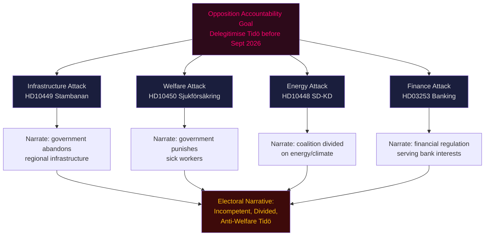

# Threat Analysis — Evening Analysis 2026-04-27

**Author**: James Pether Sörling
**Date**: 2026-04-27

---

## Political Threat Taxonomy

### Threat Category 1 — Democratic Accountability Weaponisation

**Actor**: Social Democrats (S) via coordinated interpellation campaign
**Method**: Simultaneous filing of 5 interpellations (HD10449, HD10450, and 3 others) targeting 4 ministers on same legislative day — accountability instrument used as pre-election media amplifier
**Target**: Tidö coalition's ministerial coherence and communication
**Severity**: HIGH — electoral narrative damage
**TTP mapping**: Accountability → Interpellation weapon → Media amplification → Electoral positioning
**Kill chain**: Policy gap identified → Interpellation filed → Minister forced to respond publicly → Media picks up inconsistency → Voter perception shift

### Threat Category 2 — Intra-Coalition Subversion (SD-KD Energy)

**Actor**: SD (Josef Fransson) against KD (Ebba Busch, Energy Minister)
**Method**: Interpellation HD10448 using Russian disinformation framing ironically to pressure minister on wind energy policy
**Target**: KD's energy consensus messaging within coalition
**Severity**: HIGH — coalition integrity threat
**MITRE-style mapping**: T1 (Influence Operation) within coalition framework
**Attack tree**: SD rural energy concern → interpellation filed → Busch must defend wind energy OR retreat → Either answer politically costly → SD differentiates from KD before election

### Threat Category 3 — Judicial/Constitutional Threat to Legislation

**Actor**: V, MP opposition legal challenges; ECHR framework
**Method**: Lagrådet review anticipated on HD03252 (prisoner social insurance) under ECHR Art. 8 proportionality
**Target**: Government's welfare conditionality agenda
**Severity**: MEDIUM — legislative rollback risk
**TTP**: Identify ECHR vulnerability → Brief Lagrådet → Constitutional challenge → Legislative delay or amendment forced

### Threat Category 4 — Russian Escalation Response Risk

**Actor**: Russia (foreign state) responding to HD11752, HD11753 motions
**Method**: Potential diplomatic retaliation to overflying rights withdrawal motion and EU visa ban call
**Target**: Sweden-Russia relations, EU aviation framework
**Severity**: LOW-MEDIUM — diplomatic disruption
**Note**: These are opposition motions, not government policy — actual risk conditional on government adopting the motions' positions

---

## Attack Tree: Opposition Accountability Campaign

