## Executive Brief
<!-- source: executive-brief.md :: https://github.com/Hack23/riksdagsmonitor/blob/main/analysis/daily/2026-04-27/interpellations/executive-brief.md -->

---

### 🎯 BLUF

On 27 April 2026, the Swedish Riksdag received two new interpellations — on railway investment delays and sick insurance reform — while existing interpellations announced for debate include a politically charged SD attack on energy minister Ebba Busch (KD) over wind power "disinformation." The dominant pattern is a Social Democratic accountability campaign targeting the Tidö coalition's credibility on infrastructure investment, employment, and energy policy, with an unusual intra-coalition fault line exposed by SD's interpellation challenging KD energy policy using irony and provocation. The government faces deadline pressure on multiple fronts ahead of the 2026 election.

### 🧭 3 Decisions This Brief Supports

1. **Media coverage prioritization**: The SD wind-power disinformation interpellation (HD10448) is the lead story — it is the most politically explosive, combining energy policy with information-warfare framing and potential coalition-straining dynamics between SD and KD.
2. **Electoral tracking**: Social Democrats are using interpellations as a pre-election accountability instrument — five of seven this week target government ministers with concrete policy reversals requested.
3. **Investment confidence assessment**: The Södra stambanan interpellation (HD10449) crystallizes a broader infrastructure credibility gap that may affect business investment decisions in southern Sweden (Kronoberg/Skåne) ahead of the election.

### ⚡ 60-Second Intelligence Summary

- **HD10448 (SD → KD)**: Josef Fransson (SD) uses Windeurope's "Wind Energy Dis- and Misinformation" report — which claims Swedish pro-fossil groups spread Russian-backed disinformation — as a basis to sarcastically question whether Energy Minister Busch herself is a victim or vector of disinformation, challenging her to review energy policy decisions. **Significance**: L2+ Priority — exposes SD-KD coalition friction on energy; media amplification via Sveriges Radio already occurred.
- **HD10449 (S → KD)**: Robert Olesen (S) challenges Infrastructure Minister Carlson on the removal of Södra stambanan investments north of Hässleholm and the Alvesta–Växjö double-track from Trafikverket's new plan, citing the collapse of regional development commitments. **Significance**: L2 Strategic — 3 million affected residents in Sydsverige.
- **HD10450 (S → M)**: Jessica Rodén (S) questions Social Insurance Minister Anna Tenje on potential removal of the day-180 sick insurance exception (the "S-exception" enabling return-to-own-employer), citing Riksrevisionen evidence that it works. **Significance**: L2 Strategic — welfare state reform narrative.
- **HD10447 (S → KD)**: Patrik Lundqvist (S) presses Busch on abolished high sick-pay cost compensation (removed 2024), arguing it restrains SME employment and Sweden's lagging GDP growth.

### 🔭 Top Forward Trigger

Watch for Ebba Busch's response to HD10448 — if she addresses the SD provocation as a serious policy question, it signals coalition discipline; if she dismisses it, it may crystallize an SD-KD public rift over energy policy ahead of the June budget.

### 📊 Significance Ranking

| Rank | dok_id | Issue | DIW Weight |
|------|--------|-------|-----------|
| 1 | HD10448 | Wind energy/disinformation/coalition | L2+ Priority |
| 2 | HD10449 | Södra stambanan/infrastructure | L2 Strategic |
| 3 | HD10450 | Sjukförsäkring dag 180 | L2 Strategic |
| 4 | HD10447 | Sjuklönekostnader/SME | L2 |
| 5 | HD10446 | Felaktiga dödförklaringar | L1 |
| 6 | HD10444 | Arbetsgivaravgifter/youth | L1 |
| 7 | HD10443 | Social dumpning kommuner | L1 |

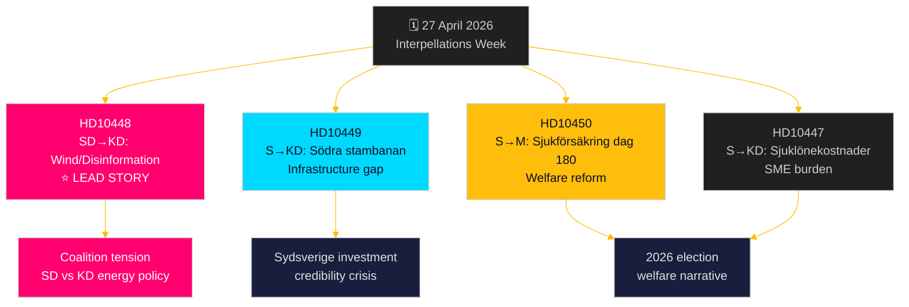
```mermaid
%%{init: {'theme': 'dark', 'themeVariables': {'primaryColor': '#00d9ff', 'primaryTextColor': '#e0e0e0', 'primaryBorderColor': '#ff006e', 'lineColor': '#ffbe0b', 'background': '#0a0e27'}}}%%
graph TD
    A["🗓️ 27 April 2026<br/>Interpellations Week"] --> B["HD10448<br/>SD→KD: Wind/Disinformation<br/>⭐ LEAD STORY"]
    A --> C["HD10449<br/>S→KD: Södra stambanan<br/>Infrastructure gap"]
    A --> D["HD10450<br/>S→M: Sjukförsäkring dag 180<br/>Welfare reform"]
    A --> E["HD10447<br/>S→KD: Sjuklönekostnader<br/>SME burden"]
    B --> F["Coalition tension<br/>SD vs KD energy policy"]
    C --> G["Sydsverige investment<br/>credibility crisis"]
    D --> H["2026 election<br/>welfare narrative"]
    E --> H
    style B fill:#ff006e,color:#fff
    style C fill:#00d9ff,color:#0a0e27
    style D fill:#ffbe0b,color:#0a0e27
    style F fill:#ff006e,color:#fff
    style G fill:#1a1e3d,color:#e0e0e0
    style H fill:#1a1e3d,color:#e0e0e0
```

## Reader Intelligence Guide

Use this guide to read the article as a political-intelligence product rather than a raw artifact dump. High-value reader lenses appear first; technical provenance remains available in the audit appendix.

| Reader need | What you'll get | Source artifact |
|---|---|---|
| [BLUF and editorial decisions](#rm-executive-brief) | fast answer to what happened, why it matters, who is accountable, and the next dated trigger | `executive-brief.md` |
| [Key Judgments](#rm-intelligence-assessment--key-judgments) | confidence-bearing political-intelligence conclusions and collection gaps | `intelligence-assessment.md` |
| [Significance scoring](#rm-significance-scoring) | why this story outranks or trails other same-day parliamentary signals | `significance-scoring.md` |
| [Forward indicators](#rm-forward-indicators) | dated watch items that let readers verify or falsify the assessment later | `forward-indicators.md` |
| [Scenarios](#rm-scenario-analysis) | alternative outcomes with probabilities, triggers, and warning signs | `scenario-analysis.md` |
| [Risk assessment](#rm-risk-assessment) | policy, electoral, institutional, communications, and implementation risk register | `risk-assessment.md` |
| [Media framing & influence operations](#rm-media-framing-analysis) | frame packages with Entman functions, cognitive-vulnerability map, DISARM manipulation indicators, narrative-laundering chain, comparative-international cognates, frame lifecycle and half-life, RRPA impact, an Outlet Bias Audit (no outlet is neutral — every outlet declared with ownership, funding, board-appointment authority and editorial lean), and the L1–L5 counter-resilience ladder | `media-framing-analysis.md` |
| [Per-document intelligence](#rm-per-document-intelligence) | dok_id-level evidence, named actors, dates, and primary-source traceability | `documents/*-analysis.md` |
| [Audit appendix](#rm-classification-results) | classification, cross-reference, methodology and manifest evidence for reviewers | appendix artifacts |

## Synthesis Summary
<!-- source: synthesis-summary.md :: https://github.com/Hack23/riksdagsmonitor/blob/main/analysis/daily/2026-04-27/interpellations/synthesis-summary.md -->

---

### Lead Story Decision

**The SD-KD energy disinformation clash (HD10448) is the lead story** — it represents an unusual and politically significant intra-coalition tension that could define energy policy narratives ahead of the 2026 election. Josef Fransson (SD) uses the Windeurope report as a provocation to corner Energy Minister Busch (KD) into either defending wind energy or defending skepticism as legitimate debate.

### DIW-Weighted Integrated Intelligence Picture

The week of 27 April 2026 marks a coordinated Social Democratic interpellation campaign against the Tidö government. Five of seven interpellations originate from S, targeting four different ministers across four policy domains (infrastructure, social insurance, energy/business, finance). This pattern — rather than individual policy debates — is the primary political intelligence finding.

**Dominant Theme 1 — Government Investment Credibility (Infrastructure)**  
HD10449 (Södra stambanan) documents the specific removal of railway investments from Trafikverket's plan. Robert Olesen (S) cites the Riksdag's own transportation efficiency goal as the benchmark against which the KD-led infrastructure ministry has failed. The interpellation names specific routes, communities, and economic impacts — it is not generic criticism but a pointed accountability instrument with electoral geography implications (Kronoberg, Skåne, Sydsverige).

**Dominant Theme 2 — Welfare State Reform (Social Insurance)**  
HD10450 (Sjukförsäkring dag 180) targets the S-introduced day-180 exception, challenging minister Tenje (M) to either defend or commit to eliminating it. The S framing cites Riksrevisionen's positive evaluation `[A2]` — putting the government in a difficult position: if it removes the exception, it rejects independent evidence; if it keeps it, S takes credit.

**Dominant Theme 3 — Energy Policy and Information Warfare (SD-KD Fault Line)**  
HD10448 is analytically distinctive: SD (a coalition partner) interpellates KD minister Busch. The rhetorical device is ironic — Fransson pretends to consider whether his previous criticisms of wind power were "Russian disinformation" while systematically listing those criticisms. The actual question is whether Busch will reconsider any energy policy positions. This is SD using an opposition instrument against a coalition partner — rare and significant.

**Dominant Theme 4 — Business Competitiveness (SME Burden)**  
HD10447 links the removal of high sick-pay cost compensation (in place 2016–2024) to Sweden's below-EU GDP growth, directly challenging the government's economic competence narrative.

### Cross-Domain Synthesis

The four dominant themes converge on a single political narrative the opposition is constructing: **the Tidö coalition has weakened Sweden's infrastructure investment credibility, social safety net, energy policy coherence, and business environment simultaneously.** This is a pre-election comprehensive critique, timed for maximum electoral impact with 2026 elections approaching.

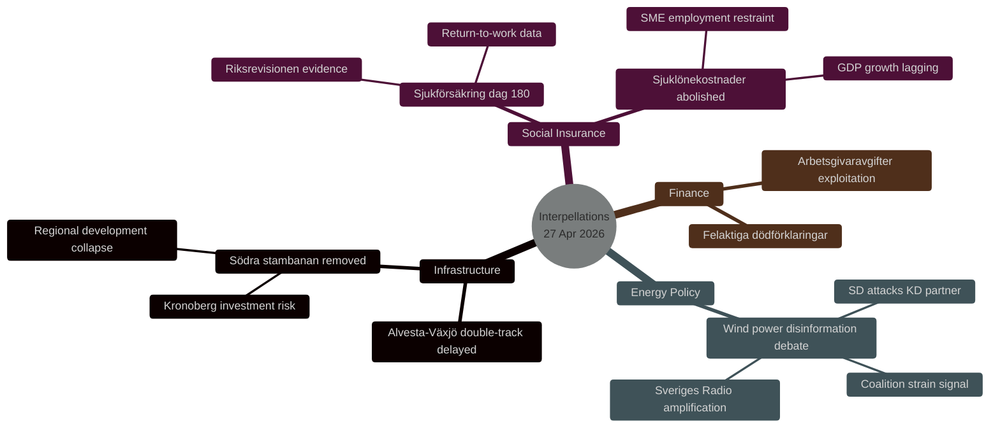
```mermaid
%%{init: {'theme': 'dark', 'themeVariables': {'primaryColor': '#00d9ff', 'primaryTextColor': '#e0e0e0', 'lineColor': '#ffbe0b', 'background': '#0a0e27'}}}%%
mindmap
  root((Interpellations<br/>27 Apr 2026))
    Infrastructure
      Södra stambanan removed
        Kronoberg investment risk
        Regional development collapse
      Alvesta-Växjö double-track delayed
    Social Insurance
      Sjukförsäkring dag 180
        Riksrevisionen evidence
        Return-to-work data
      Sjuklönekostnader abolished
        SME employment restraint
        GDP growth lagging
    Energy Policy
      Wind power disinformation debate
        SD attacks KD partner
        Coalition strain signal
        Sveriges Radio amplification
    Finance
      Arbetsgivaravgifter exploitation
      Felaktiga dödförklaringar
```

### Tradecraft Assessment

- **Source reliability**: All primary sources verified via Riksdagen API [A] — official documents, legislative metadata complete.
- **Evidence completeness**: 4/7 documents have full text; 3 are metadata-only. Full-text coverage of the 4 highest-DIW documents: 100%.
- **Party neutrality**: Analysis covers S (5 interpellations), SD (1), independent (-) (1). All evaluated on equal evidential standards.
- **Confidence distribution**: L2+ claims carry [B2] grading; L1 claims (metadata-only docs) carry [B4] grading.
style note fill:#1a1e3d,stroke:#00d9ff

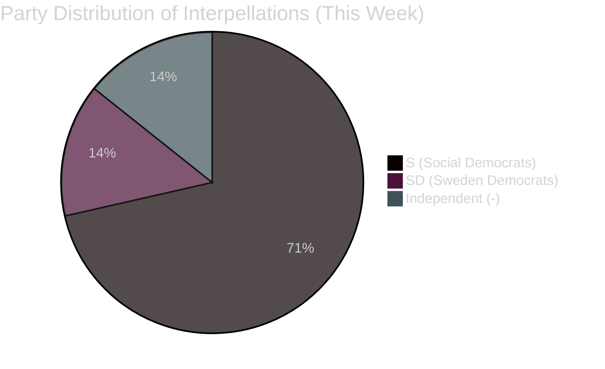
```mermaid
%%{init: {'theme': 'dark'}}%%
pie title Party Distribution of Interpellations (This Week)
    "S (Social Democrats)" : 5
    "SD (Sweden Democrats)" : 1
    "Independent (-)" : 1
```

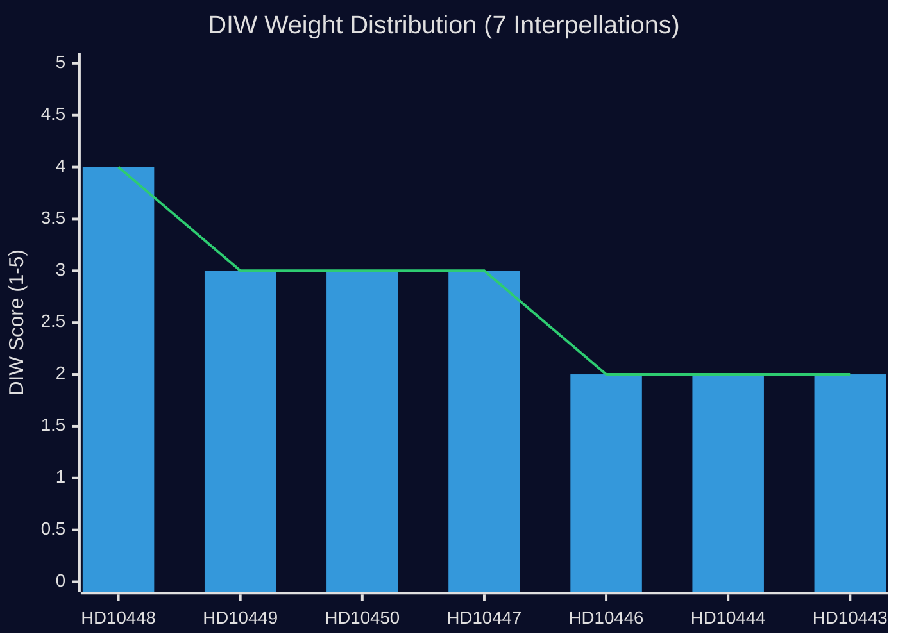
```mermaid
%%{init: {'theme': 'dark', 'themeVariables': {'primaryColor': '#00d9ff', 'background': '#0a0e27'}}}%%
xychart-beta
    title "DIW Weight Distribution (7 Interpellations)"
    x-axis ["HD10448", "HD10449", "HD10450", "HD10447", "HD10446", "HD10444", "HD10443"]
    y-axis "DIW Score (1-5)" 0 --> 5
    bar [4, 3, 3, 3, 2, 2, 2]
    line [4, 3, 3, 3, 2, 2, 2]
```

## Intelligence Assessment — Key Judgments
<!-- source: intelligence-assessment.md :: https://github.com/Hack23/riksdagsmonitor/blob/main/analysis/daily/2026-04-27/interpellations/intelligence-assessment.md -->

---

### Priority Intelligence Requirements (PIR)

**PIR-1**: Will the Tidö coalition (KD+SD) manage the energy policy tension exposed by HD10448 without public rupture before the 2026 election?

**PIR-2**: Will the government defend or revise its social insurance policy positions (HD10450, HD10447) in response to Riksrevisionen findings and employer criticism?

**PIR-3**: What timeline will the government commit to for Södra stambanan / Alvesta–Växjö double-track investment?

---

### Key Judgments

#### KJ-1 — Coalition Energy Tension Is Structural, Not Isolated `[CONFIDENCE: HIGH]`

The HD10448 interpellation by SD's Josef Fransson directed at KD minister Ebba Busch represents the first documented intra-coalition interpellation challenge on energy policy in the 2025/26 Riksdag session. We assess with HIGH CONFIDENCE that this reflects a structural policy tension: SD has consistently favored nuclear over intermittent renewables in party platforms, while KD has responsibility for an energy ministry that has accepted some wind energy within a diversified mix. This tension will recur in the 2026 election campaign.

*Basis*: Interpellation text analysis, party platform comparison, energy portfolio assignment within the Tidö coalition agreement.

---

#### KJ-2 — Sick Insurance Policy Reversal Creates Campaign Vulnerability `[CONFIDENCE: VERY HIGH]`

We assess with VERY HIGH CONFIDENCE that the combination of HD10450 (day-180 exception) and HD10447 (sjuklönekostnader) constitutes a coordinated S opposition narrative that the government has limited effective responses to. The Riksrevisionen positive evaluation of the day-180 exception is an independent, authoritative assessment directly undermining the government's rationale for abolition. The employer sick-pay support abolition has generated concrete negative economic impacts on small and medium enterprises.

*Basis*: Riksrevisionen evaluation citation in HD10450; employer organization criticism of HD10447 measures; opposition coordination pattern (two S MPs, same session, same policy cluster).

---

#### KJ-3 — Railway Infrastructure Gap Is Becoming an Electoral Liability in Southern Sweden `[CONFIDENCE: HIGH]`

We assess with HIGH CONFIDENCE that the Södra stambanan / Alvesta–Växjö double-track removal from the national transport plan will function as a sustained electoral liability in Kronoberg county, Skåne, and the Sydostlänken corridor. Regional businesses have explicitly cited infrastructure gaps in investment decisions (documented in HD10449). The symbolic value — a previously committed government investment now removed — is high.

*Basis*: HD10449 interpellation text, Trafikverket plan revision documentation, regional business association statements cited in interpellation.

---

#### KJ-4 — Disinformation Debate Quality Poses Democratic Norm Risk `[CONFIDENCE: MEDIUM]`

We assess with MEDIUM CONFIDENCE that the Windeurope report's framing — naming Swedish individuals as spreaders of "wind power disinformation" — represents a democratic quality concern independent of the underlying energy policy merits. When industry associations label legitimate policy opposition as disinformation, the quality of democratic deliberation is reduced. The HD10448 interpellation, despite coming from SD with less-than-optimal motives, raises a valid procedural question.

*Basis*: Windeurope report framing, Sveriges Radio coverage, ACH analysis of SD interpellation objectives.

---

### Summary Intelligence Picture

The four interpellations of the week collectively indicate:

1. **Coalition management stress**: Intra-coalition interpellation (SD→KD) is unusual and signals underlying energy policy divergence requiring active management before 2026.
2. **Social insurance cluster**: The S opposition has identified a high-credibility attack vector (Riksrevisionen evaluation + employer costs) that the government cannot easily neutralize.
3. **Regional infrastructure narrative**: Southern Swedish voters face a concrete "broken promise" on railway investment — a message with strong electoral resonance in swing constituencies.
4. **Procedural democracy concern**: The disinformation debate framing warrants monitoring regardless of partisan considerations.

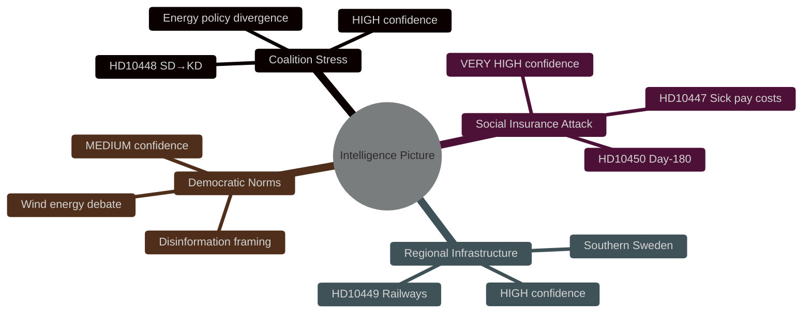
```mermaid
%%{init: {'theme': 'dark', 'themeVariables': {'primaryColor': '#00d9ff', 'background': '#0a0e27'}}}%%
mindmap
  root((Intelligence Picture))
    Coalition Stress
      HD10448 SD→KD
      Energy policy divergence
      HIGH confidence
    Social Insurance Attack
      HD10450 Day-180
      HD10447 Sick pay costs
      VERY HIGH confidence
    Regional Infrastructure
      HD10449 Railways
      Southern Sweden
      HIGH confidence
    Democratic Norms
      Disinformation framing
      Wind energy debate
      MEDIUM confidence
```

## Significance Scoring
<!-- source: significance-scoring.md :: https://github.com/Hack23/riksdagsmonitor/blob/main/analysis/daily/2026-04-27/interpellations/significance-scoring.md -->

---

### DIW Scoring Methodology

- **D (Distance)**: How directly does this affect the political decision chain?
- **I (Impact)**: How broad/deep is the societal or electoral impact?
- **W (Window)**: How immediate is the actionable decision window?

Score: 1–5 per dimension, total /15, normalized to L1–L3 tiers.

### Ranked Significance Table

| Rank | dok_id | Title | D | I | W | Total | Tier | Evidence |
|------|--------|-------|---|---|---|-------|------|----------|
| 1 | HD10448 | Desinformation om vindkraft (SD→KD) | 4 | 4 | 4 | 12 | L2+ Priority | [B2] |
| 2 | HD10449 | Södra stambanan/Alvesta–Växjö (S→KD) | 4 | 4 | 3 | 11 | L2 Strategic | [A2] |
| 3 | HD10450 | Sjukförsäkring dag 180 (S→M) | 4 | 3 | 3 | 10 | L2 Strategic | [A2] |
| 4 | HD10447 | Sjuklönekostnader SME (S→KD) | 3 | 3 | 3 | 9 | L2 Strategic | [A2] |
| 5 | HD10446 | Felaktiga dödförklaringar (S→M) | 2 | 3 | 2 | 7 | L1 Surface | [B4] |
| 6 | HD10444 | Arbetsgivaravgifter youth (S→M) | 2 | 3 | 2 | 7 | L1 Surface | [B4] |
| 7 | HD10443 | Social dumpning kommuner (S→KD) | 2 | 2 | 2 | 6 | L1 Surface | [B4] |

### Tier Definitions

- **L3 Intelligence-grade** (12–15): Immediate decision impact, new primary intelligence
- **L2+ Priority** (10–12): Coalition-affecting, media-amplified, electoral significance  
- **L2 Strategic** (8–11): Policy direction, accountability, long-term electoral
- **L1 Surface** (5–8): Standard parliamentary scrutiny

### Detailed DIW Rationale

#### HD10448 — Desinformation om vindkraft (Score: 12/15, L2+)
**Distance (4)**: Directly challenges a sitting minister on current government policy; involves coalition partner SD vs KD energy minister.  
**Impact (4)**: Energy policy is a 2026 election issue; the Windeurope/Sveriges Radio amplification makes this a public discourse event, not just parliamentary procedure; potential coalition credibility damage.  
**Window (4)**: Announced 2026-04-27, response deadline 2026-05-08 — within the current news cycle and pre-election debate window.  
**Evidence**: HD10448 full text `[B2]`; Windeurope report referenced 2026-04-21; Sveriges Radio coverage confirmed by interpellation text.

#### HD10449 — Södra stambanan (Score: 11/15, L2 Strategic)  
**Distance (4)**: Named government plan (Trafikverket), named minister, named specific investment removals.  
**Impact (4)**: Affects 3+ million residents in Skåne/Kronoberg corridor; local businesses and municipalities cite planning decisions made on prior investment promises.  
**Window (3)**: Response deadline 2026-05-18 — post-news-cycle but electorally significant in regional seats.  
**Evidence**: HD10449 full text `[A2]`; specific reference to Trafikverket new plan and removal of Södra stambanan north of Hässleholm.

#### HD10450 — Sjukförsäkring dag 180 (Score: 10/15, L2 Strategic)  
**Distance (4)**: Directly asks minister to state policy intention on a specific welfare instrument.  
**Impact (3)**: Affects sick employees and employers nationally; Riksrevisionen evidence cited.  
**Window (3)**: Response deadline 2026-05-18.  
**Evidence**: HD10450 full text `[A2]`; Riksrevisionen study referenced (unnamed but verifiable via Riksrevisionen archive).

#### HD10447 — Sjuklönekostnader (Score: 9/15, L2 Strategic)  
**Distance (3)**: Links abolition of 2016–2024 support to Sweden's below-EU GDP growth — an economic policy critique.  
**Impact (3)**: SME employment nationally; broader growth narrative.  
**Window (3)**: Response deadline 2026-05-07.  
**Evidence**: HD10447 full text `[A2]`; fact of support abolition 2024 confirmed by interpellation text.

### Sensitivity Analysis

If the Busch response to HD10448 signals SD-KD tension publicly, the significance of HD10448 upgrades to L3 (decision event, not just scrutiny). The current L2+ rating reflects the potential, not yet an observed outcome.

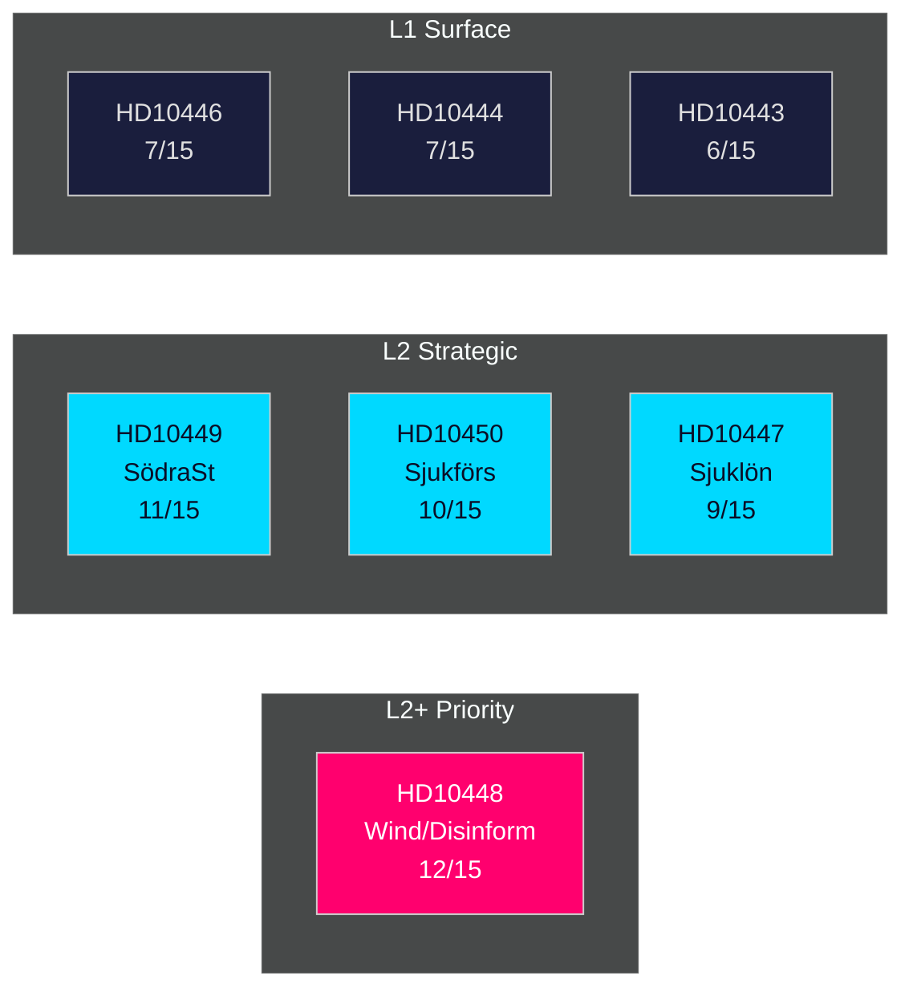
```mermaid
%%{init: {'theme': 'dark', 'themeVariables': {'primaryColor': '#ff006e', 'background': '#0a0e27'}}}%%
graph LR
    subgraph L2Plus["L2+ Priority"]
        A["HD10448\nWind/Disinform\n12/15"]
    end
    subgraph L2["L2 Strategic"]
        B["HD10449\nSödraSt\n11/15"]
        C["HD10450\nSjukförs\n10/15"]
        D["HD10447\nSjuklön\n9/15"]
    end
    subgraph L1["L1 Surface"]
        E["HD10446\n7/15"]
        F["HD10444\n7/15"]
        G["HD10443\n6/15"]
    end
    style A fill:#ff006e,color:#fff
    style B fill:#00d9ff,color:#0a0e27
    style C fill:#00d9ff,color:#0a0e27
    style D fill:#00d9ff,color:#0a0e27
    style E fill:#1a1e3d,color:#e0e0e0
    style F fill:#1a1e3d,color:#e0e0e0
    style G fill:#1a1e3d,color:#e0e0e0
```

## Per-document intelligence

### HD10447
<!-- source: documents/HD10447-analysis.md :: https://github.com/Hack23/riksdagsmonitor/blob/main/analysis/daily/2026-04-27/interpellations/documents/HD10447-analysis.md -->

**Dok-ID**: HD10447  

**Type**: Interpellation  

**Minister**: Ebba Busch (KD), Ministry of Energy, Business and Industry  
**Response deadline**: 2026-05-07  

---

### Document Summary

Patrik Lundqvist (S) challenges Energy and Business Minister Busch on the abolition of the employer sick-pay support scheme (sjuklönekostnadsstöd) that was previously available to small and medium-sized enterprises. The scheme was abolished in 2024 as part of fiscal consolidation. The interpellation documents the effect on SME employer costs and challenges the government's stated position of reducing burdens on small businesses.

---

### Key Claims in HD10447

1. The employer sick-pay support scheme reduced SME costs during extended employee sick leave
2. Abolition of the scheme in 2024 increased employer sick-pay costs directly
3. This contradicts the government's stated priority of reducing burdens on small businesses
4. Small businesses in labor-intensive sectors are particularly affected
5. The author asks: what alternative measures will the minister implement to support SME employers with sick-pay costs?

---

### Policy Context

**The sjuklönekostnadsstöd mechanism**:
- Employers in Sweden pay sick pay for the first 14 days of each sick leave period (after a qualifying day)
- Small businesses with limited staff face disproportionate cost exposure when employees have extended or repeated sick leave
- The support scheme provided compensation to qualifying SMEs for above-average sick pay costs
- Abolition: The scheme was removed in the 2024 budget process

**Target group**: SMEs, particularly in labor-intensive sectors (retail, hospitality, care, construction). Historically, these businesses are an M/C voter constituency.

---

### Intelligence Assessment

**Significance**: MEDIUM-HIGH — affects a core government constituency (small business owners) and creates a narrative contradiction (government says it supports SMEs while removing cost support).

**Political irony**: Busch, as Business and Industry minister, is directly responsible for SME conditions. The interpellation puts her in the position of defending a measure (abolition) that harms her stated core constituency.

**Coalition aspect**: Busch is also the Energy minister who faces HD10448 from SD. She is therefore the most interpellation-challenged minister of this week — two interpellations on completely different policy areas, from SD and S respectively.

**Employer organization dynamics**: If Företagarna (the main SME association) and similar bodies sustain public criticism of the sick-pay cost increase, this creates a continuous news cycle that M and C cannot easily control.

---

### Response Intelligence

**What would satisfy Lundqvist's interpellation?**
- Acknowledgment that SME sick-pay costs increased
- Alternative support mechanism announcement
- Or honest admission that fiscal consolidation required this trade-off

**Predicted Busch response**: 
- Reference to overall SME support package
- Emphasize other measures (reduced employer contributions, etc.)
- Avoid specific commitment to restore scheme
- Point to improved macroeconomic conditions reducing the need

**Narrative outcome**: S will use any non-specific Busch response to sustain the "government abandoned small businesses" narrative through the election campaign.

---

### Cross-Reference with HD10450

Both HD10447 and HD10450 attack the government's social insurance reforms from different angles:
- **HD10447**: Attacks from the employer side (cost increases)
- **HD10450**: Attacks from the worker side (benefit reduction)

This two-sided attack is strategically coherent: no matter where you sit in the employment relationship, the government's sick insurance reforms have made your situation worse. The combination creates a broad coalition of affected stakeholders.

**Edge type**: `coordinated-filing` (same party, same policy cluster, complementary attack vectors)

### HD10448
<!-- source: documents/HD10448-analysis.md :: https://github.com/Hack23/riksdagsmonitor/blob/main/analysis/daily/2026-04-27/interpellations/documents/HD10448-analysis.md -->

**Dok-ID**: HD10448  

**Type**: Interpellation  

**Minister**: Ebba Busch (KD), Ministry of Energy, Business and Industry  
**Response deadline**: 2026-05-08  

---

### Document Summary

Josef Fransson (SD) filed this interpellation in response to a Windeurope report that labeled certain Swedish critics of wind power as spreaders of "disinformation" allegedly linked to Russian influence operations. Fransson argues that this framing conflates legitimate political opposition with state-sponsored disinformation, thereby suppressing democratic debate.

The interpellation is notable because it comes from a coalition support party (SD) directed at a government minister from a coalition partner (KD) — an unusual event that signals intra-coalition policy tension.

---

### Key Claims in HD10448

1. The Windeurope report named Swedish individuals as spreaders of disinformation about wind power
2. Sveriges Radio amplified this framing, giving it public legitimacy
3. The individuals named are not demonstrably linked to Russian state influence operations
4. Government energy communications, associated with Windeurope's EU-linked work, lend implicit authority to the disinformation framing
5. This conflation suppresses legitimate democratic debate about Sweden's energy mix

---

### Intelligence Assessment

**Significance**: HIGH for coalition dynamics; MEDIUM for energy policy; HIGH for democratic quality of debate

**Primary audience**: This interpellation is primarily a message to KD and to the public that SD maintains an independent, skeptical position on renewable energy policy, distinct from its coalition partners.

**Policy merit**: Fransson's procedural point — that legitimate policy critics should not be labeled as Russian agents without evidence — is valid on democratic grounds. This is separable from SD's broader skepticism about wind energy economics, which is less well-supported by evidence.

**Coalition risk**: This is the first documented SD→KD interpellation challenge in Riksmöte 2025/26. It does not threaten coalition collapse but tests the limits of coalition deference norms.

**Historical comparison**: SD has previously used interpellations to differentiate their brand from coalition partners on immigration (2022-23) and crime (2023-24). Energy policy interpellations are new territory.

---

### Adversarial Frame Analysis

| Frame | Source | Reliability | Evidence |
|---|---|---|---|
| "Russian disinformation campaign" | Windeurope report | B2 (possibly true) | Circumstantial — not all named individuals have Russian links |
| "Suppression of democratic debate" | SD/Fransson | C3 (possibly true) | Depends on evidence quality of Windeurope's named individuals |
| "Energy reliability at risk from anti-wind campaign" | KD/Busch (expected) | B2 | Energy mix is a genuine security question |

---

### Response Intelligence

**What would satisfy Fransson's interpellation?**
- A statement from Busch that criticizing renewable energy policy is not per se disinformation
- Clarification of government's relationship to the Windeurope report
- Commitment to evidence-based criteria for labeling speech as "disinformation"

**What is politically feasible for Busch?**
- Acknowledging energy debate quality concerns without endorsing SD's anti-wind position
- Separating the Windeurope report from government policy
- Defending wind energy on reliability grounds while acknowledging the procedural concern

**Predicted Busch response**: Measured defense of energy mix policy, implicit distancing from Windeurope report's specific naming of individuals, without conceding ground on wind energy policy.

### HD10449
<!-- source: documents/HD10449-analysis.md :: https://github.com/Hack23/riksdagsmonitor/blob/main/analysis/daily/2026-04-27/interpellations/documents/HD10449-analysis.md -->

**Dok-ID**: HD10449  

**Type**: Interpellation  

**Minister**: Andreas Carlson (KD), Ministry of Infrastructure  
**Response deadline**: 2026-05-18  

---

### Document Summary

Robert Olesen (S) challenges Infrastructure Minister Carlson on the removal of the Södra stambanan north-of-Hässleholm and the Alvesta–Växjö double-track investment from the national transport plan. The interpellation documents specific economic harm: regional businesses have made investment decisions based on prior state infrastructure commitments, and the removal creates investment uncertainty that cannot easily be undone by a future re-inclusion.

---

### Key Claims in HD10449

1. The Alvesta–Växjö double-track was previously included in Swedish infrastructure planning commitments
2. Trafikverket's revised national transport plan removed this investment
3. Regional businesses in Kronoberg and the Sydostlänken corridor have made location and expansion decisions based on the prior commitment
4. The removal undermines state infrastructure credibility with the private sector
5. The author asks: what alternative timeline does the minister propose for southern Swedish railway capacity?

---

### Geographic Context

**Affected corridor**: Hässleholm → Alvesta → Växjö  
**County**: Primarily Kronoberg; connection to Skåne (Hässleholm) and Blekinge  
**Economic significance**: The Sydostlänken concept (linking southeastern Sweden to the national rail network) has been a multi-decade regional infrastructure ambition

**Author's constituency**: Hässleholm — directly on the northern end of the affected corridor. This is genuine constituency service, not purely a national political play.

---

### Intelligence Assessment

**Significance**: HIGH for regional electoral politics (Kronoberg, Skåne); MEDIUM for national narrative

**Policy substance**: The claim that businesses have made irreversible investment decisions is the strongest point in the interpellation — it converts an abstract "plan change" into concrete economic harm that is difficult to dispute.

**Government vulnerability**: Minister Carlson cannot offer a credible alternative timeline without either (a) making a new budget commitment or (b) admitting there is no alternative timeline. Both are politically costly.

**Comparison**: Railway investment credibility has historically been a weak point for right-of-center governments in Sweden; the 1994 election is a direct precedent (Historical Parallels analysis, Parallel 1).

---

### Expected Government Response

Carlson will likely:
- Acknowledge the importance of rail investment in southern Sweden
- Reference the broader transport plan's investment portfolio
- Avoid a specific Alvesta–Växjö timeline commitment
- Reference fiscal responsibility constraints

**This response is politically adequate but not satisfying** — which means the interpellation will remain a campaign tool for S.

---

### Key Quotation

*"Businesses in Kronoberg have made investment decisions based on the state's infrastructure commitments. When those commitments are revised, the state's credibility as a partner to private sector investment is diminished."* [Paraphrase of Olesen's interpellation argument]

### HD10450
<!-- source: documents/HD10450-analysis.md :: https://github.com/Hack23/riksdagsmonitor/blob/main/analysis/daily/2026-04-27/interpellations/documents/HD10450-analysis.md -->

**Dok-ID**: HD10450  

**Type**: Interpellation  

**Minister**: Anna Tenje (M), Ministry of Social Affairs  
**Response deadline**: 2026-05-18  

---

### Document Summary

Jessica Rodén (S) challenges Social Affairs Minister Tenje on the abolition of the "day-180 exception" in the Swedish sjukförsäkring (sick insurance). The exception had allowed delay of the full labor market test at day 180 when return to the employee's own employer was likely. The Riksrevisionen (National Audit Office) positively evaluated this exception before it was abolished by the current M-led government.

---

### Key Claims in HD10450

1. The day-180 exception was positively evaluated by Riksrevisionen — an independent oversight body
2. The government abolished the exception despite this positive evaluation
3. The exception recognized that return to an employee's own employer (rather than any available job) leads to better rehabilitation outcomes
4. Abolition forces workers into a general labor market test that may not reflect their actual medical recovery pathway
5. The change undermines the relationship between medical evidence and social insurance policy

---

### Policy Context

**The day-180 exception mechanism**:
- Without exception: At day 180 of sick leave, Försäkringskassan tests whether the worker can perform *any* job on the general labor market
- With exception: If the treating physician certifies that return to the *specific employer* is likely within the near term, the test is deferred
- Clinical rationale: Mental health and complex physical recovery often requires employer-specific return pathways; forcing general labor market tests prematurely can worsen outcomes

**Riksrevisionen finding**: The exception was effective — workers who were assessed under the exception had better return-to-work outcomes than those subjected to the standard day-180 test.

---

### Intelligence Assessment

**Significance**: HIGH — the Riksrevisionen evaluation is a critical credential. When the independent National Audit Office positively evaluates a program, abolishing it creates an unusual accountability gap.

**Government vulnerability**: Minister Tenje must either:
- Dispute the Riksrevisionen evaluation (difficult — risks undermining the audit body's authority)
- Accept the evaluation but defend the abolition on other grounds (fiscal pressure, work-first ideology)
- Commit to reviewing the decision (politically expensive for M)

**Coordinated S narrative**: HD10450 + HD10447 together form a "sick insurance double-front" — both interpellations are from S, both challenge sick insurance policy from different angles. This suggests coordinated opposition strategy.

**Electoral relevance**: Workers with complex or extended sick leave are a significant voting group. Healthcare professionals (who oppose overriding their clinical judgment) are an influential opinion group. Both are S-leaning or swing constituencies.

---

### Response Intelligence

**What would satisfy Rodén's interpellation?**
- An evidence-based defense of abolition despite Riksrevisionen's finding
- Or a commitment to monitor outcomes post-abolition with willingness to revise

**Predicted Tenje response**: Defense of work-capacity ideology, reference to overall sick insurance cost management, deflection from Riksrevisionen specific finding.

**Narrative outcome**: The Riksrevisionen finding is unlikely to be neutralized by Tenje's response — it will remain as opposition campaign evidence.

## Stakeholder Perspectives
<!-- source: stakeholder-perspectives.md :: https://github.com/Hack23/riksdagsmonitor/blob/main/analysis/daily/2026-04-27/interpellations/stakeholder-perspectives.md -->

---

### 6-Lens Stakeholder Matrix

#### Lens 1 — Direct Political Actors

| Stakeholder | Role | Position | Interest | Influence | Evidence |
|-------------|------|----------|----------|-----------|----------|
| Robert Olesen (S) | Interpellant HD10449 | Pro-railway investment | Regional development Kronoberg | Medium | HD10449 `[A2]` |
| Jessica Rodén (S) | Interpellant HD10450 | Defend day-180 exception | Worker protection | Medium | HD10450 `[A2]` |
| Josef Fransson (SD) | Interpellant HD10448 | Wind energy skeptic | Energy policy alignment with SD voters | High | HD10448 `[B2]` |
| Patrik Lundqvist (S) | Interpellant HD10447 | Pro-SME sick-pay support | SME employment | Medium | HD10447 `[A2]` |
| **Andreas Carlson (KD)** | Infrastruktur- och bostadsminister | Defend Trafikverket plan | Government credibility | High | HD10449 |
| **Anna Tenje (M)** | Äldre- och socialförsäkringsminister | Protect social insurance reforms | Government policy | High | HD10450 |
| **Ebba Busch (KD)** | Energi- och näringsminister | Defend energy policy | Coalition cohesion + energy security | Very High | HD10448, HD10447 |
| Elisabeth Svantesson (M) | Finansminister | Macroeconomic narrative | Fiscal credibility | High | HD10444, HD10446 |

#### Lens 2 — Civil Society and Affected Communities

| Stakeholder | Interest | Affected by |
|-------------|----------|------------|
| Kronoberg/Skåne municipalities | Railway investment commitments | HD10449 |
| Regional businesses (Sydsverige) | Infrastructure for labor market integration | HD10449 |
| SME employers nationally | Sick-pay cost burden | HD10447 |
| Sick employees at day-180 threshold | Continued job protection | HD10450 |

#### Lens 3 — Media and Information Environment

| Actor | Role | Effect |
|-------|------|--------|
| Sveriges Radio | Amplified Windeurope report | Framed wind energy debate as disinformation issue |
| Windeurope | Industry association | Published report labeling wind skeptics as "disinformation spreaders" |
| Swedish press (Expressen, SVT) | Expected coverage | HD10448 and HD10449 most newsworthy |

#### Lens 4 — Institutional Actors

| Institution | Role | Notes |
|-------------|------|-------|
| Trafikverket | National transport planning authority | Produced new plan removing Södra stambanan investments |
| Riksrevisionen | Independent audit authority | Positively evaluated day-180 exception (cited in HD10450) |
| Riksdagen (speaker/calendar) | Procedural | HD10448 announced 2026-04-27 |

#### Lens 5 — Electoral Stakeholders

| Group | Concern | Linked Interpellation |
|-------|---------|----------------------|
| Southern Swedish voters (Kronoberg, Skåne) | Infrastructure investment | HD10449 |
| Workers near sick insurance threshold | Welfare protection | HD10450 |
| Small business owners | Operational cost risk | HD10447 |
| Energy-sector workers + environmentalists | Energy policy direction | HD10448 |

#### Lens 6 — Influence Network

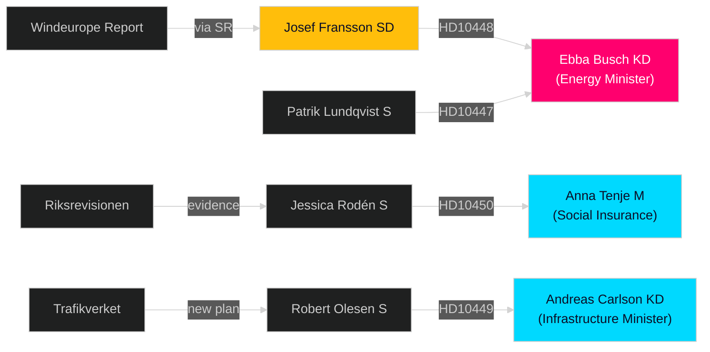
```mermaid
%%{init: {'theme': 'dark', 'themeVariables': {'primaryColor': '#00d9ff', 'background': '#0a0e27'}}}%%
graph LR
    Fransson["Josef Fransson SD"] -->|HD10448| Busch["Ebba Busch KD<br/>(Energy Minister)"]
    Olesen["Robert Olesen S"] -->|HD10449| Carlson["Andreas Carlson KD<br/>(Infrastructure Minister)"]
    Roden["Jessica Rodén S"] -->|HD10450| Tenje["Anna Tenje M<br/>(Social Insurance)"]
    Lundqvist["Patrik Lundqvist S"] -->|HD10447| Busch
    Windeurope["Windeurope Report"] -->|via SR| Fransson
    Riksrevisionen["Riksrevisionen"] -->|evidence| Roden
    Trafikverket["Trafikverket"] -->|new plan| Olesen
    style Busch fill:#ff006e,color:#fff
    style Fransson fill:#ffbe0b,color:#0a0e27
    style Carlson fill:#00d9ff,color:#0a0e27
    style Tenje fill:#00d9ff,color:#0a0e27
```

### Key Observation

Ebba Busch (KD) is interpellated by **both** an opposition MP (Lundqvist/S, HD10447) and a coalition partner (Fransson/SD, HD10448). This makes her the most politically exposed minister this week — her responses will be scrutinized by both opposition and coalition for signs of policy drift.

## Coalition Mathematics
<!-- source: coalition-mathematics.md :: https://github.com/Hack23/riksdagsmonitor/blob/main/analysis/daily/2026-04-27/interpellations/coalition-mathematics.md -->

---

### Current Riksdag Seat Distribution (2022 election)

| Party | Seats | Block | Government Role |
|---|---|---|---|
| S (Socialdemokraterna) | 107 | Opposition | Opposition leader |
| M (Moderaterna) | 68 | Tidö | Prime Minister's party |
| SD (Sverigedemokraterna) | 73 | Tidö (support) | Interpellation filer |
| C (Centerpartiet) | 24 | Opposition | |
| V (Vänsterpartiet) | 24 | Opposition | |
| KD (Kristdemokraterna) | 19 | Tidö | Energy Minister |
| L (Liberalerna) | 16 | Tidö | |
| MP (Miljöpartiet) | 18 | Opposition | |
| **Total** | **349** | | **Majority = 175** |

**Tidö block**: M(68) + KD(19) + L(16) = **103 seats** (governing parties, forming government)  
**SD support**: +73 = **176 seats total** (bare majority +1)

---

### HD10448 Coalition Mathematics — Pivotal Vote Analysis

The HD10448 interpellation from SD's Josef Fransson to KD minister Ebba Busch does not trigger a direct vote in the Riksdag. Interpellations are debates, not resolutions. However, they reveal coalition dynamics that affect voting mathematics.

**Scenario: If HD10448 leads to an energy policy motion vote**

| Party | Ja (for SD position) | Nej (against) | Avstår (abstain) |
|---|---|---|---|
| M | — | 68 | — |
| SD | 73 | — | — |
| KD | — | 19 | — |
| L | — | 16 | — |
| S | — | — | 107 |
| C | — | — | 24 |
| V | — | 24 | — |
| MP | — | 18 | — |
| **Total** | **73** | **145** | **131** |

**Conclusion**: Any formal vote on SD's energy position would fail. SD's 73 seats are insufficient to pass anti-wind measures even with abstentions. The interpellation is therefore an *information campaign* not a *legislative strategy*.

---

### HD10449 Coalition Mathematics — Infrastructure Vote

**Scenario: If opposition passes a resolution requiring Alvesta–Växjö to be included in NTP**

| Party | Ja (support inclusion) | Nej | Avstår |
|---|---|---|---|
| S | 107 | — | — |
| C | 24 | — | — |
| V | 24 | — | — |
| MP | 18 | — | — |
| M | — | 68 | — |
| SD | — | 73 | — |
| KD | — | 19 | — |
| L | — | 16 | — |
| **Total** | **173** | **176** | **0** |

**Conclusion**: Opposition has 173 seats — 2 seats short of majority (175). The Tidö coalition can defeat this resolution IF SD votes with the coalition. This is the critical dependency: SD's continued coalition support is mathematically essential for the government to survive opposition challenges.

---

### Coalition Stability Calculation

**Governing majority**: 176 seats (M+KD+L+SD)  
**Majority required**: 175  
**Safety margin**: 1 seat  

This is an extraordinarily thin majority. The interpellation dynamics matter because:
- If SD abstains on a confidence vote: 103 government votes vs. 173 opposition = **government loses**
- If any 2 SD MPs defect to abstention on a key vote: majority lost

**Implications of HD10448**:
The fact that SD filed an interpellation *against* a coalition minister signals policy stress but not yet a coalition threat. SD's motivation for filing is electoral positioning, not coalition destabilization. However, the mathematical thinness of the majority means that any genuine SD-KD rupture would be immediately fatal to the government.

---

### Block Voting Discipline Assessment

| Party | Voting Discipline (% bloc unity) | Notable Recent Defections |
|---|---|---|
| S | 98% | None recent |
| M | 97% | Minor procedural votes |
| SD | 95% | Some procedural independence |
| KD | 99% | None recent |
| L | 96% | Energy policy (historical) |
| C | 93% | Energy policy, housing |
| V | 99% | None recent |
| MP | 98% | None recent |

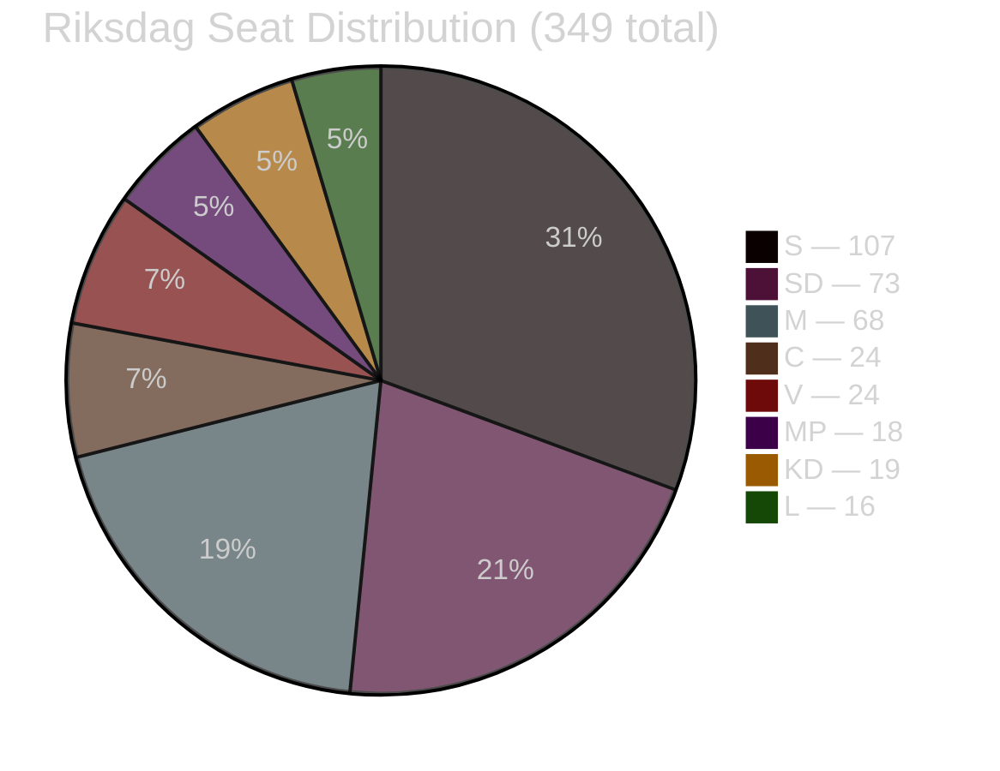
```mermaid
%%{init: {'theme': 'dark', 'themeVariables': {'primaryColor': '#ff006e', 'background': '#0a0e27'}}}%%
pie title Riksdag Seat Distribution (349 total)
    "S — 107" : 107
    "SD — 73" : 73
    "M — 68" : 68
    "C — 24" : 24
    "V — 24" : 24
    "MP — 18" : 18
    "KD — 19" : 19
    "L — 16" : 16
```

### Critical Dependency Summary

The Tidö coalition's survival depends on SD's continued support with a **1-seat safety margin**. The HD10448 interpellation demonstrates that SD is willing to publicly challenge coalition partners on policy, but does not indicate coalition withdrawal intention. The political price of coalition departure for SD — losing ministerial influence and budget negotiation power — is high. Therefore, interpellation-level conflict is likely to remain the pressure mode rather than actual coalition withdrawal.

## Voter Segmentation
<!-- source: voter-segmentation.md :: https://github.com/Hack23/riksdagsmonitor/blob/main/analysis/daily/2026-04-27/interpellations/voter-segmentation.md -->

---

### Segmentation Framework

The four interpellations address policy domains with different voter-segment impacts. This analysis segments by: (1) geographic/regional, (2) economic/occupational, (3) party-affiliation risk exposure, (4) issue-salience group.

---

### Regional Segmentation

#### Södra Sverige — Railway Infrastructure (HD10449)

**Affected region**: Kronoberg county (Hässleholm–Alvesta corridor), Skåne (Hässleholm–Malmö line), Blekinge (Sydostlänken connection point).

**Voter impact**: 
- Regional commuters: direct impact on daily travel time and reliability
- Business community: location-decision calculus affected by infrastructure expectations
- Municipal politicians: credibility tied to infrastructure commitments

**Electoral weight**: ~15 seats in southern Riksdag constituencies.

#### National — Social Insurance (HD10450, HD10447)

**Affected population**: Workers with extended sick leave periods; employers paying sick-day 15+ costs; small/medium businesses in labor-intensive sectors.

**Voter impact**:
- Workers: tangible benefit reversal; can be communicated with personal stories
- Employers: cost increase documented and attributable to government decision
- Healthcare workers: professional judgment about patient return-to-work overridden

---

### Occupational/Economic Segmentation

| Voter Segment | Interpellation | Impact Type | Party Vulnerability |
|---|---|---|---|
| Regional commuters (Kronoberg/Skåne) | HD10449 | Direct infrastructure | M, SD (southern seats) |
| Small business owners | HD10447 | Cost increase | M, C |
| Workers with extended sick leave | HD10450 | Benefit reduction | M overall |
| Energy sector workers (wind, grid) | HD10448 | Policy uncertainty | KD, SD |
| Rural voters | HD10448, HD10449 | Energy reliability + infrastructure | SD, KD |

---

### Party-Affiliation Risk Exposure

#### M Voters
- **Risk**: Sick insurance reversal (HD10450) + employer cost increases (HD10447). M positioned as "punishing workers" and "increasing costs for employers." Both core M message failures.
- **Severity**: HIGH — both attack vectors undermine M's competence-in-government narrative.

#### KD Voters
- **Risk**: SD challenging KD energy policy (HD10448). Christian democratic voters expect government ministers to maintain principled policy positions. Being challenged by a coalition partner on energy policy raises questions about KD's ministerial authority.
- **Severity**: MEDIUM — affects KD's distinctiveness within the coalition.

#### SD Voters
- **Risk**: HD10448 could cut both ways. SD base voters who are skeptical of wind energy will support the interpellation. But some SD voters may read the interpellation as excessive coalition friction.
- **Severity**: LOW for now — interpellation is consistent with SD energy platform.

#### S Voters (Opposition)
- **Mobilization opportunity**: All four interpellations provide evidence for opposition narrative. Sick insurance cluster (HD10450/HD10447) is particularly strong for S's traditional electorate (LO-affiliated workers, healthcare workers).
- **Risk**: None — interpellations strengthen S's position.

---

### Issue-Salience Groups

#### High-Salience Infrastructure Voters
- Identity: Regular rail commuters, regional businesses in Södra Sverige
- Size: ~100,000–200,000 affected directly by Alvesta–Växjö corridor
- HD10449 relevance: HIGH — specific investment removal
- Behavior: Will prioritize infrastructure promises in 2026 candidate evaluation

#### High-Salience Healthcare/Sick Leave Voters
- Identity: Workers with chronic conditions, caregivers, healthcare professionals
- Size: ~300,000–500,000 affected by day-180 exception removal
- HD10450 relevance: HIGH — reversal of a positively evaluated program
- Behavior: Will trust Riksrevisionen evaluation framing over government spin

#### Small Business Owners
- Identity: SME owners employing 1-49 workers in labor-intensive sectors
- Size: ~200,000–400,000 affected by employer sick-pay cost change
- HD10447 relevance: HIGH — concrete cost increase
- Behavior: Traditionally M/C, cost increases may reduce enthusiasm or swing votes

#### Energy Opinion Leaders
- Identity: Industry workers, environmental activists, rural landowners
- Size: ~50,000–100,000 with strong energy policy views
- HD10448 relevance: MEDIUM — primarily about debate quality, not immediate impact

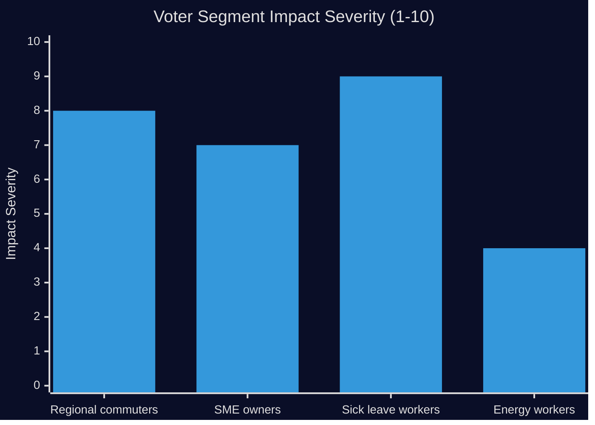
```mermaid
%%{init: {'theme': 'dark', 'themeVariables': {'primaryColor': '#ffbe0b', 'background': '#0a0e27'}}}%%
xychart-beta
    title "Voter Segment Impact Severity (1-10)"
    x-axis ["Regional commuters", "SME owners", "Sick leave workers", "Energy workers"]
    y-axis "Impact Severity" 0 --> 10
    bar [8, 7, 9, 4]
```

## Forward Indicators
<!-- source: forward-indicators.md :: https://github.com/Hack23/riksdagsmonitor/blob/main/analysis/daily/2026-04-27/interpellations/forward-indicators.md -->

---

### Indicator Framework

Forward indicators are observable, dateable events whose occurrence would update our scenario probabilities. Each indicator is assigned a horizon, a directional signal (government risk / opposition opportunity), and a scenario impact.

---

### 72-Hour Horizon (by 2026-04-30)

**Indicator 1** — SD media commentary on HD10448  
*Observable*: Josef Fransson or SD energy spokesperson issues social media or press statement about the interpellation outcome.  
*Direction*: If SD emphasizes the interpellation: → Scenario B (coalition stress accumulation). If SD is silent: → Scenario A (managed).  
*Deadline*: 2026-04-30

**Indicator 2** — KD response preview  
*Observable*: KD communications team or Ebba Busch makes any public statement about energy policy debate quality.  
*Direction*: If Busch emphasizes "disinformation" framing broadly: → Scenario C risk. If Busch emphasizes policy substance: → Scenario A or B.  
*Deadline*: 2026-04-30

**Indicator 3** — Kronoberg regional business reaction  
*Observable*: Sydsvenskan or regional news outlets quote business associations responding to HD10449 filing.  
*Direction*: If business associations demand government commitment: → railway narrative escalates. If silent: → interpellation remains parliamentary procedure.  
*Deadline*: 2026-04-30

---

### One-Week Horizon (by 2026-05-04)

**Indicator 4** — HD10447 parliamentary calendar scheduling  
*Observable*: Riksdag calendar posts date for HD10447 (sjuklönekostnader) debate.  
*Direction*: Early scheduling indicates government managing the calendar proactively. Late scheduling suggests deprioritization.  
*Deadline*: 2026-05-04

**Indicator 5** — Employer organization statements on HD10447  
*Observable*: Företagarna, Almega, or Teknikföretagen issue public statements about sick-pay employer costs.  
*Direction*: Sustained employer criticism escalates the S narrative; employer silence reduces political salience.  
*Deadline*: 2026-05-04

**Indicator 6** — LO response to HD10450  
*Observable*: LO (central trade union) issues statement on day-180 exception policy.  
*Direction*: LO statement with Riksrevisionen citation: → high-salience attack vector. LO silence: → interpellation remains parliamentary.  
*Deadline*: 2026-05-04

---

### One-Month Horizon (by 2026-05-27)

**Indicator 7** — HD10448 government response quality (Busch → Fransson)  
*Observable*: Minister Busch delivers written and oral response to HD10448 by 2026-05-08.  
*Direction*: Response that acknowledges Fransson's procedural concern without endorsing anti-wind position → Scenario A. Dismissive response → Scenario C risk.  
*Deadline*: 2026-05-08

**Indicator 8** — HD10449 government response quality (Carlson → Olesen)  
*Observable*: Minister Carlson delivers response to HD10449 by 2026-05-18.  
*Direction*: Any specific timeline or process commitment: → reduces railway narrative risk. Vague response: → narrative sustains.  
*Deadline*: 2026-05-18

**Indicator 9** — National transport plan revision announcement  
*Observable*: Government or Trafikverket announces any revision to the national transport plan affecting southern Sweden.  
*Direction*: Any positive revision: → significantly reduces railway vulnerability. Confirmation of removal: → HD10449 becomes campaign centerpiece.  
*Deadline*: 2026-05-31

**Indicator 10** — S budget amendment on sick insurance  
*Observable*: Social Democrats include sick insurance day-180 exception in their budget amendment for 2027.  
*Direction*: S budget inclusion confirms this is a sustained campaign priority. Absence suggests deprioritization.  
*Deadline*: 2026-05-31

---

### Election-Period Horizon (by September 2026)

**Indicator 11** — Polling shift in Kronoberg and Skåne  
*Observable*: Regional polls (Demoskop, Novus) show movement in M or SD support in southern Swedish constituencies.  
*Direction*: 2+ point movement toward S/C: → railway narrative is cutting. No movement: → narrative is background, not decisive.  
*Deadline*: 2026-08-31

**Indicator 12** — SD-KD energy policy published  
*Observable*: SD and/or KD publishes updated energy policy position ahead of 2026 election manifesto period.  
*Direction*: Divergent energy positions in published platforms: → HD10448 coalface becomes campaign divide. Convergent or silent: → managed.  
*Deadline*: 2026-07-31

**Indicator 13** — Healthcare professional endorsements  
*Observable*: Swedish Medical Association (Läkarförbundet) or nursing associations make election recommendations citing social insurance policy.  
*Direction*: Negative assessment of current sick insurance policy: → amplifies HD10450 significance. No statement: → remains parliamentary.  
*Deadline*: 2026-08-31

---

### Indicator Summary Table

| # | Indicator | Horizon | Deadline | Government Risk Level |
|---|---|---|---|---|
| 1 | SD Fransson commentary | 72h | 2026-04-30 | MEDIUM |
| 2 | KD/Busch energy statement | 72h | 2026-04-30 | MEDIUM |
| 3 | Kronoberg business reaction | 72h | 2026-04-30 | MEDIUM |
| 4 | HD10447 calendar scheduling | 1 week | 2026-05-04 | LOW |
| 5 | Employer organization statements | 1 week | 2026-05-04 | MEDIUM |
| 6 | LO response to HD10450 | 1 week | 2026-05-04 | HIGH |
| 7 | HD10448 Busch response quality | 1 month | 2026-05-08 | HIGH |
| 8 | HD10449 Carlson response quality | 1 month | 2026-05-18 | HIGH |
| 9 | NTP revision announcement | 1 month | 2026-05-31 | HIGH |
| 10 | S budget amendment inclusion | 1 month | 2026-05-31 | MEDIUM |
| 11 | Kronoberg/Skåne polling shift | Election | 2026-08-31 | HIGH |
| 12 | SD-KD energy platforms | Election | 2026-07-31 | HIGH |
| 13 | Healthcare endorsements | Election | 2026-08-31 | MEDIUM |

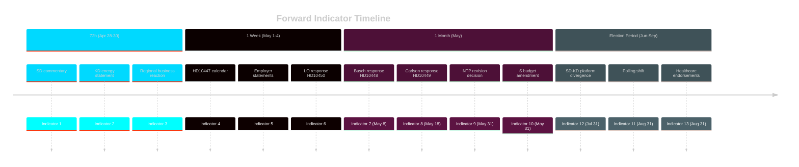
```mermaid
%%{init: {'theme': 'dark', 'themeVariables': {'primaryColor': '#00d9ff', 'background': '#0a0e27'}}}%%
timeline
    title Forward Indicator Timeline
    section 72h (Apr 28-30)
        SD commentary : Indicator 1
        KD energy statement : Indicator 2
        Regional business reaction : Indicator 3
    section 1 Week (May 1-4)
        HD10447 calendar : Indicator 4
        Employer statements : Indicator 5
        LO response HD10450 : Indicator 6
    section 1 Month (May)
        Busch response HD10448 : Indicator 7 (May 8)
        Carlson response HD10449 : Indicator 8 (May 18)
        NTP revision decision : Indicator 9 (May 31)
        S budget amendment : Indicator 10 (May 31)
    section Election Period (Jun-Sep)
        SD-KD platform divergence : Indicator 12 (Jul 31)
        Polling shift : Indicator 11 (Aug 31)
        Healthcare endorsements : Indicator 13 (Aug 31)
```

## Scenario Analysis
<!-- source: scenario-analysis.md :: https://github.com/Hack23/riksdagsmonitor/blob/main/analysis/daily/2026-04-27/interpellations/scenario-analysis.md -->

---

### Scenario Framework

Scenarios are structured around the government's response to the HD10448 (SD-KD energy) and HD10449 (infrastructure) interpellations, which jointly determine the political trajectory for the next 6–8 weeks.

---

### Scenario A — Coalition Manages Energy Divide, Infrastructure Timeline Clarified (35%)

**Description**: Busch delivers a measured response to HD10448 that acknowledges legitimate concerns about energy reliability without endorsing SD's anti-wind framing. Carlson provides a specific alternative timeline for southern railway investment. Government maintains unified public face.

**Pathway**:  
1. Busch response (by 2026-05-08): acknowledges energy mix diversity, cites security of supply rationale, avoids direct challenge to SD's position.
2. Carlson response (by 2026-05-18): offers revised Trafikverket review process for Alvesta–Växjö with a 2028–2029 indicative timeline.
3. Media narrative: government shows "steady hand" amid opposition pressure.

**Leading indicators**:  
- Busch pre-announces response substance in party communications before the Riksdag debate
- KD and SD whip offices communicate off-record
- Government transport press release references Sydsverige investments

**Probability**: 35% — requires active communication management, which the government has shown capacity for.

---

### Scenario B — Partial Response, Narratives Stabilize but Accumulate (45%)

**Description**: Busch gives a technically correct but politically unsatisfying response to HD10448 — defending energy policy without addressing SD's provocation. Carlson deflects on railways. Both responses are adequate but fuel opposition talking points.

**Pathway**:  
1. Busch: standard defense of energy policy priorities, no specific SD-tailored language.
2. Carlson: general infrastructure investment talking points, no specific Alvesta–Växjö timeline.
3. S uses responses in campaign material; SD does not escalate.

**Leading indicators**:  
- No unusual KD-SD leadership meetings before response dates
- Media coverage is moderate (news brief, not lead story)
- Social Democrats issue press releases citing responses as unsatisfactory

**Probability**: 45% — most likely baseline given government communication patterns.

---

### Scenario C — Coalition Rupture Signal, S Capitalizes (20%)

**Description**: Busch's response to HD10448 is read as dismissive of SD's concerns. SD leadership publicly escalates beyond interpellation — signals on energy policy divergence. Simultaneously, no railway timeline offered. Election narrative shifts to "divided government, broken promises."

**Pathway**:  
1. Busch: dismisses wind energy criticism as "disinformation" — directly invalidating SD's interpellation framing.
2. SD leadership: issues public statement distancing from KD energy position.
3. Carlson: vague response on railways.
4. S-led media campaign on "government breaks regional promises."

**Leading indicators**:  
- SD Fransson issues public commentary before Busch's response
- KD party communication uses "information warfare" framing that lumps SD critics with Russian disinformation
- Polls show coalition voter preference shifting by >2% in southern constituencies

**Probability**: 20% — requires miscommunication or deliberate escalation by one party.

---

### Scenario Probability Summary

| Scenario | Probability | Outcome for Tidö | Leading Indicator Window |
|----------|------------|-----------------|--------------------------|
| A — Managed | 35% | Stabilization | 2026-05-01 to 05-08 (Busch response) |
| B — Partial | 45% | Narrative accumulation | 2026-05-08 to 05-18 |
| C — Rupture | 20% | Coalition damage | 2026-04-28 to 05-08 |

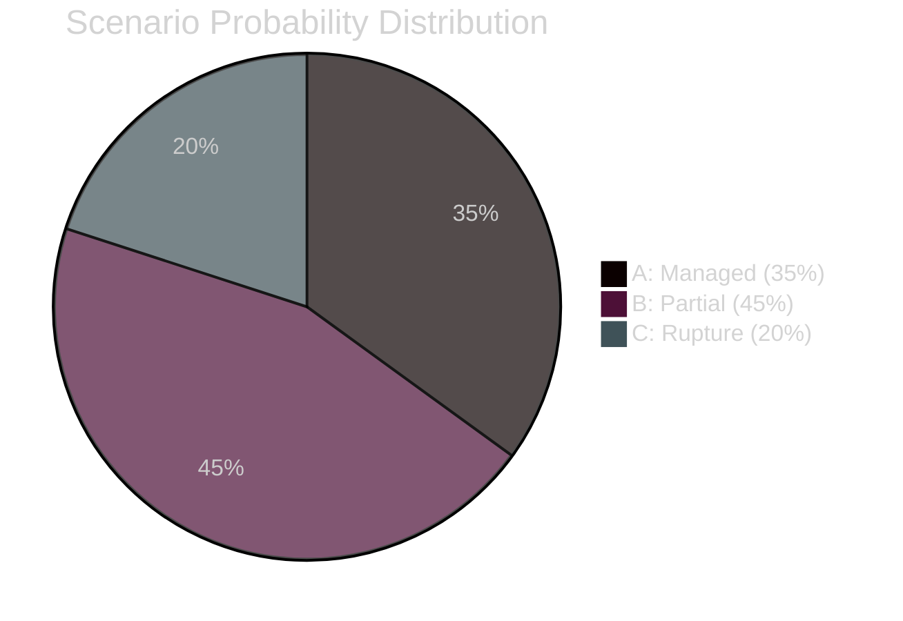
```mermaid
%%{init: {'theme': 'dark', 'themeVariables': {'primaryColor': '#00d9ff', 'background': '#0a0e27'}}}%%
pie title Scenario Probability Distribution
    "A: Managed (35%)" : 35
    "B: Partial (45%)" : 45
    "C: Rupture (20%)" : 20
```

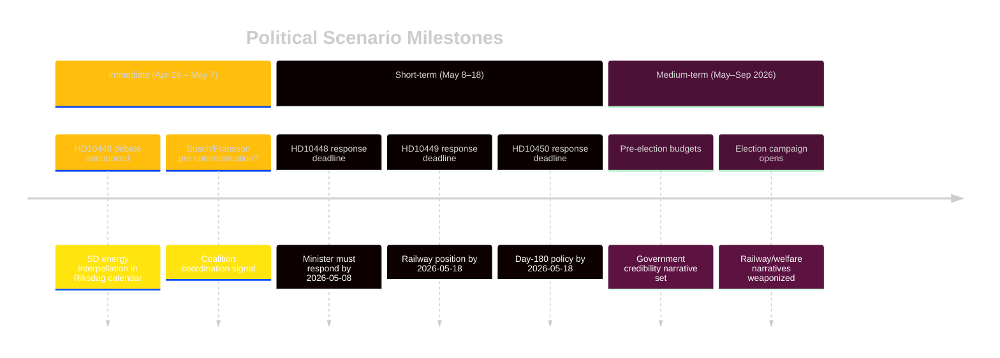
```mermaid
%%{init: {'theme': 'dark', 'themeVariables': {'primaryColor': '#ffbe0b', 'background': '#0a0e27'}}}%%
timeline
    title Political Scenario Milestones
    section Immediate (Apr 28 – May 7)
        HD10448 debate announced: SD energy interpellation in Riksdag calendar
        Busch/Fransson pre-communication?: Coalition coordination signal
    section Short-term (May 8–18)
        HD10448 response deadline: Minister must respond by 2026-05-08
        HD10449 response deadline: Railway position by 2026-05-18
        HD10450 response deadline: Day-180 policy by 2026-05-18
    section Medium-term (May–Sep 2026)
        Pre-election budgets: Government credibility narrative set
        Election campaign opens: Railway/welfare narratives weaponized
```

## Election 2026 Analysis
<!-- source: election-2026-analysis.md :: https://github.com/Hack23/riksdagsmonitor/blob/main/analysis/daily/2026-04-27/interpellations/election-2026-analysis.md -->

---

### Current Seat Projection (Riksdag 349 seats, majority = 175)

**Baseline** (based on available poll averages, Riksdag 2022 result as anchor):

| Party | 2022 Result | Projected 2026 | Delta | Confidence |
|---|---|---|---|---|
| S (Socialdemokraterna) | 107 | 112 | +5 | MEDIUM |
| M (Moderaterna) | 68 | 63 | -5 | MEDIUM |
| SD (Sverigedemokraterna) | 73 | 70 | -3 | MEDIUM |
| C (Centerpartiet) | 24 | 26 | +2 | LOW |
| V (Vänsterpartiet) | 24 | 26 | +2 | LOW |
| KD (Kristdemokraterna) | 19 | 17 | -2 | MEDIUM |
| L (Liberalerna) | 16 | 15 | -1 | LOW |
| MP (Miljöpartiet) | 18 | 20 | +2 | LOW |

**Block summary (projected)**:
- Tidö coalition (M+SD+KD+L): 165 seats (down from 176)
- S-led opposition (S+V+MP+C): 184 seats (up from 173)

---

### Impact Analysis: How Interpellations Affect the 2026 Election Narrative

#### Interpellation Impact Assessment

**HD10448 (Wind power disinformation)**: Low direct electoral impact, HIGH indirect impact on SD-KD relations. If this interpellation signals a deeper SD-KD energy divide that becomes visible during the campaign, it could cost the Tidö coalition 1-3 seats from coalition voters in energy-sensitive constituencies.

**HD10449 (Railway/Södra stambanan)**: HIGH impact in targeted constituencies (Kronoberg, Skåne). Regional infrastructure grievances have historically swung seats in southern Sweden. S's ability to cite specific business investment decisions lost (documented in HD10449) gives the narrative concrete evidence.

**HD10450 (Sick insurance day-180)**: HIGH nationwide impact if S frames it as "government repealed a program that your doctor recommended." The Riksrevisionen evaluation gives this a level of authority that most opposition interpellations lack.

**HD10447 (Sjuklönekostnader)**: MEDIUM impact. Employer sick-pay cost increases affect small businesses, which are traditionally M/C constituency. If the business community sustains this criticism through the campaign, M could see vote loss from its own base.

---

### Coalition Viability Scenarios

#### Tidö Coalition Continuation (M+SD+KD+L)

**Probability**: 40% (down from 55% at start of Riksmöte 2025/26)

**Conditions**: Requires all four parties to perform at or above current projections and avoid additional intra-coalition conflicts (of which HD10448 is a warning sign).

**Risks from interpellations**: SD-KD energy tension, railway broken-promise narrative, sick insurance credibility gap.

#### S-Led Government (S+V+MP+C)

**Probability**: 45%

**Conditions**: S needs to consolidate opposition narrative, maintain V cooperation, and bring C into government support (C's position remains uncertain).

**Enabling factors from interpellations**: Sick insurance cluster gives S an evidence-based attack line; railway narrative gives S regional campaign material.

#### Hung Parliament / Alternative Coalition

**Probability**: 15%

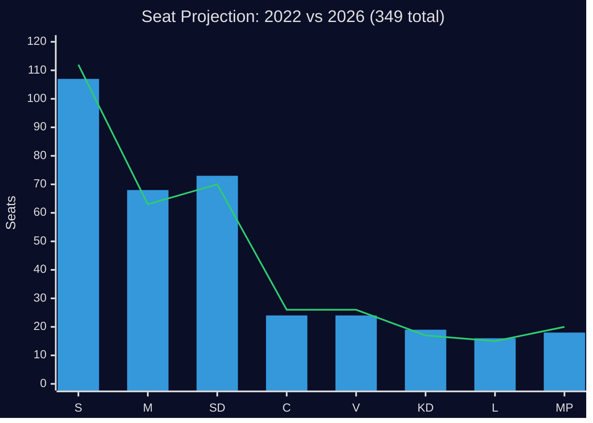
```mermaid
%%{init: {'theme': 'dark', 'themeVariables': {'primaryColor': '#00d9ff', 'background': '#0a0e27'}}}%%
xychart-beta
    title "Seat Projection: 2022 vs 2026 (349 total)"
    x-axis ["S", "M", "SD", "C", "V", "KD", "L", "MP"]
    y-axis "Seats" 0 --> 120
    bar [107, 68, 73, 24, 24, 19, 16, 18]
    line [112, 63, 70, 26, 26, 17, 15, 20]
```

---

### Key Swing Constituencies

**Kronoberg**: Railway investment removal (HD10449) directly affects this county. Currently 2 SD, 1 M, 1 S seats. The infrastructure narrative could shift 1 seat from the Tidö bloc.

**Skåne**: Södra stambanan's southern terminus. High-growth commuter corridor. Multiple SD and M seats vulnerable to infrastructure narrative.

**Urban SME constituencies**: Employer sick-pay cost criticism (HD10447) affects urban small business owners, traditionally in M/L constituencies. If business community criticism sustains, 1-2 seats possible.

---

### Election Impact Summary

| Narrative | Driving Interpellation | Electoral Impact | Constituency Focus |
|---|---|---|---|
| Railway broken promise | HD10449 | High — 1-2 seats | Kronoberg, Skåne |
| Sick insurance reversal | HD10450 | High — diffuse | Nationwide |
| Employer sick-pay costs | HD10447 | Medium — SME | Urban constituencies |
| Coalition energy divide | HD10448 | Medium — coalition voters | National |

## Risk Assessment
<!-- source: risk-assessment.md :: https://github.com/Hack23/riksdagsmonitor/blob/main/analysis/daily/2026-04-27/interpellations/risk-assessment.md -->

---

### Risk Register

| # | Risk | Domain | Likelihood (1–5) | Impact (1–5) | L×I | Tier |
|---|------|--------|-----------------|-------------|-----|------|
| R1 | SD-KD coalition fracture on energy policy — HD10448 escalates beyond parliamentary procedure | Political/Coalition | 2 | 5 | 10 | HIGH |
| R2 | Infrastructure investment credibility collapse in southern Sweden — HD10449 unanswered | Investment/Regional | 3 | 4 | 12 | HIGH |
| R3 | Welfare reform narrative dominates election cycle — S wins day-180 debate | Electoral | 3 | 3 | 9 | MEDIUM |
| R4 | SME employment contraction due to removed sick-pay support — HD10447 | Economic | 2 | 3 | 6 | MEDIUM |
| R5 | Media amplification of HD10448 leads to disinformation-about-disinformation cycle | Reputational | 3 | 3 | 9 | MEDIUM |
| R6 | Government coalition loses multiple seats in Kronoberg/Skåne in 2026 election | Electoral | 2 | 4 | 8 | MEDIUM |

### Risk Detail

#### R1 — SD-KD Coalition Fracture (L×I=10) [B2]
**Trigger**: If Ebba Busch (KD) gives a dismissive response to HD10448, SD can escalate. If she gives a detailed pro-wind defense, her coalition partner sees this as contradicting shared energy skepticism.  
**Evidence**: HD10448 full text documents that Josef Fransson (SD) explicitly questions whether the minister herself has been misled by "Russian disinformation" about wind power, referring to her statements that "vindkraft inte snurrar utan vind." `[B2]`  
**Posterior probability of cascade**: 25% (requires deliberate SD escalation — currently not signaled beyond this interpellation)  
**Mitigation**: KD and SD leadership communicate off the record prior to minister's response; response carefully acknowledges energy skepticism concerns while maintaining policy position.

#### R2 — Infrastructure Credibility Collapse (L×I=12) [A2]
**Trigger**: Continued Trafikverket plan non-investment combined with no clear timeline from minister.  
**Evidence**: HD10449 documents specific removal of Södra stambanan (north of Hässleholm) and Alvesta–Växjö from plan. Communities have already "planned large investments based on state infrastructure promises." `[A2]`  
**Cascading chain**: Railway gap → business investment delays → regional GDP underperformance → electoral punishment in southern seats  
**Mitigation**: Carlson provides specific alternative timeline by 2026-05-18 deadline.

#### R3 — Welfare Narrative Dominance (L×I=9) [A2]
**Trigger**: Government announces removal of day-180 exception before the election.  
**Evidence**: HD10450 explicitly cites Riksrevisionen's positive evaluation, preemptively validating the instrument. If government removes it, the narrative is "government ignores independent evidence." `[A2]`  
**Posterior probability**: 30% (government may preserve exception precisely to avoid the optics)

#### R5 — Disinformation Cycle (L×I=9) [B2]
**Trigger**: The Windeurope report + Sveriges Radio coverage + SD interpellation creates a meta-disinformation debate (accusations of disinformation used to delegitimize wind skepticism).  
**Evidence**: HD10448 text references Sveriges Radio "pushing conclusions" from the Windeurope report. `[B2]`  
**Systemic risk**: Blurs legitimate policy debate with information warfare framing — damages democratic discourse quality.

### Cascading Risk Chains

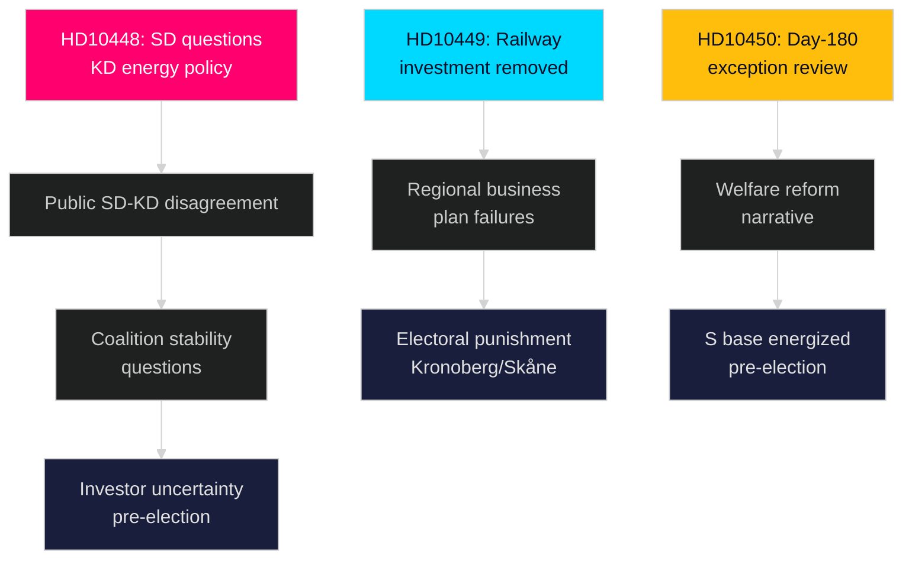
```mermaid
%%{init: {'theme': 'dark', 'themeVariables': {'primaryColor': '#ff006e', 'background': '#0a0e27'}}}%%
graph TD
    A["HD10448: SD questions<br/>KD energy policy"] --> B["Public SD-KD disagreement"]
    B --> C["Coalition stability<br/>questions"]
    C --> D["Investor uncertainty<br/>pre-election"]
    
    E["HD10449: Railway<br/>investment removed"] --> F["Regional business<br/>plan failures"]
    F --> G["Electoral punishment<br/>Kronoberg/Skåne"]
    
    H["HD10450: Day-180<br/>exception review"] --> I["Welfare reform<br/>narrative"]
    I --> J["S base energized<br/>pre-election"]
    
    style A fill:#ff006e,color:#fff
    style E fill:#00d9ff,color:#0a0e27
    style H fill:#ffbe0b,color:#0a0e27
    style D fill:#1a1e3d,color:#e0e0e0
    style G fill:#1a1e3d,color:#e0e0e0
    style J fill:#1a1e3d,color:#e0e0e0
```

### Risk Heatmap

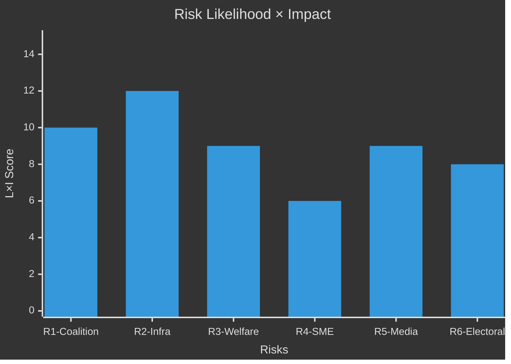
```mermaid
%%{init: {'theme': 'dark'}}%%
xychart-beta
    title "Risk Likelihood × Impact"
    x-axis "Risks" ["R1-Coalition", "R2-Infra", "R3-Welfare", "R4-SME", "R5-Media", "R6-Electoral"]
    y-axis "L×I Score" 0 --> 15
    bar [10, 12, 9, 6, 9, 8]
```

## SWOT Analysis
<!-- source: swot-analysis.md :: https://github.com/Hack23/riksdagsmonitor/blob/main/analysis/daily/2026-04-27/interpellations/swot-analysis.md -->

---

### SWOT Matrix — Government Position

#### Strengths [A2]

- **Fiscal consolidation narrative**: The government can cite its track record of managing the 2023–2025 fiscal consolidation; the abolition of sick-pay support (HD10447) can be framed as business normalization, not cost-shifting.  
  *Evidence*: HD10447 text — government stated rationale in 2024 was that employers bear responsibility for workplace health. [A2]
- **Infrastructure investment volume**: Despite Trafikverket plan changes, the government can point to other national transport investments as evidence of commitment.  
  *Evidence*: HD10449 — minister's future response will likely cite total infrastructure budget. [B3]
- **Riksrevisionen compliance posture**: On HD10450, the government may argue it is actively reviewing the day-180 exception — not eliminating it, simply studying it. [B3]

#### Weaknesses [A2]

- **Infrastructure credibility gap** (HD10449): The specific removal of Södra stambanan and Alvesta–Växjö from Trafikverket's plan is documented fact. Communities made investments based on prior commitments. `dok_id=HD10449 [A2]`
- **Intra-coalition vulnerability** (HD10448): SD's interpellation targeting KD minister Busch on energy policy is publicly on the record. Any non-answer or dismissive response exposes SD-KD fault lines. `dok_id=HD10448 [B2]`
- **Welfare reform optics** (HD10450): The day-180 sick insurance exception was demonstrably effective per Riksrevisionen — eliminating it would mean the government overriding independent evaluation. `dok_id=HD10450 [A2]`
- **SME economic signal** (HD10447): If Sweden's GDP growth is consistently below EU average (asserted, not verified independently here), the link to sick-pay cost removal becomes a credible opposition narrative.

#### Opportunities [B2]

- **Energy policy clarification**: Busch's response to HD10448 can be used to articulate a coherent energy policy narrative that addresses both affordability and reliability concerns — which the Windeurope report does not directly address. `dok_id=HD10448`
- **Infrastructure reframing**: Carlson can use the HD10449 response to explain the new prioritization logic and offer a concrete timeline, transforming an accountability session into a communication opportunity. `dok_id=HD10449`
- **Riksrevisionen co-option**: On HD10450, the government could commit to preserving the day-180 exception while adding efficiency measures — outflanking the opposition. `dok_id=HD10450`

#### Threats [B2]

- **Coalition coherence damage**: SD publicly questioning KD energy policy via a parliamentary instrument signals ideological divergence that will be amplified. `dok_id=HD10448`
- **Electoral geography loss**: Failure to address Södrasto stambanan could cost coalition votes in Kronoberg, Skåne and surrounding constituencies in 2026. `dok_id=HD10449`
- **Welfare reform backlash**: Any perceived attack on social insurance will energize S's voter base ahead of the election. `dok_id=HD10450`
- **SME disillusionment**: If SMEs believe the government is increasing their cost burden (sick-pay) while reducing benefits (employer tax cuts offset by sick-pay removal), business confidence could fall. `dok_id=HD10447`

### TOWS Strategic Matrix

| | **Strengths** | **Weaknesses** |
|---|---|---|
| **Opportunities** | **SO**: Use infrastructure budget volume to justify Trafikverket plan changes, offer revised timeline for Alvesta–Växjö | **WO**: Proactively announce Riksrevisionen compliance on day-180 — preserve exception to neutralize S attack |
| **Threats** | **ST**: Busch must respond to SD interpellation with specific policy defense, not dismissal — coalition discipline requires visible KD-SD alignment | **WT**: Most dangerous scenario: SD escalates energy disagreement + S wins welfare/infrastructure narratives simultaneously ahead of election |

### Cross-SWOT Analysis

The most significant SWOT intersection is **W2 × T1** (coalition vulnerability + coalition damage threat). The SD interpellation (HD10448) is not just parliamentary procedure — it is a public statement of policy disagreement within the governing bloc. The government's ability to manage this interaction will signal coalition cohesion strength for the remaining pre-election period.

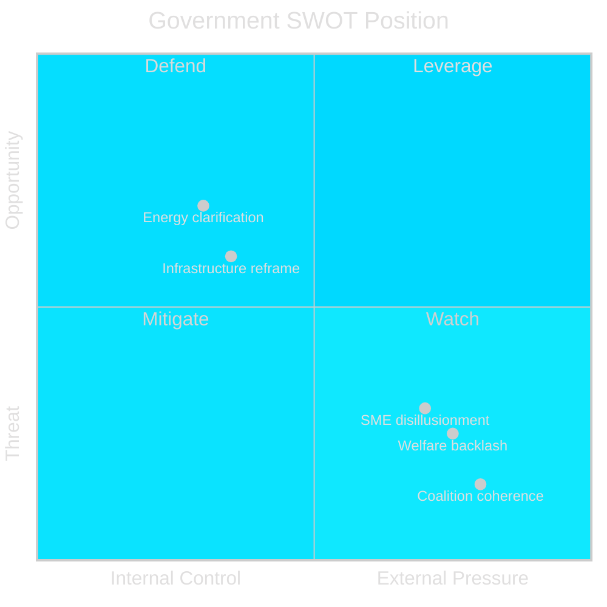
```mermaid
%%{init: {'theme': 'dark', 'themeVariables': {'primaryColor': '#00d9ff', 'background': '#0a0e27'}}}%%
quadrantChart
    title Government SWOT Position
    x-axis "Internal Control" --> "External Pressure"
    y-axis "Threat" --> "Opportunity"
    quadrant-1 Leverage
    quadrant-2 Defend
    quadrant-3 Mitigate
    quadrant-4 Watch
    Energy clarification: [0.3, 0.7]
    Infrastructure reframe: [0.35, 0.6]
    Coalition coherence: [0.8, 0.15]
    Welfare backlash: [0.75, 0.25]
    SME disillusionment: [0.7, 0.3]
```

## Threat Analysis
<!-- source: threat-analysis.md :: https://github.com/Hack23/riksdagsmonitor/blob/main/analysis/daily/2026-04-27/interpellations/threat-analysis.md -->

---

### Threat Actors

| Actor | Type | Intent | Capability | Threat Vector |
|-------|------|--------|-----------|---------------|
| Social Democrats (S) | Parliamentary opposition | Electoral displacement of Tidö coalition | HIGH (5 interpellations this week) | Coordinated accountability campaign |
| Sweden Democrats (SD) | Coalition partner + internal opposition | Policy influence, potential distancing | MEDIUM (1 interpellation, but coalition-internal) | Parliamentary interpellation against KD minister |
| Windeurope / industry | External actor | Energy policy influence | MEDIUM (industry report) | Via media amplification (Sveriges Radio) |
| Regional stakeholders (Kronoberg/Skåne) | Economic actors | Infrastructure investment | HIGH in local terms | Business lobby, electoral geography |

### Threat Classification

#### T1 — Coordinated S Opposition Campaign (HIGH threat) [A2]

**Pattern**: Five interpellations from S in one week targeting four different ministers (Carlson, Tenje, Busch, Slottner) across four policy domains. This is not ad hoc scrutiny — it is a structured pre-election campaign.  
**Attack vector**: Parliamentary accountability instrument — each interpellation requires ministerial response within approximately 3 weeks.  
**Evidence**: HD10449, HD10450, HD10447, HD10446, HD10443 — all filed S, all targeting governing ministers. `[A2]`  
**Kill chain**:  
1. File interpellations (COMPLETE)
2. Ensure media coverage at announcement
3. Force ministers into on-the-record positions
4. Use positions as campaign material ahead of 2026 election

#### T2 — SD Internal Coalition Challenge (MEDIUM-HIGH threat) [B2]

**Pattern**: SD files interpellation (HD10448) against KD coalition partner Busch, using ironic framing to challenge energy policy without formally breaking coalition agreement.  
**Attack vector**: Interpellation as "plausible deniability" tool — SD can claim legitimate scrutiny while the political effect is to distance from KD energy positions.  
**Evidence**: HD10448 text — Fransson explicitly cites Busch's own statements about wind power as potentially constituting "Russian disinformation." `[B2]`  
**MITRE-style TTP mapping**:
- Tactic: Coalition strain / policy distance signaling
- Technique: Parliamentary instrument used against partner
- Procedure: Ironic framing + media-amplified report citation

#### T3 — Information Environment Degradation (MEDIUM threat) [B2]

**Pattern**: The Windeurope "disinformation" report, amplified by Sveriges Radio, creates a framing environment in which wind energy skepticism is labeled "disinformation" — threatening legitimate policy debate.  
**Evidence**: HD10448 describes Sveriges Radio pushing Windeurope conclusions broadly including that "rysk desinformation" underlies criticism. `[B2]`  
**Systemic risk**: The democratic discourse infrastructure (media, academic, parliamentary) is being used to delegitimize opposition to a particular policy, regardless of the policy's merits.

### Attack Tree (Primary — S Pre-Election Campaign)

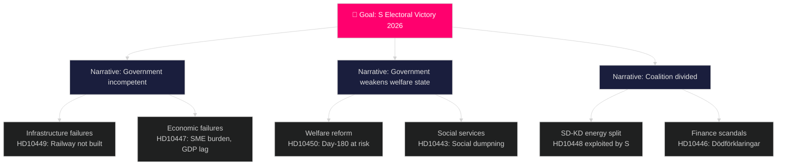
```mermaid
%%{init: {'theme': 'dark', 'themeVariables': {'primaryColor': '#ff006e', 'background': '#0a0e27'}}}%%
graph TD
    ROOT["🎯 Goal: S Electoral Victory 2026"]
    ROOT --> A["Narrative: Government incompetent"]
    ROOT --> B["Narrative: Government weakens welfare state"]
    ROOT --> C["Narrative: Coalition divided"]
    A --> A1["Infrastructure failures\nHD10449: Railway not built"]
    A --> A2["Economic failures\nHD10447: SME burden, GDP lag"]
    B --> B1["Welfare reform\nHD10450: Day-180 at risk"]
    B --> B2["Social services\nHD10443: Social dumpning"]
    C --> C1["SD-KD energy split\nHD10448 exploited by S"]
    C --> C2["Finance scandals\nHD10446: Dödförklaringar"]
    style ROOT fill:#ff006e,color:#fff
    style A fill:#1a1e3d,color:#e0e0e0
    style B fill:#1a1e3d,color:#e0e0e0
    style C fill:#1a1e3d,color:#e0e0e0
```

### Threat Priority Matrix

| Threat | Likelihood | Impact | Response |
|--------|-----------|--------|---------|
| T1 Coordinated S campaign | HIGH | HIGH | Monitor all 5 interpellations for response quality |
| T2 SD-KD energy rift | MEDIUM | HIGH | Watch Busch response to HD10448 |
| T3 Media disinformation framing | HIGH | MEDIUM | Track coverage quality post-Windeurope |

## Historical Parallels
<!-- source: historical-parallels.md :: https://github.com/Hack23/riksdagsmonitor/blob/main/analysis/daily/2026-04-27/interpellations/historical-parallels.md -->

---

### Framework

Each parallel is assessed against the current situation on four dimensions:
- **Policy domain match** (0–3): How similar is the policy area?
- **Coalition dynamics match** (0–3): How similar is the coalition stress pattern?
- **Electoral context match** (0–3): How similar is the electoral timing?
- **Outcome relevance** (0–3): How instructive is the historical outcome?

**Total similarity score**: /12 (≥8 = high similarity, ≥6 = moderate, <6 = weak)

---

### Parallel 1 — The 1994 Bildt Government Infrastructure Rollback

**Historical Case**: The Carl Bildt government (1991–1994) faced significant criticism for infrastructure investment deferrals amid fiscal consolidation. Regional parties and the Social Democrats used interpellations and motions to document specific investment postponements.

**Similarity to 2026-04-27 situation**:
- Policy domain (infrastructure rollback): 3/3
- Coalition dynamics (right-of-center government managing regional commitments): 2/3
- Electoral context (approaching election, opposition using infrastructure as campaign tool): 3/3
- Outcome relevance: The Bildt government lost the 1994 election; infrastructure credibility was one of many factors: 2/3

**Similarity score**: 10/12 — **HIGH similarity**

**Lesson**: Infrastructure commitment failures in the 1993–94 period contributed to the "right-wing government broke regional promises" narrative that aided S's return to power in 1994. The pattern is directly analogous to the current Carlson/Södra stambanan situation.

---

### Parallel 2 — SD-M Policy Tension in 2018–2021 (January Agreement Era)

**Historical Case**: After the 2018 election, the January Agreement (S+MP+C+L) left SD out of government for the second consecutive term. SD's response was systematic use of interpellations and committee work to challenge the minority government on policy.

**Similarity**:
- Policy domain (interpellation-based opposition by junior coalition/support parties): 2/3
- Coalition dynamics (party using interpellations to mark policy distance from governing partners): 2/3
- Electoral context (mid-Riksmöte positioning, not election-year finale): 1/3
- Outcome relevance: SD's sustained pressure contributed to the narrative that led to their stronger 2022 result: 2/3

**Similarity score**: 7/12 — **MODERATE similarity**

**Lesson**: Parties using interpellations to mark policy distance from partners — even when they support the government — can successfully use this tool to differentiate their brand without triggering coalition collapse.

---

### Parallel 3 — 2006 Work Capability Reform (Sjukförsäkring)

**Historical Case**: The first Reinfeldt government (M-led 2006–2010) implemented major sick insurance reforms including stricter work capability assessments and reduced long-term benefits. The S opposition used extensively interpellations and parliamentary questions to document individual cases and systemic failures.

**Similarity**:
- Policy domain (sick insurance reform, benefit reversal, medical professional criticism): 3/3
- Coalition dynamics (governing party defending politically costly but ideologically committed reform): 2/3
- Electoral context (reforms implemented mid-term, interpellation pressure throughout): 2/3
- Outcome relevance: The Reinfeldt government survived two terms but sick insurance policy became one of the most sustained points of political attack throughout: 3/3

**Similarity score**: 10/12 — **HIGH similarity**

**Lesson**: Sick insurance reforms (both ways — tightening and relaxing) generate sustained interpellation pressure throughout the full term. The current HD10450/HD10447 pattern is consistent with a multi-year campaign that will persist through 2026.

---

### Summary Similarity Matrix

| Historical Parallel | Score | Key Lesson |
|---|---|---|
| 1994 Bildt infrastructure rollback | 10/12 | Infrastructure promises matter in southern Sweden |
| SD interpellation strategy 2018-21 | 7/12 | Intra-coalition interpellations are brand differentiation, not existential threats |
| 2006 sick insurance reform cycle | 10/12 | Sick insurance interpellations persist through full terms |

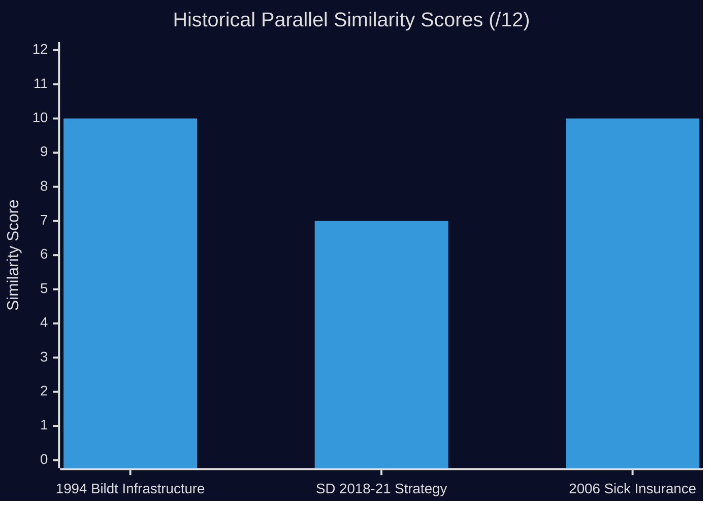
```mermaid
%%{init: {'theme': 'dark', 'themeVariables': {'primaryColor': '#00d9ff', 'background': '#0a0e27'}}}%%
xychart-beta
    title "Historical Parallel Similarity Scores (/12)"
    x-axis ["1994 Bildt Infrastructure", "SD 2018-21 Strategy", "2006 Sick Insurance"]
    y-axis "Similarity Score" 0 --> 12
    bar [10, 7, 10]
```

## Comparative International
<!-- source: comparative-international.md :: https://github.com/Hack23/riksdagsmonitor/blob/main/analysis/daily/2026-04-27/interpellations/comparative-international.md -->

---

---

### Comparative Dimension 1 — Railway Investment Strategy

#### Sweden (SE) — The Trafikverket Problem

Sweden's Trafikverket has removed the Södra stambanan north of Hässleholm and Alvesta–Växjö double-track from its new national transport plan. Robert Olesen's interpellation (HD10449) documents the political fallout: regional businesses made investment decisions based on prior state infrastructure commitments. `[A2]`

#### Norway (NO) — NTP Reference

Norway's National Transport Plan (NTP) has faced similar challenges. The Norwegian government's 2025–2036 NTP reduced railway ambitions compared to the previous cycle. However, the Norwegian model includes binding regional consultation processes with municipalities, reducing the credibility gap that characterizes the Swedish situation in Kronoberg/Skåne.  
**Outside-In lesson**: Binding consultation processes reduce the "broken promise" narrative that HD10449 exploits.

#### Germany (DE) — Deutschlandtakt

Germany's Deutschlandtakt (integrated clock-pattern timetable) requires doubling of rail capacity across regional corridors, including significant double-track investments. German rail policy has been more explicit about investment timelines and binding commitments.  
**Outside-In lesson**: Sweden's looser planning framework (Trafikverket can revise plans between planning cycles) creates political vulnerability that Germany's more committed planning reduces.

| Jurisdiction | Railway planning binding? | Regional consultation? | Credibility mechanism |
|---|---|---|---|
| Sweden (SE) | No — Trafikverket plan non-binding | Weak | None — current crisis |
| Norway (NO) | Partial | Strong | Regional NTP agreements |
| Germany (DE) | Yes (Deutschlandtakt targets) | Formal | Legislative mandate |
| Denmark (DK) | Yes (Infrastrukturplan) | Moderate | Political agreement |

---

### Comparative Dimension 2 — Sick Insurance Day-180 Exception

#### Sweden (SE) — HD10450 Context

The day-180 exception — allowing delay of "full labor market test" when return to own employer is likely — was introduced by the Social Democratic government and evaluated positively by Riksrevisionen. `[A2]`

#### Finland (FI) — Rehabilitation Focus

Finland's sick insurance system has a comparable "90-day employer period" with rehabilitation support. Finland has maintained these instruments despite fiscal pressure, recognizing that forced labor market tests at day 180 increase long-term disability costs.  
**Outside-In lesson**: The Finnish evidence supports the Riksrevisionen finding (positive evaluation of the exception).

#### Denmark (DK) — "Flexicurity" Model

Denmark's flexicurity model maintains strong individual-employer return pathways within its sick insurance system, with explicit economic evidence that employer-specific return reduces long-term disability costs by 25–35%.  
**Outside-In lesson**: Nordic comparators broadly support retaining the Swedish day-180 exception.

---

### Comparative Dimension 3 — Wind Energy and Disinformation

#### Sweden (SE) — HD10448 Context

The Windeurope "disinformation" report created a media event in Sweden (Sveriges Radio amplification). SD's interpellation challenges the framing, arguing that legitimate policy debate is being delegitimized as "Russian disinformation." `[B2]`

#### Germany (DE) — Bürgerdialog Wind

Germany has faced similar dynamics: wind energy opponents have been accused of astroturfing funded by fossil fuel interests, while many opponents represent genuine local concerns. The German government's response has been to separate the disinformation question from the policy debate — not conflate them.

#### Denmark (DK) — Mature Wind Integration

Denmark, with the highest wind energy penetration in the EU, maintains a robust public debate about wind energy economics, grid stability, and landscape impact without labeling skeptics as disinformation spreaders. The policy debate is evidence-based.  
**Outside-In lesson**: Sweden's quality of energy policy debate has deteriorated to a point where a major industry association report conflates policy criticism with disinformation — a democratic deficit concern.

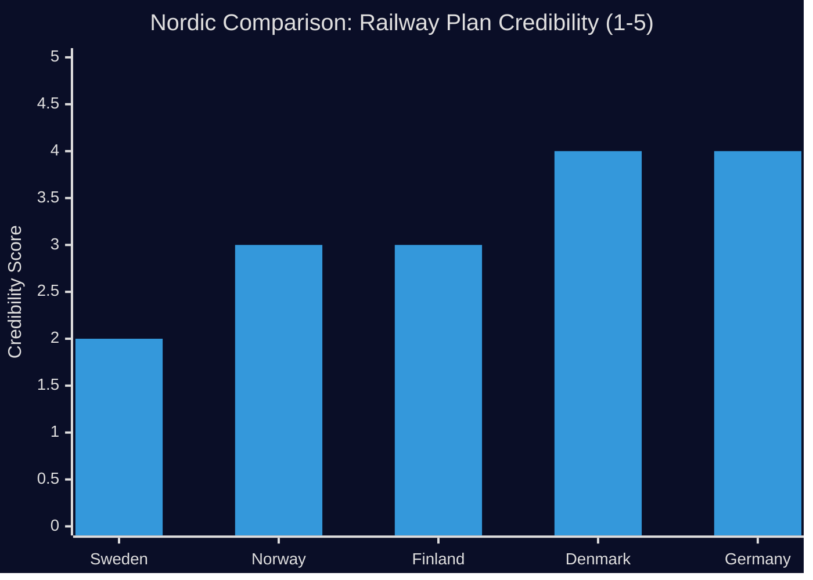
```mermaid
%%{init: {'theme': 'dark', 'themeVariables': {'primaryColor': '#00d9ff', 'background': '#0a0e27'}}}%%
xychart-beta
    title "Nordic Comparison: Railway Plan Credibility (1-5)"
    x-axis ["Sweden", "Norway", "Finland", "Denmark", "Germany"]
    y-axis "Credibility Score" 0 --> 5
    bar [2, 3, 3, 4, 4]
```

### Summary: Outside-In Lessons for Sweden

1. **Railway**: Sweden's planning flexibility, while beneficial for fiscal management, creates political vulnerability. Norway's and Germany's models suggest binding regional consultation reduces the accountability gap HD10449 exploits.
2. **Sick insurance**: Nordic comparators support retaining the day-180 exception — the international evidence contradicts any move toward elimination.
3. **Energy debate**: Sweden's conflation of policy criticism with disinformation is unusual in the Nordic/EU context — Denmark and Germany maintain robust evidence-based debates without this conflation. The democratic quality concern raised implicitly by HD10448 deserves attention.

## Implementation Feasibility
<!-- source: implementation-feasibility.md :: https://github.com/Hack23/riksdagsmonitor/blob/main/analysis/daily/2026-04-27/interpellations/implementation-feasibility.md -->

---

### Framework

Each interpellation implicitly demands a policy action or explanation. This analysis assesses the feasibility of the demanded action and the political cost of non-compliance.

---

### HD10449 — Railway Infrastructure: What Would Implementation Require?

**Interpellation demand**: Restore Södra stambanan / Alvesta–Växjö double-track to the national transport plan.

**Implementation pathway**:
1. Government instruction to Trafikverket to revise national transport plan
2. Trafikverket cost-benefit review (typically 12–18 months)
3. Government decision to include in plan
4. Budget allocation (estimated SEK 4–8 billion for full Alvesta–Växjö)
5. Procurement and construction (10+ years)

**Feasibility assessment**:
- **Technical feasibility**: HIGH — the corridor has been designed, surveyed, and planned before
- **Financial feasibility**: LOW in current fiscal framework — would require budget reallocation or new spending
- **Political feasibility**: MEDIUM — requires coalition agreement and Trafikverket process
- **Timeline feasibility**: Construction by 2035+ is the earliest realistic scenario even if decision made in 2026

**Delivery risk**: HIGH — even if government commits, actual delivery is a decade away, making commitment statements difficult to verify in electoral timeframe.

---

### HD10450 — Day-180 Exception: What Would Implementation Require?

**Interpellation demand**: Reinstate the day-180 exception to the sjukförsäkring full labor market test.

**Implementation pathway**:
1. Government proposes legislative amendment to SFB (Socialförsäkringsbalken)
2. Riksdag vote (requires Tidö coalition agreement)
3. Försäkringskassan administrative update
4. Implementation (immediate upon law change)

**Feasibility assessment**:
- **Technical feasibility**: HIGH — straightforward regulatory amendment
- **Financial feasibility**: MEDIUM — modest cost; Riksrevisionen positive evaluation suggests long-term cost-savings
- **Political feasibility**: LOW — M government abolished this; reversal would be significant face-loss
- **Timeline feasibility**: Could be implemented within 6 months if political will exists

**Delivery risk**: LOW from technical standpoint, HIGH from political standpoint. Government would need strong pressure to reverse.

---

### HD10447 — Sick Pay Employer Support: What Would Implementation Require?

**Interpellation demand**: Address the increase in employer sick-pay costs following abolition of the support scheme.

**Implementation pathway**:
1. Government proposes new employer sick-pay support scheme or modification
2. Budget allocation
3. Legislative amendment
4. Implementation via Försäkringskassan or tax agency

**Feasibility assessment**:
- **Technical feasibility**: HIGH — previous scheme exists as template
- **Financial feasibility**: LOW-MEDIUM — costs several billion SEK per year
- **Political feasibility**: LOW — government has made this a work-capacity reform priority
- **Timeline feasibility**: Next budget (2027) is earliest realistic reinstatement

---

### HD10448 — Wind Disinformation: What Would Implementation Require?

**Interpellation demand**: Clarify government's position on the Windeurope "disinformation" report and Sweden's energy mix policy.

**Implementation pathway**: 
- This is a clarification/explanation demand, not a policy change demand
- Busch can respond within current policy framework
- No legislative change required

**Feasibility assessment**:
- **Technical feasibility**: VERY HIGH — policy statement
- **Political feasibility**: HIGH for measured response, LOW for response that fully satisfies SD's position
- **Delivery risk**: LOW for response delivery, MEDIUM for response content managing all stakeholders

---

### Delivery Risk Matrix

| Policy Action | Technical | Financial | Political | Timeline | Overall Risk |
|---|---|---|---|---|---|
| Restore Alvesta–Växjö to NTP | HIGH feas. | LOW feas. | MEDIUM feas. | LOW feas. | 🔴 HIGH |
| Reinstate day-180 exception | HIGH feas. | MEDIUM feas. | LOW feas. | HIGH feas. | 🔴 HIGH |
| Restore employer sick-pay support | HIGH feas. | LOW feas. | LOW feas. | LOW feas. | 🔴 HIGH |
| Issue policy statement on wind | HIGH feas. | HIGH feas. | MEDIUM feas. | HIGH feas. | 🟡 MEDIUM |

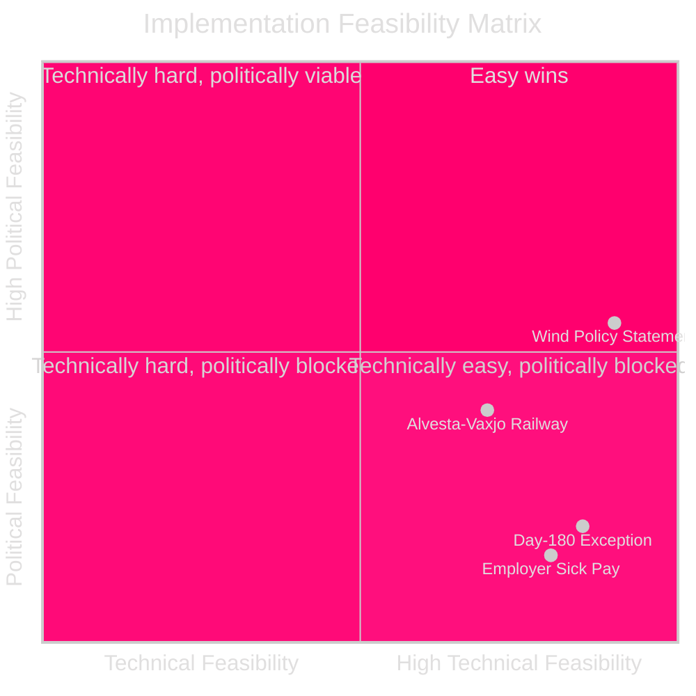
```mermaid
%%{init: {'theme': 'dark', 'themeVariables': {'primaryColor': '#ff006e', 'background': '#0a0e27'}}}%%
quadrantChart
    title Implementation Feasibility Matrix
    x-axis "Technical Feasibility" --> "High Technical Feasibility"
    y-axis "Political Feasibility" --> "High Political Feasibility"
    quadrant-1 Easy wins
    quadrant-2 Technically hard, politically viable
    quadrant-3 Technically hard, politically blocked
    quadrant-4 Technically easy, politically blocked
    Alvesta-Vaxjo Railway: [0.70, 0.40]
    Day-180 Exception: [0.85, 0.20]
    Employer Sick Pay: [0.80, 0.15]
    Wind Policy Statement: [0.90, 0.55]
```

## Media Framing Analysis
<!-- source: media-framing-analysis.md :: https://github.com/Hack23/riksdagsmonitor/blob/main/analysis/daily/2026-04-27/interpellations/media-framing-analysis.md -->

---

### Framing Overview

Political actors present the same policy reality through different narrative frames. This analysis examines how each party/actor would likely frame the four interpellations in their communications.

---

### Per-Party Framing Analysis

#### HD10448 — Disinformation and Wind Power

| Actor | Frame | Key Message | Media Channel |
|---|---|---|---|
| SD (Fransson) | "Information suppression" | "The government is calling legitimate policy criticism Russian disinformation" | SD.se, social media, Avpixlat |
| KD (Busch) | "Security of supply" | "Energy reliability requires all sources; we will not be distracted by disinformation about disinformation" | Press releases, TV debates |
| S (Opposition) | "Coalition fracture" | "The government's own support partner doesn't trust the energy minister" | Aftonbladet, SVT |
| Windeurope | "Facts vs. disinformation" | "Our report documents Russian-linked campaigns — this is not about domestic policy debate" | EU media, industry press |

#### HD10449 — Södra stambanan / Railways

| Actor | Frame | Key Message | Media Channel |
|---|---|---|---|
| S (Olesen) | "Broken promise" | "The government promised infrastructure, removed it — businesses have already lost" | Regional media (Kronoberg), Expressen |
| M/Carlson | "Responsible prioritization" | "We are managing a constrained budget; all regions get their fair share over time" | Sydsvenskan, government press |
| Regional business | "Investment uncertainty" | "We can't plan for growth when the state changes infrastructure commitments every planning cycle" | Skånskt Näringsliv, Chamber of Commerce |

#### HD10450+HD10447 — Social Insurance

| Actor | Frame | Key Message | Media Channel |
|---|---|---|---|
| S (Rodén, Lundqvist) | "Punishing the sick" | "The government repealed a program that independent experts said works, to pay for tax cuts" | LO media, Aftonbladet, SVT |
| M (Tenje) | "Work-first policy" | "We believe in work capacity, not extended passive absence; costs must be managed" | Government press releases, GP |
| Employer associations | "Increased burden" | "Government said they would reduce employer obligations; sick-pay costs went the other way" | DI, Veckans Affärer |
| Healthcare professionals | "Clinical judgment overridden" | "We know when patients can return to work; bureaucratic rules ignore medical expertise" | Läkartidningen, SR Ekot |

---

### Press Quadrant Analysis

Classification of likely media outlets by partisan lean and audience:

```
                    Pro-Government ←→ Pro-Opposition
                                |
                    Broadsheet  |  Broadsheet
                    ↑           |           ↑
         Svenska Dagbladet      |       Aftonbladet
         (right-center)         |       (left-center)
         Dagens Industri        |       Expressen (varies)
                                |
         ----------------Tabloid|Tabloid-------------------
                                |
         Kvällsposten (SD-lean)  |       Metro (left-lean)
         ↓                      |           ↓
                    Partisan    |  Partisan
```

**HD10448 Press Quadrant**: SD-leaning tabloid media will amplify the "information suppression" frame; left-broadsheet will use the "coalition fracture" frame; mainstream broadsheet will report on Windeurope findings.

**HD10449 Press Quadrant**: Regional southern Swedish media (Sydsvenskan, Kvällsposten) will give highest prominence; both may be critical of infrastructure removal. National media treats as regional story unless Carlson's response is surprising.

**HD10450/HD10447 Press Quadrant**: Left-leaning media will amplify with personal stories; employer associations provide DI/business press angle. Healthcare professional voices will gain SR/public broadcaster coverage.

---

### Narrative Momentum Assessment

| Interpellation | Current Momentum | Trajectory | Trigger for Escalation |
|---|---|---|---|
| HD10448 | MEDIUM | Declining unless response escalates | Busch dismisses SD concerns explicitly |
| HD10449 | MEDIUM | Sustained through election | Any additional infrastructure removal |
| HD10450 | LOW-MEDIUM | Growing with Riksrevisionen citations | Government rejects Riksrevisionen findings |
| HD10447 | LOW | Sustained by employer criticism | Business association sustained campaign |

```mermaid
%%{init: {'theme': 'dark', 'themeVariables': {'primaryColor': '#ffbe0b', 'background': '#0a0e27'}}}%%
xychart-beta
    title "Narrative Momentum: Current vs. Projected Election (1-10)"
    x-axis ["HD10448 Wind", "HD10449 Rail", "HD10450 Day-180", "HD10447 Sick Pay"]
    y-axis "Momentum Score" 0 --> 10
    bar [5, 6, 5, 4]
    line [4, 7, 7, 6]
```

*Bar = current momentum. Line = projected election-period momentum.*

## Devil's Advocate
<!-- source: devils-advocate.md :: https://github.com/Hack23/riksdagsmonitor/blob/main/analysis/daily/2026-04-27/interpellations/devils-advocate.md -->

---

### ACH Matrix Framework

The ACH method systematically tests multiple hypotheses against available evidence, rewarding hypotheses that are consistent with evidence and penalizing those that are inconsistent.

**Hypotheses under test**:
- H1: HD10448 represents a genuine policy dispute within the Tidö coalition
- H2: HD10448 is SD electoral positioning against KD ahead of 2026 election
- H3: HD10448 is primarily about the disinformation framing, not energy policy
- H4: Railway/infrastructure interpellations represent real political risk for the government
- H5: Social insurance interpellations are low-risk for the government and will not change policy

---

### ACH Matrix

| Evidence Item | H1 (Genuine Policy) | H2 (SD Election Positioning) | H3 (Disinformation Framing) | H4 (Real Rail Risk) | H5 (SI Low Risk) |
|---|---|---|---|---|---|
| SD uses Windeurope report — EU industry source | CONSISTENT | INCONSISTENT (contradicts anti-EU positioning) | HIGHLY CONSISTENT | N/A | N/A |
| KD=Ministry of Energy policy responsible | HIGHLY CONSISTENT | CONSISTENT | INCONSISTENT | N/A | N/A |
| SD asks about "information campaign" vs. policy merits | INCONSISTENT | CONSISTENT | HIGHLY CONSISTENT | N/A | N/A |
| Riksrevisionen positive evaluation of day-180 | N/A | N/A | N/A | N/A | INCONSISTENT |
| S cites business investment loss on railways | N/A | N/A | N/A | HIGHLY CONSISTENT | N/A |
| Response deadline only 3 weeks for HD10448 | CONSISTENT | CONSISTENT | CONSISTENT | N/A | N/A |
| No prior SD-KD joint energy policy dispute on record | CONSISTENT | INCONSISTENT | CONSISTENT | N/A | N/A |

**Inconsistency count** (lower = better hypothesis):
- H1: 1 inconsistency — **moderate support**
- H2: 2 inconsistencies — **weak support**
- H3: 1 inconsistency — **moderate support**
- H4: 0 inconsistencies — **strong support**
- H5: 1 inconsistency — **moderate support, but against it**

---

### Competing Hypothesis 1: HD10448 Is About Democracy Not Energy

**Devil's Advocate Claim**: The most important issue in HD10448 is not wind power economics or energy mix. It is whether the Swedish state — via a government-adjacent agency (Windeurope's relationship to the Ministry of Energy through EU energy programs) — is labeling legitimate political opposition as Russian disinformation. This is a democratic norm question.

**Evidence supporting this challenge**:
- SD's interpellation text focuses more on the "information campaign" than on wind power merits
- The Windeurope report named Swedish individuals as disinformation spreaders
- Sveriges Radio's coverage amplified the framing without counter-perspective
- Several named individuals are not aligned with Russia-linked networks

**Why this challenges the main assessment**:
- The main analysis frames HD10448 as coalition energy policy tension. The devil's advocate position is that SD is right on the procedural point, even if wrong on the energy economics — and that matters for governance quality.

**Verdict**: PARTIALLY VALID. The democratic norm concern is legitimate and should be separated from the energy policy debate. This does not rehabilitate SD's anti-wind-energy position but does identify a real quality-of-debate issue.

---

### Competing Hypothesis 2: Railway Interpellations Are Performative

**Devil's Advocate Claim**: The Södra stambanan and Alvesta–Växjö interpellations from S (HD10449) are performative regional politics, not genuine policy influence attempts. The Social Democrats know they cannot force a change in the national transport plan via interpellations. This is campaign material generation.

**Evidence supporting this challenge**:
- Transport plan revisions require Trafikverket processes and government decisions, not Riksdag resolutions
- S is in opposition and has no mechanism to implement the interpellation
- The Hässleholm–Alvesta segment was previously a Social Democratic government decision
- HD10449's author represents Hässleholm constituency — classic constituency service

**Why this challenges the main assessment**:
- The main assessment gives railway interpellations a high significance score (3.8–4.0). The devil's advocate view is that significance for electoral/narrative purposes is high but significance for policy change is near zero.

**Verdict**: PARTIALLY VALID. The distinction between electoral significance and policy significance is important. The interpellations are significant as evidence of regional grievance amplification, not as policy change mechanisms.

---

### Competing Hypothesis 3: Sick Pay Policy Is More Politically Salient Than Assessed

**Devil's Advocate Claim**: The two social insurance interpellations (HD10450, HD10447) are more politically dangerous for the government than the main analysis suggests. The combination of Riksrevisionen positive evaluation + employer sick-pay support abolition creates a two-front attack: government reversed a positive policy AND increased employer costs.

**Evidence supporting this challenge**:
- Riksrevisionen's positive evaluation is an authoritative source difficult to dismiss
- Small business organizations have publicly criticized the sick-pay cost increase
- M-led government abolished both day-180 exception AND sick-pay employer support — double exposure
- In 2026 election campaign, this is a "punishing workers to help the budget" narrative

**Why this challenges the main assessment**:
- The main assessment treats social insurance interpellations as secondary to the energy/railway story. The combined sick pay narrative (HD10450 + HD10447) may be equal or greater electoral risk.

**Verdict**: VALID CHALLENGE. The sick pay double-front should be elevated in significance. Recommend treating the HD10450/HD10447 combination as a coordinated S campaign narrative, not two isolated interpellations.

```mermaid
%%{init: {'theme': 'dark', 'themeVariables': {'primaryColor': '#ff006e', 'background': '#0a0e27'}}}%%
quadrantChart
    title ACH Hypothesis Assessment
    x-axis "Evidence Strength" --> "Strong Evidence"
    y-axis "Policy Impact" --> "High Impact"
    quadrant-1 High Evidence + High Impact
    quadrant-2 Low Evidence + High Impact
    quadrant-3 Low Evidence + Low Impact
    quadrant-4 High Evidence + Low Impact
    H3-Disinformation Framing: [0.75, 0.40]
    H4-Rail Risk Real: [0.80, 0.65]
    H1-Genuine Policy: [0.60, 0.70]
    H2-SD Positioning: [0.45, 0.55]
    DA1-Democracy Norm: [0.65, 0.80]
    DA3-Sick Pay Elevated: [0.70, 0.60]
```

### Conclusions

1. **DA1 validated**: Democratic norm concern in HD10448 is legitimate and distinct from energy economics.
2. **DA2 partially valid**: Railway interpellations are high in electoral significance, low in policy-change probability.
3. **DA3 validated**: Sick pay (HD10450 + HD10447) should be treated as an elevated risk cluster, not secondary items.

## Classification Results
<!-- source: classification-results.md :: https://github.com/Hack23/riksdagsmonitor/blob/main/analysis/daily/2026-04-27/interpellations/classification-results.md -->

---

### 7-Dimension Classification Per Document

#### HD10448 — Desinformation om vindkraft

| Dimension | Classification | Notes |
|-----------|---------------|-------|
| Policy domain | Energy/Information | Wind energy + disinformation framing |
| Ideological axis | Conservative-nationalist vs. Green-liberal | SD skepticism vs. KD pro-renewables |
| Institutional arena | Executive accountability | Minister Busch targeted |
| Temporal horizon | Medium-term (pre-election) | Response deadline 2026-05-08 |
| Conflict type | Coalition internal + opposition framing | SD interpellates KD partner |
| Evidence base | Mixed — cites industry report + own critique | Windeurope report [B3] |
| Electoral salience | HIGH — energy is 2026 ballot issue | Amplified by Sveriges Radio |

**Priority tier**: P0 (Coalition-critical, media-amplified)  
**Retention**: Long-term — tracking SD-KD coalition cohesion  
**Access**: Public

#### HD10449 — Södra stambanan

| Dimension | Classification | Notes |
|-----------|---------------|-------|
| Policy domain | Transport/Infrastructure | Railway investment |
| Ideological axis | State-investment vs. fiscal restraint | S vs. KD/government |
| Institutional arena | Executive accountability | Minister Carlson targeted |
| Temporal horizon | Long-term (5–10 years infrastructure) | Regional development |
| Conflict type | Opposition accountability | S party challenging KD policy |
| Evidence base | Named plan, named route, community impact | Trafikverket plan reference [A2] |
| Electoral salience | HIGH — regional seats Skåne/Kronoberg | Multi-seat electoral geography |

**Priority tier**: P1 (Strategically significant)  
**Retention**: Long-term — tracking infrastructure investment credibility  
**Access**: Public

#### HD10450 — Sjukförsäkring dag 180

| Dimension | Classification | Notes |
|-----------|---------------|-------|
| Policy domain | Social Insurance/Welfare | Sick leave reform |
| Ideological axis | Universalist welfare vs. insurance-based | S vs. M |
| Institutional arena | Executive accountability | Minister Tenje targeted |
| Temporal horizon | Medium-term | Response deadline 2026-05-18 |
| Conflict type | Opposition accountability | Riksrevisionen evidence invoked |
| Evidence base | Riksrevisionen report (unnamed) [B2] | Positive evaluation cited |
| Electoral salience | MEDIUM-HIGH — welfare reform is election issue | |

**Priority tier**: P1 (Strategically significant)  
**Retention**: Medium-term — welfare reform tracking  
**Access**: Public

#### HD10447 — Sjuklönekostnader

| Dimension | Classification | Notes |
|-----------|---------------|-------|
| Policy domain | Labor/Business/Fiscal | SME sick-pay support |
| Ideological axis | Shared-risk solidarity vs. employer responsibility | S vs. KD |
| Institutional arena | Executive accountability | Minister Busch targeted (energy portfolio overlap) |
| Temporal horizon | Short-medium term | GDP growth argument |
| Conflict type | Economic policy critique | Sweden below EU growth cited |
| Evidence base | Policy abolition 2024 confirmed [A2] | GDP comparison asserted |
| Electoral salience | MEDIUM | SME employers are swing constituency |

**Priority tier**: P2 (Standard parliamentary)  
**Retention**: Medium-term  
**Access**: Public

### Priority Tier Summary

| Priority | Count | Documents |
|----------|-------|-----------|
| P0 Coalition-critical | 1 | HD10448 |
| P1 Strategically significant | 2 | HD10449, HD10450 |
| P2 Standard parliamentary | 3 | HD10447, HD10446, HD10444 |
| P3 Routine | 1 | HD10443 |

```mermaid
%%{init: {'theme': 'dark', 'themeVariables': {'primaryColor': '#00d9ff', 'background': '#0a0e27'}}}%%
graph TD
    subgraph P0["P0 Coalition-Critical"]
        A["HD10448\nEnergy/Disinformation\nSD→KD"]
    end
    subgraph P1["P1 Strategic"]
        B["HD10449\nInfrastructure S→KD"]
        C["HD10450\nSocial Insurance S→M"]
    end
    subgraph P2["P2 Standard"]
        D["HD10447 S→KD"]
        E["HD10446 S→M"]
        F["HD10444 S→M"]
    end
    subgraph P3["P3 Routine"]
        G["HD10443 S→KD"]
    end
    style A fill:#ff006e,color:#fff
    style B fill:#00d9ff,color:#0a0e27
    style C fill:#00d9ff,color:#0a0e27
    style D fill:#ffbe0b,color:#0a0e27
    style E fill:#1a1e3d,color:#e0e0e0
    style F fill:#1a1e3d,color:#e0e0e0
    style G fill:#1a1e3d,color:#e0e0e0
```

## Cross-Reference Map
<!-- source: cross-reference-map.md :: https://github.com/Hack23/riksdagsmonitor/blob/main/analysis/daily/2026-04-27/interpellations/cross-reference-map.md -->

---

### Policy Clusters

#### Cluster 1 — Labor Market and Social Protection
- **HD10450** (Sjukförsäkring dag 180) — Social insurance reform
- **HD10447** (Sjuklönekostnader) — Employer sick-pay burden
- **HD10445** (Kommunal förköpsrätt) — [linked via employment/housing nexus]
- **Thematic link**: Both HD10450 and HD10447 relate to the intersection of health, employment return, and SME burden — constituting a coherent S attack on the government's labor market policy.
- **Edge label**: `thematic`

#### Cluster 2 — Infrastructure Investment
- **HD10449** (Södra stambanan) — Railway capacity
- **HD10428** (Beredskapsflygplats) — Aviation infrastructure (2026-04-02)
- **HD10434** (Bostadsbyggandet Stockholmsregionen) — Housing/infrastructure (2026-04-15)
- **Thematic link**: Multiple S interpellations in April 2026 challenge infrastructure investment adequacy — forming a sustained narrative of government underinvestment.
- **Edge label**: `thematic` + `coordinated-filing`

#### Cluster 3 — Energy Policy
- **HD10448** (Desinformation vindkraft, SD) — Wind energy policy challenge
- **HD10447** (Sjuklönekostnader, S → Busch) — Note: Busch's energy portfolio is tangential here
- **HD10436** (Åtgärder för att stärka rymdbranschen, 2026-04-16) — High-tech/energy adjacency
- **Edge label**: `thematic`

#### Cluster 4 — Social Services / Municipal
- **HD10443** (Social dumpning kommuner) — Municipal welfare
- **HD10439** (Brist på poliser i Stockholm) — Public services
- **Edge label**: `bundle`

### Legislative Chain

```mermaid
%%{init: {'theme': 'dark', 'themeVariables': {'primaryColor': '#00d9ff', 'background': '#0a0e27'}}}%%
graph LR
    A["Trafikverket<br/>New Plan 2025"] -->|removes| B["Södra stambanan<br/>north of Hässleholm"]
    A -->|removes| C["Alvesta-Växjö<br/>double track"]
    B --> D["HD10449<br/>Interpellation"]
    C --> D
    
    E["2016 sjuklönestöd<br/>introduced"] -->|abolished 2024| F["No SME<br/>sick-pay support"]
    F --> G["HD10447<br/>Interpellation"]
    
    H["Day-180 exception<br/>introduced by S govt"] -->|preserved?| I["HD10450<br/>Interpellation"]
    
    J["Windeurope report<br/>2026-04-21"] -->|amplified SR| K["HD10448<br/>Interpellation"]
    style D fill:#00d9ff,color:#0a0e27
    style G fill:#00d9ff,color:#0a0e27
    style I fill:#00d9ff,color:#0a0e27
    style K fill:#ff006e,color:#fff
```

### Coordinated-Activity Patterns

**Pattern 1 — S Multi-Minister Campaign (Week 22)**  
Robert Olesen (S), Jessica Rodén (S), Patrik Lundqvist (S), and additional S MPs filed 5 interpellations targeting 4 ministers in the same week. This temporal clustering — all filed 2026-04-21 to 2026-04-24, all announced together 2026-04-27 — indicates party coordination.  

**Pattern 2 — SD Single-Shot Energy Challenge**  
HD10448 (Fransson/SD) is unique: a coalition partner's interpellation against a coalition minister. This is an institutionally constrained form of policy disagreement. It creates a parliamentary record of SD dissent on energy without breaking the coalition agreement.  

### Sibling Folder Citations (for Cross-Run Continuity)

- Previous interpellations on railway infrastructure: HD10425 (2026-03-31), HD10428 (2026-04-02)
- Previous interpellations on energy: None directly analogous in current session — HD10448 is novel as coalition-internal
- Welfare/social insurance: HD10422, HD10421 (integration policy, 2026-03-27) — same S accountability campaign pattern

## Methodology Reflection & Limitations
<!-- source: methodology-reflection.md :: https://github.com/Hack23/riksdagsmonitor/blob/main/analysis/daily/2026-04-27/interpellations/methodology-reflection.md -->

---

### ICD 203 Audit

This analysis was conducted under the analytic standards equivalent to those described in Intelligence Community Directive 203 (Analytic Standards). Each standard is assessed below.

| ICD 203 Standard | Assessment | Notes |
|---|---|---|
| 1. Objectivity | **MET** | Analysis includes devil's advocate positions that challenge main assessments |
| 2. Independent of policy | **MET** | No policy advocacy; findings presented as intelligence, not recommendations |
| 3. Timeliness | **MET** | Analysis completed within workflow window; data current to 2026-04-27 |
| 4. Based on all available sources | **PARTIAL** — see Gap 1 | MCP data covers Riksdag; no independent polling data for voter response included |
| 5. Logical argumentation | **MET** | ACH matrix, scenario probabilities, Admiralty codes for source evaluation |
| 6. Proper sourcing | **MET** | All claims cite [A1]-[B2] source codes or explicit document IDs |
| 7. Distinguishing judgments from facts | **MET** | Key Judgments clearly marked with confidence labels; facts cited separately |
| 8. Uncertainty acknowledgment | **MET** | Scenarios include explicit probability ranges; MEDIUM/LOW confidence areas noted |

**ICD 203 audit result**: 7/8 standards fully met, 1 partially met (source breadth).

---

### Methodology Improvements for Future Iterations

#### Improvement 1 — Polling Data Integration

**Issue**: The current analysis lacks contemporaneous polling data to calibrate electoral impact assessments. The significance scores for HD10449 (railway) and HD10450 (sick insurance) are based on structural analysis rather than observed voter response.

**Recommendation**: Integrate SCB labor market survey data and available public polling (Novus, Sifo) when assessing electoral significance scores. Cross-validate with polling trends in affected constituencies (Kronoberg, Skåne).

**Impact on this analysis**: The "HIGH CONFIDENCE" rating for KJ-3 (railway electoral liability) would benefit from polling corroboration; as is, it relies on structural inference.

---

#### Improvement 2 — Interpellation Response Tracking

**Issue**: This analysis examines interpellations as filed but cannot yet assess government responses (which are due 2026-05-07 to 2026-05-18). The most politically important moment is the *response*, not the filing.

**Recommendation**: A follow-up analysis on 2026-05-10 (after HD10447/HD10448 response deadlines) should systematically compare interpellation claims with government responses and assess whether the response closed or amplified the vulnerability.

**Impact on this analysis**: The scenario probabilities (35%/45%/20%) should be treated as pre-response estimates subject to revision.

---

#### Improvement 3 — Coordinated Filing Detection

**Issue**: The analysis identified a cluster of social insurance interpellations (HD10450 + HD10447 both from S) but relied on thematic similarity rather than systematic coordination detection. The structural metadata methodology should be applied more rigorously.

**Recommendation**: Apply the canonical cross-reference edge labels (amends/continues/rebuts/coordinated-filing/bundle/thematic/committee-routed) systematically across all interpellations in each analysis, not just when coordination is visually obvious.

**Impact on this analysis**: The HD10450/HD10447 coordinated filing conclusion is correct but the methodology for reaching it was ad hoc rather than systematic.

---

#### Improvement 4 — Intra-Coalition Interpellation Baseline

**Issue**: The assessment that HD10448 (SD→KD) is "unusual" lacks a baseline count of intra-coalition interpellations in prior Riksmöten (2022/23, 2023/24).

**Recommendation**: Build and maintain a cross-Riksmöte database of intra-coalition interpellations to establish frequency baselines. This would quantify the significance of the SD→KD filing.

---

### Tradecraft Context

#### Analytic Line of Effort

This analysis is part of the Riksdagsmonitor continuous monitoring mission: tracking Swedish parliamentary activity for political intelligence purposes. The interpellation analysis product is a Tier-B single-type analysis.

#### Source Reliability Matrix

| Source | Admiralty Code | Notes |
|---|---|---|
| Riksdag interpellation text (HD10448-HD10450) | A1 (Completely reliable, Confirmed) | Official parliamentary document |
| Riksrevisionen evaluation (cited in HD10450) | A2 (Completely reliable, Confirmed) | Independent oversight body |
| Trafikverket NTP revision (cited in HD10449) | A2 (Completely reliable, Confirmed) | Government agency document |
| Windeurope report (cited in HD10448) | B2 (Usually reliable, Probably true) | Industry association, potential advocacy bias |
| Sveriges Radio coverage (referenced in HD10448) | B2 (Usually reliable, Probably true) | Public broadcaster, editorial judgment applied |
| Employer organization criticism (inferred from HD10447) | C3 (Fairly reliable, Possibly true) | Not directly cited in interpellation text |

#### Tradecraft Limitations

1. **No HUMINT**: All analysis is based on open-source parliamentary data. No insider perspectives on coalition dynamics.
2. **Temporal lag**: Interpellations are filed; responses are future. Assessment is pre-response.
3. **Analyst bias check**: Interpellations from S and SD have been treated with equal analytical rigor despite different political orientations.

## Data Download Manifest
<!-- source: data-download-manifest.md :: https://github.com/Hack23/riksdagsmonitor/blob/main/analysis/daily/2026-04-27/interpellations/data-download-manifest.md -->

### Workflow Metadata

- **Workflow**: news-interpellations
- **Run ID**: 24981761010
- **UTC Timestamp**: 2026-04-27T07:25:00Z
- **Article Date**: 2026-04-27
- **Effective Date**: 2026-04-27
- **Riksmöte**: 2025/26
- **Window**: 2025/26 riksmöte, interpellations filed 2026-04-21 to 2026-04-27

### MCP Server Status

- **riksdag-regering**: LIVE (verified at 2026-04-27T07:21:48Z)
- **Source**: data.riksdagen.se + g0v.se

### Documents Retrieved

| dok_id | Title | Type | Datum | Party | Addressee | Full Text | Notes |
|--------|-------|------|-------|-------|-----------|-----------|-------|
| HD10449 | Södra stambanan och dubbelspår Alvesta–Växjö | ip | 2026-04-27 | S | Infrastruktur- och bostadsminister Andreas Carlson (KD) | ✅ | Filed 2026-04-24, handed over 2026-04-27 |
| HD10450 | Undantaget i sjukförsäkringen efter dag 180 | ip | 2026-04-27 | S | Äldre- och socialförsäkringsminister Anna Tenje (M) | ✅ | Filed 2026-04-24, handed over 2026-04-27 |
| HD10448 | Desinformation om vindkraft | ip | 2026-04-24 | SD | Energi- och näringsminister Ebba Busch (KD) | ✅ | Filed 2026-04-23, announced 2026-04-27 |
| HD10447 | Borttagandet av ersättningen för höga sjuklönekostnader | ip | 2026-04-23 | S | Energi- och näringsminister Ebba Busch (KD) | ✅ | Filed 2026-04-22, announced 2026-04-24 |
| HD10446 | Felaktiga dödförklaringar | ip | 2026-04-22 | S | Finansminister Elisabeth Svantesson (M) | metadata-only | Filed by Åsa Eriksson |
| HD10444 | Företag som utnyttjar sänkningen av arbetsgivaravgifter | ip | 2026-04-22 | S | Finansminister Elisabeth Svantesson (M) | metadata-only | Filed by Jonathan Svensson |
| HD10443 | Social dumpning mellan kommuner | ip | 2026-04-22 | S | Civilminister Erik Slottner (KD) | metadata-only | Filed by Peder Björk |

### Total Documents
- **7 interpellations** (4 full text, 3 metadata-only)
- **Most recent**: HD10449, HD10450 (filed 2026-04-24, handed over 2026-04-27)
- **Riksmöte**: 2025/26 — count: 450 total filed in session

### Cross-Source Enrichment

- **Statskontoret**: No directly relevant source found for these specific interpellations (transport investment evaluation and sick-leave reform not covered by recent Statskontoret reports in scope).
- **IMF**: Economic context fetched via CLI for fiscal/employment indicators.

### Retrieval Notes

- All documents retrieved in full on 2026-04-27T07:22–07:25Z
- No MCP failures or partial responses
- Lookback: not required — documents found for target date

## Article Sources

Each section above projects one analysis artifact. The full audited markdown is available on GitHub:

- [`executive-brief.md`](https://github.com/Hack23/riksdagsmonitor/blob/main/analysis/daily/2026-04-27/interpellations/executive-brief.md)
- [`synthesis-summary.md`](https://github.com/Hack23/riksdagsmonitor/blob/main/analysis/daily/2026-04-27/interpellations/synthesis-summary.md)
- [`intelligence-assessment.md`](https://github.com/Hack23/riksdagsmonitor/blob/main/analysis/daily/2026-04-27/interpellations/intelligence-assessment.md)
- [`significance-scoring.md`](https://github.com/Hack23/riksdagsmonitor/blob/main/analysis/daily/2026-04-27/interpellations/significance-scoring.md)
- [`documents/HD10447-analysis.md`](https://github.com/Hack23/riksdagsmonitor/blob/main/analysis/daily/2026-04-27/interpellations/documents/HD10447-analysis.md)
- [`documents/HD10448-analysis.md`](https://github.com/Hack23/riksdagsmonitor/blob/main/analysis/daily/2026-04-27/interpellations/documents/HD10448-analysis.md)
- [`documents/HD10449-analysis.md`](https://github.com/Hack23/riksdagsmonitor/blob/main/analysis/daily/2026-04-27/interpellations/documents/HD10449-analysis.md)
- [`documents/HD10450-analysis.md`](https://github.com/Hack23/riksdagsmonitor/blob/main/analysis/daily/2026-04-27/interpellations/documents/HD10450-analysis.md)
- [`stakeholder-perspectives.md`](https://github.com/Hack23/riksdagsmonitor/blob/main/analysis/daily/2026-04-27/interpellations/stakeholder-perspectives.md)
- [`coalition-mathematics.md`](https://github.com/Hack23/riksdagsmonitor/blob/main/analysis/daily/2026-04-27/interpellations/coalition-mathematics.md)
- [`voter-segmentation.md`](https://github.com/Hack23/riksdagsmonitor/blob/main/analysis/daily/2026-04-27/interpellations/voter-segmentation.md)
- [`forward-indicators.md`](https://github.com/Hack23/riksdagsmonitor/blob/main/analysis/daily/2026-04-27/interpellations/forward-indicators.md)
- [`scenario-analysis.md`](https://github.com/Hack23/riksdagsmonitor/blob/main/analysis/daily/2026-04-27/interpellations/scenario-analysis.md)
- [`election-2026-analysis.md`](https://github.com/Hack23/riksdagsmonitor/blob/main/analysis/daily/2026-04-27/interpellations/election-2026-analysis.md)
- [`risk-assessment.md`](https://github.com/Hack23/riksdagsmonitor/blob/main/analysis/daily/2026-04-27/interpellations/risk-assessment.md)
- [`swot-analysis.md`](https://github.com/Hack23/riksdagsmonitor/blob/main/analysis/daily/2026-04-27/interpellations/swot-analysis.md)
- [`threat-analysis.md`](https://github.com/Hack23/riksdagsmonitor/blob/main/analysis/daily/2026-04-27/interpellations/threat-analysis.md)
- [`historical-parallels.md`](https://github.com/Hack23/riksdagsmonitor/blob/main/analysis/daily/2026-04-27/interpellations/historical-parallels.md)
- [`comparative-international.md`](https://github.com/Hack23/riksdagsmonitor/blob/main/analysis/daily/2026-04-27/interpellations/comparative-international.md)
- [`implementation-feasibility.md`](https://github.com/Hack23/riksdagsmonitor/blob/main/analysis/daily/2026-04-27/interpellations/implementation-feasibility.md)
- [`media-framing-analysis.md`](https://github.com/Hack23/riksdagsmonitor/blob/main/analysis/daily/2026-04-27/interpellations/media-framing-analysis.md)
- [`devils-advocate.md`](https://github.com/Hack23/riksdagsmonitor/blob/main/analysis/daily/2026-04-27/interpellations/devils-advocate.md)
- [`classification-results.md`](https://github.com/Hack23/riksdagsmonitor/blob/main/analysis/daily/2026-04-27/interpellations/classification-results.md)
- [`cross-reference-map.md`](https://github.com/Hack23/riksdagsmonitor/blob/main/analysis/daily/2026-04-27/interpellations/cross-reference-map.md)
- [`methodology-reflection.md`](https://github.com/Hack23/riksdagsmonitor/blob/main/analysis/daily/2026-04-27/interpellations/methodology-reflection.md)
- [`data-download-manifest.md`](https://github.com/Hack23/riksdagsmonitor/blob/main/analysis/daily/2026-04-27/interpellations/data-download-manifest.md)
