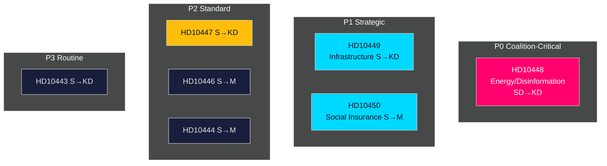

# Political Classification Results

**Date**: 2026-04-27  
**Author**: James Pether Sörling  
**Framework**: 7-dimension political classification

---

## 7-Dimension Classification Per Document

### HD10448 — Desinformation om vindkraft

| Dimension | Classification | Notes |
|-----------|---------------|-------|
| Policy domain | Energy/Information | Wind energy + disinformation framing |
| Ideological axis | Conservative-nationalist vs. Green-liberal | SD skepticism vs. KD pro-renewables |
| Institutional arena | Executive accountability | Minister Busch targeted |
| Temporal horizon | Medium-term (pre-election) | Response deadline 2026-05-08 |
| Conflict type | Coalition internal + opposition framing | SD interpellates KD partner |
| Evidence base | Mixed — cites industry report + own critique | Windeurope report [B3] |
| Electoral salience | HIGH — energy is 2026 ballot issue | Amplified by Sveriges Radio |

**Priority tier**: P0 (Coalition-critical, media-amplified)  
**Retention**: Long-term — tracking SD-KD coalition cohesion  
**Access**: Public

### HD10449 — Södra stambanan

| Dimension | Classification | Notes |
|-----------|---------------|-------|
| Policy domain | Transport/Infrastructure | Railway investment |
| Ideological axis | State-investment vs. fiscal restraint | S vs. KD/government |
| Institutional arena | Executive accountability | Minister Carlson targeted |
| Temporal horizon | Long-term (5–10 years infrastructure) | Regional development |
| Conflict type | Opposition accountability | S party challenging KD policy |
| Evidence base | Named plan, named route, community impact | Trafikverket plan reference [A2] |
| Electoral salience | HIGH — regional seats Skåne/Kronoberg | Multi-seat electoral geography |

**Priority tier**: P1 (Strategically significant)  
**Retention**: Long-term — tracking infrastructure investment credibility  
**Access**: Public

### HD10450 — Sjukförsäkring dag 180

| Dimension | Classification | Notes |
|-----------|---------------|-------|
| Policy domain | Social Insurance/Welfare | Sick leave reform |
| Ideological axis | Universalist welfare vs. insurance-based | S vs. M |
| Institutional arena | Executive accountability | Minister Tenje targeted |
| Temporal horizon | Medium-term | Response deadline 2026-05-18 |
| Conflict type | Opposition accountability | Riksrevisionen evidence invoked |
| Evidence base | Riksrevisionen report (unnamed) [B2] | Positive evaluation cited |
| Electoral salience | MEDIUM-HIGH — welfare reform is election issue | |

**Priority tier**: P1 (Strategically significant)  
**Retention**: Medium-term — welfare reform tracking  
**Access**: Public

### HD10447 — Sjuklönekostnader

| Dimension | Classification | Notes |
|-----------|---------------|-------|
| Policy domain | Labor/Business/Fiscal | SME sick-pay support |
| Ideological axis | Shared-risk solidarity vs. employer responsibility | S vs. KD |
| Institutional arena | Executive accountability | Minister Busch targeted (energy portfolio overlap) |
| Temporal horizon | Short-medium term | GDP growth argument |
| Conflict type | Economic policy critique | Sweden below EU growth cited |
| Evidence base | Policy abolition 2024 confirmed [A2] | GDP comparison asserted |
| Electoral salience | MEDIUM | SME employers are swing constituency |

**Priority tier**: P2 (Standard parliamentary)  
**Retention**: Medium-term  
**Access**: Public

## Priority Tier Summary

| Priority | Count | Documents |
|----------|-------|-----------|
| P0 Coalition-critical | 1 | HD10448 |
| P1 Strategically significant | 2 | HD10449, HD10450 |
| P2 Standard parliamentary | 3 | HD10447, HD10446, HD10444 |
| P3 Routine | 1 | HD10443 |

