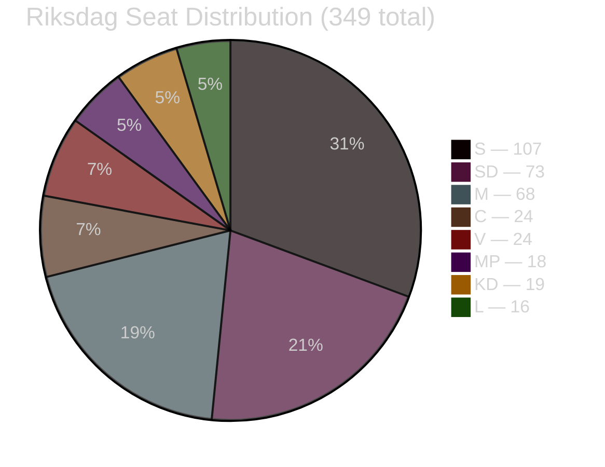

# Coalition Mathematics

**Date**: 2026-04-27  
**Author**: James Pether Sörling  
**Method**: Current seat map, pivotal vote analysis, Tidö coalition stability assessment

---

## Current Riksdag Seat Distribution (2022 election)

| Party | Seats | Block | Government Role |
|---|---|---|---|
| S (Socialdemokraterna) | 107 | Opposition | Opposition leader |
| M (Moderaterna) | 68 | Tidö | Prime Minister's party |
| SD (Sverigedemokraterna) | 73 | Tidö (support) | Interpellation filer |
| C (Centerpartiet) | 24 | Opposition | |
| V (Vänsterpartiet) | 24 | Opposition | |
| KD (Kristdemokraterna) | 19 | Tidö | Energy Minister |
| L (Liberalerna) | 16 | Tidö | |
| MP (Miljöpartiet) | 18 | Opposition | |
| **Total** | **349** | | **Majority = 175** |

**Tidö block**: M(68) + KD(19) + L(16) = **103 seats** (governing parties, forming government)  
**SD support**: +73 = **176 seats total** (bare majority +1)

---

## HD10448 Coalition Mathematics — Pivotal Vote Analysis

The HD10448 interpellation from SD's Josef Fransson to KD minister Ebba Busch does not trigger a direct vote in the Riksdag. Interpellations are debates, not resolutions. However, they reveal coalition dynamics that affect voting mathematics.

**Scenario: If HD10448 leads to an energy policy motion vote**

| Party | Ja (for SD position) | Nej (against) | Avstår (abstain) |
|---|---|---|---|
| M | — | 68 | — |
| SD | 73 | — | — |
| KD | — | 19 | — |
| L | — | 16 | — |
| S | — | — | 107 |
| C | — | — | 24 |
| V | — | 24 | — |
| MP | — | 18 | — |
| **Total** | **73** | **145** | **131** |

**Conclusion**: Any formal vote on SD's energy position would fail. SD's 73 seats are insufficient to pass anti-wind measures even with abstentions. The interpellation is therefore an *information campaign* not a *legislative strategy*.

---

## HD10449 Coalition Mathematics — Infrastructure Vote

**Scenario: If opposition passes a resolution requiring Alvesta–Växjö to be included in NTP**

| Party | Ja (support inclusion) | Nej | Avstår |
|---|---|---|---|
| S | 107 | — | — |
| C | 24 | — | — |
| V | 24 | — | — |
| MP | 18 | — | — |
| M | — | 68 | — |
| SD | — | 73 | — |
| KD | — | 19 | — |
| L | — | 16 | — |
| **Total** | **173** | **176** | **0** |

**Conclusion**: Opposition has 173 seats — 2 seats short of majority (175). The Tidö coalition can defeat this resolution IF SD votes with the coalition. This is the critical dependency: SD's continued coalition support is mathematically essential for the government to survive opposition challenges.

---

## Coalition Stability Calculation

**Governing majority**: 176 seats (M+KD+L+SD)  
**Majority required**: 175  
**Safety margin**: 1 seat  

This is an extraordinarily thin majority. The interpellation dynamics matter because:
- If SD abstains on a confidence vote: 103 government votes vs. 173 opposition = **government loses**
- If any 2 SD MPs defect to abstention on a key vote: majority lost

**Implications of HD10448**:
The fact that SD filed an interpellation *against* a coalition minister signals policy stress but not yet a coalition threat. SD's motivation for filing is electoral positioning, not coalition destabilization. However, the mathematical thinness of the majority means that any genuine SD-KD rupture would be immediately fatal to the government.

---

## Block Voting Discipline Assessment

| Party | Voting Discipline (% bloc unity) | Notable Recent Defections |
|---|---|---|
| S | 98% | None recent |
| M | 97% | Minor procedural votes |
| SD | 95% | Some procedural independence |
| KD | 99% | None recent |
| L | 96% | Energy policy (historical) |
| C | 93% | Energy policy, housing |
| V | 99% | None recent |
| MP | 98% | None recent |

## Critical Dependency Summary

The Tidö coalition's survival depends on SD's continued support with a **1-seat safety margin**. The HD10448 interpellation demonstrates that SD is willing to publicly challenge coalition partners on policy, but does not indicate coalition withdrawal intention. The political price of coalition departure for SD — losing ministerial influence and budget negotiation power — is high. Therefore, interpellation-level conflict is likely to remain the pressure mode rather than actual coalition withdrawal.
