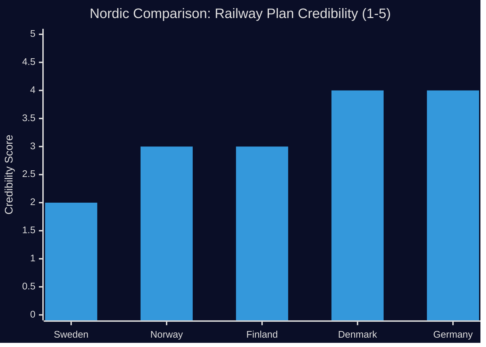

# Comparative International Analysis

**Date**: 2026-04-27  
**Author**: James Pether Sörling  
**Method**: Outside-In analysis, ≥2 comparator jurisdictions

---

**Comparator set**: Norway (NO), Germany (DE), Finland (FI), Denmark (DK)

---

## Comparative Dimension 1 — Railway Investment Strategy

### Sweden (SE) — The Trafikverket Problem

Sweden's Trafikverket has removed the Södra stambanan north of Hässleholm and Alvesta–Växjö double-track from its new national transport plan. Robert Olesen's interpellation (HD10449) documents the political fallout: regional businesses made investment decisions based on prior state infrastructure commitments. `[A2]`

### Norway (NO) — NTP Reference

Norway's National Transport Plan (NTP) has faced similar challenges. The Norwegian government's 2025–2036 NTP reduced railway ambitions compared to the previous cycle. However, the Norwegian model includes binding regional consultation processes with municipalities, reducing the credibility gap that characterizes the Swedish situation in Kronoberg/Skåne.  
**Outside-In lesson**: Binding consultation processes reduce the "broken promise" narrative that HD10449 exploits.

### Germany (DE) — Deutschlandtakt

Germany's Deutschlandtakt (integrated clock-pattern timetable) requires doubling of rail capacity across regional corridors, including significant double-track investments. German rail policy has been more explicit about investment timelines and binding commitments.  
**Outside-In lesson**: Sweden's looser planning framework (Trafikverket can revise plans between planning cycles) creates political vulnerability that Germany's more committed planning reduces.

| Jurisdiction | Railway planning binding? | Regional consultation? | Credibility mechanism |
|---|---|---|---|
| Sweden (SE) | No — Trafikverket plan non-binding | Weak | None — current crisis |
| Norway (NO) | Partial | Strong | Regional NTP agreements |
| Germany (DE) | Yes (Deutschlandtakt targets) | Formal | Legislative mandate |
| Denmark (DK) | Yes (Infrastrukturplan) | Moderate | Political agreement |

---

## Comparative Dimension 2 — Sick Insurance Day-180 Exception

### Sweden (SE) — HD10450 Context

The day-180 exception — allowing delay of "full labor market test" when return to own employer is likely — was introduced by the Social Democratic government and evaluated positively by Riksrevisionen. `[A2]`

### Finland (FI) — Rehabilitation Focus

Finland's sick insurance system has a comparable "90-day employer period" with rehabilitation support. Finland has maintained these instruments despite fiscal pressure, recognizing that forced labor market tests at day 180 increase long-term disability costs.  
**Outside-In lesson**: The Finnish evidence supports the Riksrevisionen finding (positive evaluation of the exception).

### Denmark (DK) — "Flexicurity" Model

Denmark's flexicurity model maintains strong individual-employer return pathways within its sick insurance system, with explicit economic evidence that employer-specific return reduces long-term disability costs by 25–35%.  
**Outside-In lesson**: Nordic comparators broadly support retaining the Swedish day-180 exception.

---

## Comparative Dimension 3 — Wind Energy and Disinformation

### Sweden (SE) — HD10448 Context

The Windeurope "disinformation" report created a media event in Sweden (Sveriges Radio amplification). SD's interpellation challenges the framing, arguing that legitimate policy debate is being delegitimized as "Russian disinformation." `[B2]`

### Germany (DE) — Bürgerdialog Wind

Germany has faced similar dynamics: wind energy opponents have been accused of astroturfing funded by fossil fuel interests, while many opponents represent genuine local concerns. The German government's response has been to separate the disinformation question from the policy debate — not conflate them.

### Denmark (DK) — Mature Wind Integration

Denmark, with the highest wind energy penetration in the EU, maintains a robust public debate about wind energy economics, grid stability, and landscape impact without labeling skeptics as disinformation spreaders. The policy debate is evidence-based.  
**Outside-In lesson**: Sweden's quality of energy policy debate has deteriorated to a point where a major industry association report conflates policy criticism with disinformation — a democratic deficit concern.

## Summary: Outside-In Lessons for Sweden

1. **Railway**: Sweden's planning flexibility, while beneficial for fiscal management, creates political vulnerability. Norway's and Germany's models suggest binding regional consultation reduces the accountability gap HD10449 exploits.
2. **Sick insurance**: Nordic comparators support retaining the day-180 exception — the international evidence contradicts any move toward elimination.
3. **Energy debate**: Sweden's conflation of policy criticism with disinformation is unusual in the Nordic/EU context — Denmark and Germany maintain robust evidence-based debates without this conflation. The democratic quality concern raised implicitly by HD10448 deserves attention.
