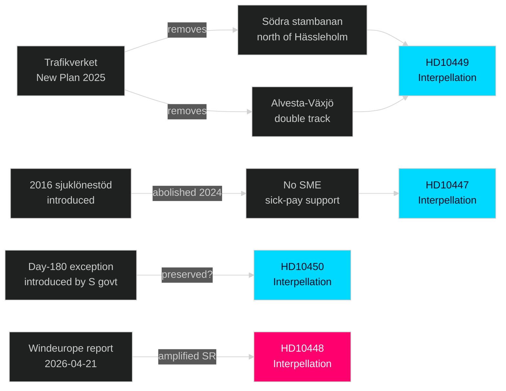

# Cross-Reference Map

**Date**: 2026-04-27  
**Author**: James Pether Sörling  
**Framework**: Policy clusters, legislative chains, coordinated-activity patterns

---

## Policy Clusters

### Cluster 1 — Labor Market and Social Protection
- **HD10450** (Sjukförsäkring dag 180) — Social insurance reform
- **HD10447** (Sjuklönekostnader) — Employer sick-pay burden
- **HD10445** (Kommunal förköpsrätt) — [linked via employment/housing nexus]
- **Thematic link**: Both HD10450 and HD10447 relate to the intersection of health, employment return, and SME burden — constituting a coherent S attack on the government's labor market policy.
- **Edge label**: `thematic`

### Cluster 2 — Infrastructure Investment
- **HD10449** (Södra stambanan) — Railway capacity
- **HD10428** (Beredskapsflygplats) — Aviation infrastructure (2026-04-02)
- **HD10434** (Bostadsbyggandet Stockholmsregionen) — Housing/infrastructure (2026-04-15)
- **Thematic link**: Multiple S interpellations in April 2026 challenge infrastructure investment adequacy — forming a sustained narrative of government underinvestment.
- **Edge label**: `thematic` + `coordinated-filing`

### Cluster 3 — Energy Policy
- **HD10448** (Desinformation vindkraft, SD) — Wind energy policy challenge
- **HD10447** (Sjuklönekostnader, S → Busch) — Note: Busch's energy portfolio is tangential here
- **HD10436** (Åtgärder för att stärka rymdbranschen, 2026-04-16) — High-tech/energy adjacency
- **Edge label**: `thematic`

### Cluster 4 — Social Services / Municipal
- **HD10443** (Social dumpning kommuner) — Municipal welfare
- **HD10439** (Brist på poliser i Stockholm) — Public services
- **Edge label**: `bundle`

## Legislative Chain

## Coordinated-Activity Patterns

**Pattern 1 — S Multi-Minister Campaign (Week 22)**  
Robert Olesen (S), Jessica Rodén (S), Patrik Lundqvist (S), and additional S MPs filed 5 interpellations targeting 4 ministers in the same week. This temporal clustering — all filed 2026-04-21 to 2026-04-24, all announced together 2026-04-27 — indicates party coordination.  
**Confidence**: [B2] — inferred from timing pattern; no direct evidence of S party leadership directive.

**Pattern 2 — SD Single-Shot Energy Challenge**  
HD10448 (Fransson/SD) is unique: a coalition partner's interpellation against a coalition minister. This is an institutionally constrained form of policy disagreement. It creates a parliamentary record of SD dissent on energy without breaking the coalition agreement.  
**Confidence**: [B2]

## Sibling Folder Citations (for Cross-Run Continuity)

- Previous interpellations on railway infrastructure: HD10425 (2026-03-31), HD10428 (2026-04-02)
- Previous interpellations on energy: None directly analogous in current session — HD10448 is novel as coalition-internal
- Welfare/social insurance: HD10422, HD10421 (integration policy, 2026-03-27) — same S accountability campaign pattern
