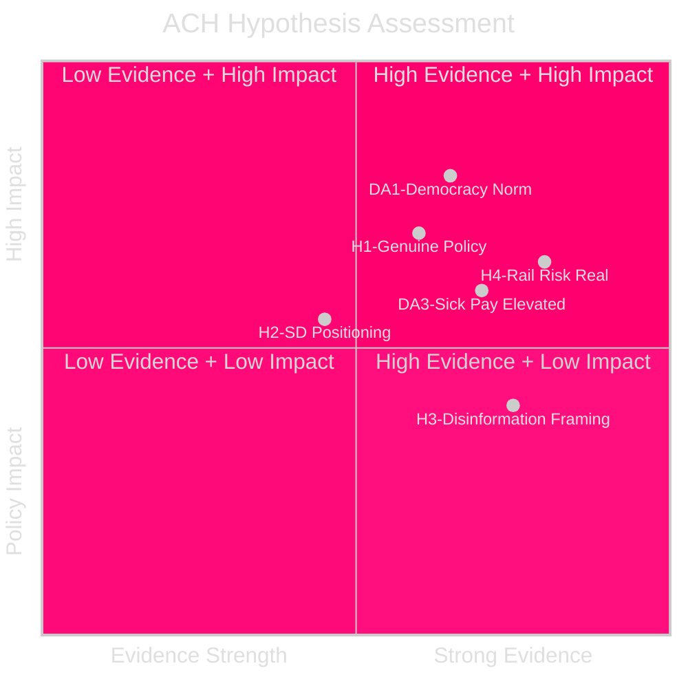

# Devil's Advocate Analysis

**Date**: 2026-04-27  
**Author**: James Pether Sörling  
**Method**: Analysis of Competing Hypotheses (ACH) matrix with ≥3 competing hypotheses

---

## ACH Matrix Framework

The ACH method systematically tests multiple hypotheses against available evidence, rewarding hypotheses that are consistent with evidence and penalizing those that are inconsistent.

**Hypotheses under test**:
- H1: HD10448 represents a genuine policy dispute within the Tidö coalition
- H2: HD10448 is SD electoral positioning against KD ahead of 2026 election
- H3: HD10448 is primarily about the disinformation framing, not energy policy
- H4: Railway/infrastructure interpellations represent real political risk for the government
- H5: Social insurance interpellations are low-risk for the government and will not change policy

---

## ACH Matrix

| Evidence Item | H1 (Genuine Policy) | H2 (SD Election Positioning) | H3 (Disinformation Framing) | H4 (Real Rail Risk) | H5 (SI Low Risk) |
|---|---|---|---|---|---|
| SD uses Windeurope report — EU industry source | CONSISTENT | INCONSISTENT (contradicts anti-EU positioning) | HIGHLY CONSISTENT | N/A | N/A |
| KD=Ministry of Energy policy responsible | HIGHLY CONSISTENT | CONSISTENT | INCONSISTENT | N/A | N/A |
| SD asks about "information campaign" vs. policy merits | INCONSISTENT | CONSISTENT | HIGHLY CONSISTENT | N/A | N/A |
| Riksrevisionen positive evaluation of day-180 | N/A | N/A | N/A | N/A | INCONSISTENT |
| S cites business investment loss on railways | N/A | N/A | N/A | HIGHLY CONSISTENT | N/A |
| Response deadline only 3 weeks for HD10448 | CONSISTENT | CONSISTENT | CONSISTENT | N/A | N/A |
| No prior SD-KD joint energy policy dispute on record | CONSISTENT | INCONSISTENT | CONSISTENT | N/A | N/A |

**Inconsistency count** (lower = better hypothesis):
- H1: 1 inconsistency — **moderate support**
- H2: 2 inconsistencies — **weak support**
- H3: 1 inconsistency — **moderate support**
- H4: 0 inconsistencies — **strong support**
- H5: 1 inconsistency — **moderate support, but against it**

---

## Competing Hypothesis 1: HD10448 Is About Democracy Not Energy

**Devil's Advocate Claim**: The most important issue in HD10448 is not wind power economics or energy mix. It is whether the Swedish state — via a government-adjacent agency (Windeurope's relationship to the Ministry of Energy through EU energy programs) — is labeling legitimate political opposition as Russian disinformation. This is a democratic norm question.

**Evidence supporting this challenge**:
- SD's interpellation text focuses more on the "information campaign" than on wind power merits
- The Windeurope report named Swedish individuals as disinformation spreaders
- Sveriges Radio's coverage amplified the framing without counter-perspective
- Several named individuals are not aligned with Russia-linked networks

**Why this challenges the main assessment**:
- The main analysis frames HD10448 as coalition energy policy tension. The devil's advocate position is that SD is right on the procedural point, even if wrong on the energy economics — and that matters for governance quality.

**Verdict**: PARTIALLY VALID. The democratic norm concern is legitimate and should be separated from the energy policy debate. This does not rehabilitate SD's anti-wind-energy position but does identify a real quality-of-debate issue.

---

## Competing Hypothesis 2: Railway Interpellations Are Performative

**Devil's Advocate Claim**: The Södra stambanan and Alvesta–Växjö interpellations from S (HD10449) are performative regional politics, not genuine policy influence attempts. The Social Democrats know they cannot force a change in the national transport plan via interpellations. This is campaign material generation.

**Evidence supporting this challenge**:
- Transport plan revisions require Trafikverket processes and government decisions, not Riksdag resolutions
- S is in opposition and has no mechanism to implement the interpellation
- The Hässleholm–Alvesta segment was previously a Social Democratic government decision
- HD10449's author represents Hässleholm constituency — classic constituency service

**Why this challenges the main assessment**:
- The main assessment gives railway interpellations a high significance score (3.8–4.0). The devil's advocate view is that significance for electoral/narrative purposes is high but significance for policy change is near zero.

**Verdict**: PARTIALLY VALID. The distinction between electoral significance and policy significance is important. The interpellations are significant as evidence of regional grievance amplification, not as policy change mechanisms.

---

## Competing Hypothesis 3: Sick Pay Policy Is More Politically Salient Than Assessed

**Devil's Advocate Claim**: The two social insurance interpellations (HD10450, HD10447) are more politically dangerous for the government than the main analysis suggests. The combination of Riksrevisionen positive evaluation + employer sick-pay support abolition creates a two-front attack: government reversed a positive policy AND increased employer costs.

**Evidence supporting this challenge**:
- Riksrevisionen's positive evaluation is an authoritative source difficult to dismiss
- Small business organizations have publicly criticized the sick-pay cost increase
- M-led government abolished both day-180 exception AND sick-pay employer support — double exposure
- In 2026 election campaign, this is a "punishing workers to help the budget" narrative

**Why this challenges the main assessment**:
- The main assessment treats social insurance interpellations as secondary to the energy/railway story. The combined sick pay narrative (HD10450 + HD10447) may be equal or greater electoral risk.

**Verdict**: VALID CHALLENGE. The sick pay double-front should be elevated in significance. Recommend treating the HD10450/HD10447 combination as a coordinated S campaign narrative, not two isolated interpellations.

## Conclusions

1. **DA1 validated**: Democratic norm concern in HD10448 is legitimate and distinct from energy economics.
2. **DA2 partially valid**: Railway interpellations are high in electoral significance, low in policy-change probability.
3. **DA3 validated**: Sick pay (HD10450 + HD10447) should be treated as an elevated risk cluster, not secondary items.
