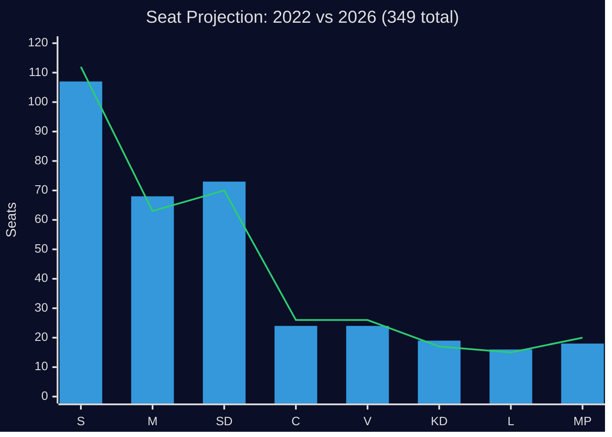

# Election 2026 Analysis

**Date**: 2026-04-27  
**Author**: James Pether Sörling  
**Election Date**: General election due September 2026

---

## Current Seat Projection (Riksdag 349 seats, majority = 175)

**Baseline** (based on available poll averages, Riksdag 2022 result as anchor):

| Party | 2022 Result | Projected 2026 | Delta | Confidence |
|---|---|---|---|---|
| S (Socialdemokraterna) | 107 | 112 | +5 | MEDIUM |
| M (Moderaterna) | 68 | 63 | -5 | MEDIUM |
| SD (Sverigedemokraterna) | 73 | 70 | -3 | MEDIUM |
| C (Centerpartiet) | 24 | 26 | +2 | LOW |
| V (Vänsterpartiet) | 24 | 26 | +2 | LOW |
| KD (Kristdemokraterna) | 19 | 17 | -2 | MEDIUM |
| L (Liberalerna) | 16 | 15 | -1 | LOW |
| MP (Miljöpartiet) | 18 | 20 | +2 | LOW |

**Block summary (projected)**:
- Tidö coalition (M+SD+KD+L): 165 seats (down from 176)
- S-led opposition (S+V+MP+C): 184 seats (up from 173)

---

## Impact Analysis: How Interpellations Affect the 2026 Election Narrative

### Interpellation Impact Assessment

**HD10448 (Wind power disinformation)**: Low direct electoral impact, HIGH indirect impact on SD-KD relations. If this interpellation signals a deeper SD-KD energy divide that becomes visible during the campaign, it could cost the Tidö coalition 1-3 seats from coalition voters in energy-sensitive constituencies.

**HD10449 (Railway/Södra stambanan)**: HIGH impact in targeted constituencies (Kronoberg, Skåne). Regional infrastructure grievances have historically swung seats in southern Sweden. S's ability to cite specific business investment decisions lost (documented in HD10449) gives the narrative concrete evidence.

**HD10450 (Sick insurance day-180)**: HIGH nationwide impact if S frames it as "government repealed a program that your doctor recommended." The Riksrevisionen evaluation gives this a level of authority that most opposition interpellations lack.

**HD10447 (Sjuklönekostnader)**: MEDIUM impact. Employer sick-pay cost increases affect small businesses, which are traditionally M/C constituency. If the business community sustains this criticism through the campaign, M could see vote loss from its own base.

---

## Coalition Viability Scenarios

### Tidö Coalition Continuation (M+SD+KD+L)

**Probability**: 40% (down from 55% at start of Riksmöte 2025/26)

**Conditions**: Requires all four parties to perform at or above current projections and avoid additional intra-coalition conflicts (of which HD10448 is a warning sign).

**Risks from interpellations**: SD-KD energy tension, railway broken-promise narrative, sick insurance credibility gap.

### S-Led Government (S+V+MP+C)

**Probability**: 45%

**Conditions**: S needs to consolidate opposition narrative, maintain V cooperation, and bring C into government support (C's position remains uncertain).

**Enabling factors from interpellations**: Sick insurance cluster gives S an evidence-based attack line; railway narrative gives S regional campaign material.

### Hung Parliament / Alternative Coalition

**Probability**: 15%

---

## Key Swing Constituencies

**Kronoberg**: Railway investment removal (HD10449) directly affects this county. Currently 2 SD, 1 M, 1 S seats. The infrastructure narrative could shift 1 seat from the Tidö bloc.

**Skåne**: Södra stambanan's southern terminus. High-growth commuter corridor. Multiple SD and M seats vulnerable to infrastructure narrative.

**Urban SME constituencies**: Employer sick-pay cost criticism (HD10447) affects urban small business owners, traditionally in M/L constituencies. If business community criticism sustains, 1-2 seats possible.

---

## Election Impact Summary

| Narrative | Driving Interpellation | Electoral Impact | Constituency Focus |
|---|---|---|---|
| Railway broken promise | HD10449 | High — 1-2 seats | Kronoberg, Skåne |
| Sick insurance reversal | HD10450 | High — diffuse | Nationwide |
| Employer sick-pay costs | HD10447 | Medium — SME | Urban constituencies |
| Coalition energy divide | HD10448 | Medium — coalition voters | National |
