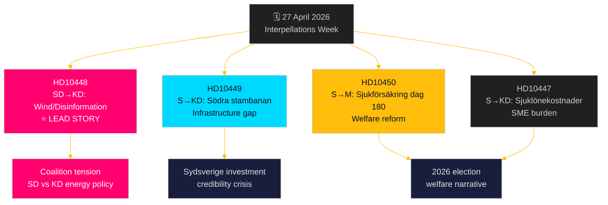

# Opposition Mounts Multi-Front Challenge: Railways, Sick Insurance, and Energy Disinformation

**Author**: James Pether Sörling  
**Date**: 2026-04-27  
**Classification**: UNCLASSIFIED // PUBLIC  
**Confidence**: MEDIUM-HIGH [B2]

---

## 🎯 BLUF

On 27 April 2026, the Swedish Riksdag received two new interpellations — on railway investment delays and sick insurance reform — while existing interpellations announced for debate include a politically charged SD attack on energy minister Ebba Busch (KD) over wind power "disinformation." The dominant pattern is a Social Democratic accountability campaign targeting the Tidö coalition's credibility on infrastructure investment, employment, and energy policy, with an unusual intra-coalition fault line exposed by SD's interpellation challenging KD energy policy using irony and provocation. The government faces deadline pressure on multiple fronts ahead of the 2026 election.

## 🧭 3 Decisions This Brief Supports

1. **Media coverage prioritization**: The SD wind-power disinformation interpellation (HD10448) is the lead story — it is the most politically explosive, combining energy policy with information-warfare framing and potential coalition-straining dynamics between SD and KD.
2. **Electoral tracking**: Social Democrats are using interpellations as a pre-election accountability instrument — five of seven this week target government ministers with concrete policy reversals requested.
3. **Investment confidence assessment**: The Södra stambanan interpellation (HD10449) crystallizes a broader infrastructure credibility gap that may affect business investment decisions in southern Sweden (Kronoberg/Skåne) ahead of the election.

## ⚡ 60-Second Intelligence Summary

- **HD10448 (SD → KD)**: Josef Fransson (SD) uses Windeurope's "Wind Energy Dis- and Misinformation" report — which claims Swedish pro-fossil groups spread Russian-backed disinformation — as a basis to sarcastically question whether Energy Minister Busch herself is a victim or vector of disinformation, challenging her to review energy policy decisions. **Significance**: L2+ Priority — exposes SD-KD coalition friction on energy; media amplification via Sveriges Radio already occurred.
- **HD10449 (S → KD)**: Robert Olesen (S) challenges Infrastructure Minister Carlson on the removal of Södra stambanan investments north of Hässleholm and the Alvesta–Växjö double-track from Trafikverket's new plan, citing the collapse of regional development commitments. **Significance**: L2 Strategic — 3 million affected residents in Sydsverige.
- **HD10450 (S → M)**: Jessica Rodén (S) questions Social Insurance Minister Anna Tenje on potential removal of the day-180 sick insurance exception (the "S-exception" enabling return-to-own-employer), citing Riksrevisionen evidence that it works. **Significance**: L2 Strategic — welfare state reform narrative.
- **HD10447 (S → KD)**: Patrik Lundqvist (S) presses Busch on abolished high sick-pay cost compensation (removed 2024), arguing it restrains SME employment and Sweden's lagging GDP growth.

## 🔭 Top Forward Trigger

Watch for Ebba Busch's response to HD10448 — if she addresses the SD provocation as a serious policy question, it signals coalition discipline; if she dismisses it, it may crystallize an SD-KD public rift over energy policy ahead of the June budget.

## 📊 Significance Ranking

| Rank | dok_id | Issue | DIW Weight |
|------|--------|-------|-----------|
| 1 | HD10448 | Wind energy/disinformation/coalition | L2+ Priority |
| 2 | HD10449 | Södra stambanan/infrastructure | L2 Strategic |
| 3 | HD10450 | Sjukförsäkring dag 180 | L2 Strategic |
| 4 | HD10447 | Sjuklönekostnader/SME | L2 |
| 5 | HD10446 | Felaktiga dödförklaringar | L1 |
| 6 | HD10444 | Arbetsgivaravgifter/youth | L1 |
| 7 | HD10443 | Social dumpning kommuner | L1 |

