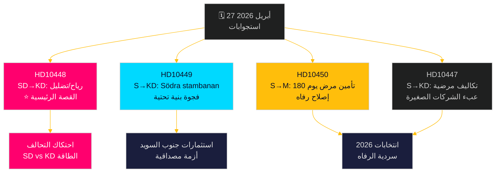

# المعارضة تشن تحدياً على جبهات متعددة: السكك الحديدية وتأمين المرض وتضليل الطاقة

**Author**: James Pether Sörling  
**Date**: 2026-04-27  
**Classification**: UNCLASSIFIED // PUBLIC  
**Confidence**: MEDIUM-HIGH [B2]

---

## 🎯 ملخص تنفيذي

في 27 أبريل 2026، تلقى الريكسداغ السويدي استجوابين جديدين — بشأن التأخيرات في استثمارات السكك الحديدية وإصلاح تأمين المرض — في حين تضمنت الاستجوابات المُعلنة مسبقاً للمناقشة هجوماً سياسياً مشحوناً من حزب SD على وزيرة الطاقة إيبا بوش (KD) بشأن "التضليل" المتعلق بطاقة الرياح. النمط السائد هو حملة محاسبة اشتراكية ديمقراطية تستهدف مصداقية تحالف تيدو في الاستثمارات البنية التحتية والتوظيف وسياسة الطاقة، مع خط صدع غير مألوف داخل التحالف كشفه استجواب SD لسياسة الطاقة لـ KD بالسخرية والاستفزاز. تواجه الحكومة ضغطاً زمنياً على جبهات متعددة قبيل انتخابات 2026.

## 🧭 3 قرارات يدعم هذا الموجز

1. **ترتيب أولويات التغطية الإعلامية**: استجواب SD بشأن طاقة الرياح/التضليل (HD10448) هو القصة الرئيسية — إنه الأكثر انفجاراً سياسياً، إذ يجمع بين سياسة الطاقة وإطار حرب المعلومات وديناميكيات محتملة تُثقل كاهل التحالف بين SD وKD.
2. **رصد انتخابي**: يستخدم الاشتراكيون الديمقراطيون الاستجوابات كأداة محاسبة قبل الانتخابات — خمسة من سبعة هذا الأسبوع موجهة لوزراء بمطالب محددة لتغيير السياسات.
3. **تقييم ثقة المستثمرين**: يجسّد استجواب HD10449 بشأن Södra stambanan فجوة أوسع في مصداقية البنية التحتية قد تؤثر على قرارات الاستثمار التجاري في جنوب السويد (Kronoberg/Skåne) قبيل الانتخابات.

## ⚡ ملخص استخباراتي في 60 ثانية

- **HD10448 (SD → KD)**: يستخدم يوزف فرانسون (SD) تقرير Windeurope "Wind Energy Dis- and Misinformation" — الذي يدّعي أن مجموعات سويدية مؤيدة للوقود الأحفوري تنشر معلومات مضللة مدعومة روسياً — أساساً للتشكيك بسخرية فيما إذا كانت وزيرة الطاقة بوش نفسها ضحية أو ناقلة للتضليل، متحدياً إياها لمراجعة قراراتها في السياسة الطاقوية. **الأهمية**: L2+ أولوية — يكشف الاحتكاك في تحالف SD-KD حول الطاقة؛ تضخيم إعلامي عبر Sveriges Radio حدث بالفعل.
- **HD10449 (S → KD)**: يتحدى روبرت أولسن (S) وزير البنية التحتية كارلسون بشأن حذف استثمارات Södra stambanan شمال Hässleholm والمسار المزدوج Alvesta–Växjö من الخطة الجديدة لـ Trafikverket، مستشهداً بانهيار التزامات التنمية الإقليمية. **الأهمية**: L2 استراتيجي — 3 ملايين ساكن متأثر في جنوب السويد.
- **HD10450 (S → M)**: تتساءل جيسيكا رودين (S) عن وزيرة التأمين الاجتماعي آنا تنيه بشأن الإلغاء المحتمل لاستثناء اليوم 180 في تأمين المرض (ما يُعرف بـ"الاستثناء S" الذي يتيح العودة إلى صاحب العمل الأصلي)، مستشهدةً بأدلة Riksrevisionen على فاعليته. **الأهمية**: L2 استراتيجي — سردية إصلاح دولة الرفاه.
- **HD10447 (S → KD)**: يضغط باتريك لوندكفيست (S) على بوش بشأن إلغاء التعويض المرتفع عن تكاليف الإجازة المرضية (أُلغي 2024)، محتجاً بأنه يُعيق توظيف الشركات الصغيرة والمتوسطة ونمو الناتج المحلي الإجمالي السويدي المتأخر.

## 🔭 أبرز محفز مستقبلي

راقب رد إيبا بوش على HD10448 — إذا تعاملت مع استفزاز SD بوصفه سؤالاً سياسياً جدياً، فهذا يشير إلى انضباط التحالف؛ أما إذا رفضته، فقد يُبلور انشقاقاً علنياً بين SD وKD حول سياسة الطاقة قبيل ميزانية يونيو.

## 📊 ترتيب الأهمية

| الترتيب | dok_id | القضية | وزن DIW |
|---------|--------|--------|---------|
| 1 | HD10448 | طاقة الرياح/التضليل/التحالف | L2+ أولوية |
| 2 | HD10449 | Södra stambanan/بنية تحتية | L2 استراتيجي |
| 3 | HD10450 | تأمين مرض يوم 180 | L2 استراتيجي |
| 4 | HD10447 | تكاليف الإجازة المرضية/الشركات الصغيرة | L2 |
| 5 | HD10446 | شهادات وفاة خاطئة | L1 |
| 6 | HD10444 | مساهمات صاحب العمل/الشباب | L1 |
| 7 | HD10443 | الإغراق الاجتماعي البلديات | L1 |

<!-- source-sha: 0d5ca67103600cd49fb8373d7e028558be2d04d5 -->

