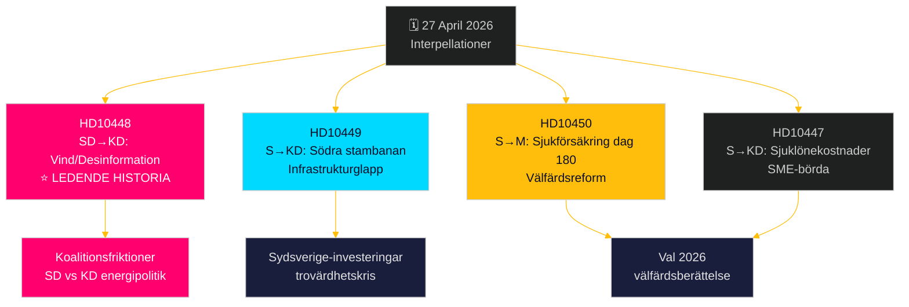

# Oppositionen udfordrer på bred front: Jernbaner, sygesikring og energidesinformation

**Author**: James Pether Sörling  
**Date**: 2026-04-27  
**Classification**: UNCLASSIFIED // PUBLIC  
**Confidence**: MEDIUM-HIGH [B2]

---

## 🎯 BLUF

Den 27. april 2026 modtog det svenske Riksdag to nye interpellationer – om forsinkede jernbaneinvesteringer og reform af sygesikringen – mens allerede annoncerede interpellationer til debat inkluderer et politisk ladet SD-angreb på energiminister Ebba Busch (KD) om vindenergi-"desinformation". Det dominerende mønster er en socialdemokratisk ansvarlighedskampagne rettet mod Tidö-koalitionens troværdighed på infrastrukturinvesteringer, beskæftigelse og energipolitik, med en usædvanlig intra-koalitionssprække eksponeret af SDs interpellation om KDs energipolitik med ironi og provokation. Regeringen er under tidspres på flere fronter forud for valget 2026.

## 🧭 3 Beslutninger dette briefing understøtter

1. **Prioritering af mediedækning**: SD-interpellationen om vindenergi/desinformation (HD10448) er den ledende historie – den er den mest politisk eksplosive, der kombinerer energipolitik med informationskrigsramme og potentielt koalitionsbelastende dynamik mellem SD og KD.
2. **Valgbevakning**: Socialdemokraterne bruger interpellationer som et førvalgsinstrument til ansvarliggørelse – fem ud af syv denne uge retter sig mod ministre med konkrete krav om politiske kursskifter.
3. **Vurdering af investeringstillid**: HD10449-interpellationen om Södra stambanan tydeliggør et bredere infrastruktur-troværdighedsgab, der kan påvirke erhvervsinvesteringsbeslutninger i det sydlige Sverige (Kronoberg/Skåne) forud for valget.

## ⚡ 60-sekunders efterretningsoversigt

- **HD10448 (SD → KD)**: Josef Fransson (SD) bruger Windeuropes rapport "Wind Energy Dis- and Misinformation" – der hævder, at svenske pro-fossile grupper spreder russiststøttet desinformation – som grundlag for sarkastisk at stille spørgsmålstegn ved, om energiminister Busch selv er offer eller spreder af desinformation, og udfordrer hende til at gennemgå energipolitiske beslutninger. **Betydning**: L2+ Prioritet – afslører SD-KD-koalitionsgnidninger om energi; medieforstærkning via Sveriges Radio er allerede sket.
- **HD10449 (S → KD)**: Robert Olesen (S) udfordrer infrastrukturminister Carlson om fjernelsen af Södra stambanans investeringer nord for Hässleholm og Alvesta–Växjö dobbeltsporet fra Trafikverkets nye plan med reference til sammenbruddet af regionale udviklingsforpligtelser. **Betydning**: L2 Strategisk – 3 millioner berørte borgere i Sydsverige.
- **HD10450 (S → M)**: Jessica Rodén (S) spørger socialforsikringsminister Anna Tenje om potentiel fjernelse af dag-180-undtagelsen i sygesikringen (det såkaldte "S-undtagelse", der muliggør tilbagevenden til egen arbejdsgiver) og citerer Riksrevisionens bevis for, at det virker. **Betydning**: L2 Strategisk – velfærdsreformfortælling.
- **HD10447 (S → KD)**: Patrik Lundqvist (S) presser Busch om afskaffet høj kompensation for sygelønsomkostninger (fjernet 2024) og argumenterer for, at det begrænser SMV-beskæftigelse og Sveriges efterslæbende BNP-vækst.

## 🔭 Vigtigste fremadrettede trigger

Hold øje med Ebba Buschs svar på HD10448 – hvis hun behandler SD-provokationen som et seriøst politisk spørgsmål, signalerer det koalitionsdisciplin; hvis hun afviser det, kan det krystallisere en offentlig SD-KD-splid om energipolitik forud for juni-budgettet.

## 📊 Signifikansrangering

| Rang | dok_id | Emne | DIW-vægt |
|------|--------|------|----------|
| 1 | HD10448 | Vindenergi/desinformation/koalition | L2+ Prioritet |
| 2 | HD10449 | Södra stambanan/infrastruktur | L2 Strategisk |
| 3 | HD10450 | Sygesikring dag 180 | L2 Strategisk |
| 4 | HD10447 | Sygelønsomkostninger/SMV | L2 |
| 5 | HD10446 | Fejlagtige dødserklæringer | L1 |
| 6 | HD10444 | Arbejdsgiverbidrag/unge | L1 |
| 7 | HD10443 | Social dumping kommuner | L1 |

<!-- source-sha: 0d5ca67103600cd49fb8373d7e028558be2d04d5 -->
