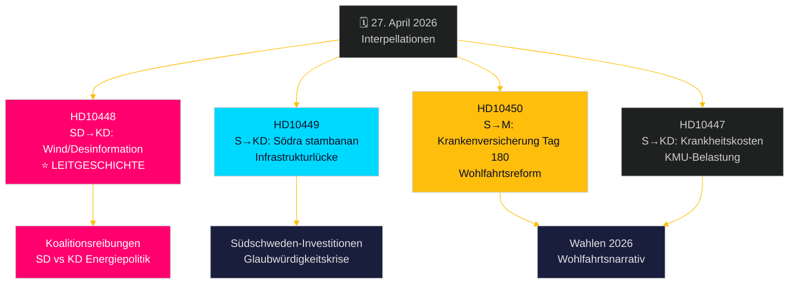

# Opposition startet Angriff auf breiter Front: Eisenbahnen, Krankenversicherung und Energiedesinformation

**Author**: James Pether Sörling  
**Date**: 2026-04-27  
**Classification**: UNCLASSIFIED // PUBLIC  
**Confidence**: MEDIUM-HIGH [B2]

---

## 🎯 BLUF

Am 27. April 2026 erhielt der schwedische Riksdag zwei neue Interpellationen – zur Verzögerung von Eisenbahninvestitionen und zur Reform der Krankenversicherung – während bereits angekündigte Interpellationen zur Debatte einen politisch aufgeladenen SD-Angriff auf Energieministerin Ebba Busch (KD) wegen Windenergie-„Desinformation" beinhalten. Das vorherrschende Muster ist eine sozialdemokratische Rechenschaftskampagne gegen die Glaubwürdigkeit der Tidö-Koalition bei Infrastrukturinvestitionen, Beschäftigung und Energiepolitik, wobei eine ungewöhnliche innerkoalitionäre Bruchlinie durch die SD-Interpellation zu KDs Energiepolitik mit Ironie und Provokation offengelegt wird. Die Regierung steht auf mehreren Fronten unter Zeitdruck vor den Wahlen 2026.

## 🧭 3 Entscheidungen, die dieses Briefing unterstützt

1. **Prioritisierung der Medienberichterstattung**: Die SD-Interpellation zur Windenergie/Desinformation (HD10448) ist die Leitgeschichte – sie ist politisch am explosivsten, verbindet Energiepolitik mit einem Informationskriegsrahmen und potenziell koalitionsbelastender Dynamik zwischen SD und KD.
2. **Wahlbeobachtung**: Die Sozialdemokraten setzen Interpellationen als Vorwahl-Rechenschaftsinstrument ein – fünf von sieben in dieser Woche richten sich an Minister mit konkreten Forderungen nach politischen Kehrtwenden.
3. **Bewertung des Investitionsklimas**: Die HD10449-Interpellation zur Södra stambanan verdeutlicht eine tiefergehende Infrastruktur-Glaubwürdigkeitslücke, die Unternehmensinvestitionsentscheidungen in Südschweden (Kronoberg/Skåne) vor den Wahlen beeinflussen könnte.

## ⚡ 60-Sekunden-Geheimdienstzusammenfassung

- **HD10448 (SD → KD)**: Josef Fransson (SD) nutzt Windeuropes Bericht „Wind Energy Dis- and Misinformation" – der behauptet, schwedische pro-fossile Gruppen verbreiteten russisch gestützte Desinformation – als Grundlage, um ironisch in Frage zu stellen, ob Energieministerin Busch selbst Opfer oder Verbreiter von Desinformation ist, und fordert sie auf, energiepolitische Entscheidungen zu überprüfen. **Bedeutung**: L2+ Priorität – legt SD-KD-Koalitionsreibungen zu Energie offen; Medienverstärkung über Sveriges Radio ist bereits erfolgt.
- **HD10449 (S → KD)**: Robert Olesen (S) fordert Infrastrukturminister Carlson wegen der Streichung der Södra-stambanan-Investitionen nördlich von Hässleholm und des Alvesta–Växjö-Doppelgleises aus Trafikverkets neuem Plan heraus und verweist auf den Zusammenbruch regionaler Entwicklungsverpflichtungen. **Bedeutung**: L2 Strategisch – 3 Millionen betroffene Einwohner in Südschweden.
- **HD10450 (S → M)**: Jessica Rodén (S) befragt Sozialversicherungsministerin Anna Tenje zur möglichen Abschaffung der Krankenversicherungs-Ausnahmeregelung zum Tag 180 (die sogenannte „S-Ausnahme", die die Rückkehr zum eigenen Arbeitgeber ermöglicht) und zitiert Riksrevisionens Belege für deren Wirksamkeit. **Bedeutung**: L2 Strategisch – Wohlfahrtsstaatsreformnarrativ.
- **HD10447 (S → KD)**: Patrik Lundqvist (S) drängt Busch wegen der abgeschafften hohen Erstattung für Krankheitskosten (2024 abgeschafft) und argumentiert, dass dies KMU-Beschäftigung und Schwedens rückständiges BIP-Wachstum hemmt.

## 🔭 Wichtigster Vorwärtstrigger

Beobachten Sie Ebba Buschs Reaktion auf HD10448 – wenn sie die SD-Provokation als ernste politische Frage behandelt, signalisiert das Koalitionsdisziplin; wenn sie sie ablehnt, könnte das einen öffentlichen SD-KD-Riss zur Energiepolitik vor dem Junihaushalt kristallisieren.

## 📊 Signifikanzranking

| Rang | dok_id | Thema | DIW-Gewicht |
|------|--------|-------|-------------|
| 1 | HD10448 | Windenergie/Desinformation/Koalition | L2+ Priorität |
| 2 | HD10449 | Södra stambanan/Infrastruktur | L2 Strategisch |
| 3 | HD10450 | Krankenversicherung Tag 180 | L2 Strategisch |
| 4 | HD10447 | Krankheitskosten/KMU | L2 |
| 5 | HD10446 | Fehlerhafte Todeserklärungen | L1 |
| 6 | HD10444 | Arbeitgeberbeiträge/Jugend | L1 |
| 7 | HD10443 | Sozialdumping Kommunen | L1 |

<!-- source-sha: 0d5ca67103600cd49fb8373d7e028558be2d04d5 -->
