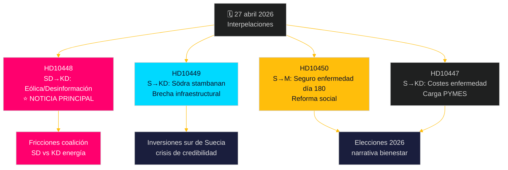

# La oposición presenta un desafío en múltiples frentes: ferrocarriles, seguro de enfermedad y desinformación energética

**Author**: James Pether Sörling  
**Date**: 2026-04-27  
**Classification**: UNCLASSIFIED // PUBLIC  
**Confidence**: MEDIUM-HIGH [B2]

---

## 🎯 BLUF

El 27 de abril de 2026, el Riksdag sueco recibió dos nuevas interpelaciones — sobre retrasos en inversiones ferroviarias y la reforma del seguro de enfermedad — mientras que las interpelaciones ya anunciadas para debate incluyen un políticamente cargado ataque de SD contra la ministra de Energía Ebba Busch (KD) sobre la "desinformación" eólica. El patrón dominante es una campaña socialdemócrata de rendición de cuentas dirigida a la credibilidad de la coalición Tidö en inversiones en infraestructuras, empleo y política energética, con una inusual línea de fractura intracoalicionaria expuesta por la interpelación de SD sobre la política energética de KD con ironía y provocación. El gobierno enfrenta presión de plazos en varios frentes antes de las elecciones de 2026.

## 🧭 3 Decisiones que apoya este informe

1. **Priorización de la cobertura mediática**: La interpelación de SD sobre energía eólica/desinformación (HD10448) es la noticia principal — es la más políticamente explosiva, combinando política energética con un marco de guerra informacional y una dinámica potencialmente dañina para la coalición entre SD y KD.
2. **Seguimiento electoral**: Los socialdemócratas utilizan las interpelaciones como instrumento de rendición de cuentas preelectoral — cinco de siete esta semana se dirigen a ministros con demandas concretas de giros políticos.
3. **Evaluación de la confianza inversora**: La interpelación HD10449 sobre Södra stambanan cristaliza una brecha más amplia de credibilidad en infraestructuras que podría afectar las decisiones de inversión empresarial en el sur de Suecia (Kronoberg/Skåne) antes de las elecciones.

## ⚡ Resumen de inteligencia en 60 segundos

- **HD10448 (SD → KD)**: Josef Fransson (SD) utiliza el informe de Windeurope "Wind Energy Dis- and Misinformation" — que afirma que grupos pro-fósiles suecos difunden desinformación respaldada por Rusia — como base para cuestionar sarcásticamente si la ministra de Energía Busch es ella misma víctima o vector de desinformación, desafiándola a revisar sus decisiones de política energética. **Importancia**: L2+ Prioritario — expone fricciones en la coalición SD-KD sobre energía; la amplificación mediática a través de Sveriges Radio ya ha tenido lugar.
- **HD10449 (S → KD)**: Robert Olesen (S) desafía al ministro de Infraestructuras Carlson por la eliminación de las inversiones de Södra stambanan al norte de Hässleholm y la doble vía Alvesta–Växjö del nuevo plan de Trafikverket, citando el colapso de los compromisos de desarrollo regional. **Importancia**: L2 Estratégico — 3 millones de residentes afectados en el sur de Suecia.
- **HD10450 (S → M)**: Jessica Rodén (S) cuestiona a la ministra de Seguridad Social Anna Tenje sobre la posible eliminación de la excepción del día 180 del seguro de enfermedad (la llamada "excepción S" que permite el retorno al propio empleador), citando evidencia de Riksrevisionen de su eficacia. **Importancia**: L2 Estratégico — narrativa de reforma del Estado de bienestar.
- **HD10447 (S → KD)**: Patrik Lundqvist (S) presiona a Busch sobre la eliminada alta compensación por costes de bajas laborales (suprimida en 2024), argumentando que limita el empleo en PYMES y el rezagado crecimiento del PIB sueco.

## 🔭 Principal disparador prospectivo

Vigilar la respuesta de Ebba Busch a HD10448 — si trata la provocación de SD como una cuestión política seria, señala disciplina de coalición; si la rechaza, podría cristalizar una ruptura pública SD-KD sobre política energética antes del presupuesto de junio.

## 📊 Ranking de significado

| Rango | dok_id | Asunto | Peso DIW |
|-------|--------|--------|----------|
| 1 | HD10448 | Energía eólica/desinformación/coalición | L2+ Prioritario |
| 2 | HD10449 | Södra stambanan/infraestructura | L2 Estratégico |
| 3 | HD10450 | Seguro de enfermedad día 180 | L2 Estratégico |
| 4 | HD10447 | Costes enfermedad/PYMES | L2 |
| 5 | HD10446 | Declaraciones erróneas de fallecimiento | L1 |
| 6 | HD10444 | Cotizaciones patronales/juventud | L1 |
| 7 | HD10443 | Dumping social municipios | L1 |

<!-- source-sha: 0d5ca67103600cd49fb8373d7e028558be2d04d5 -->
