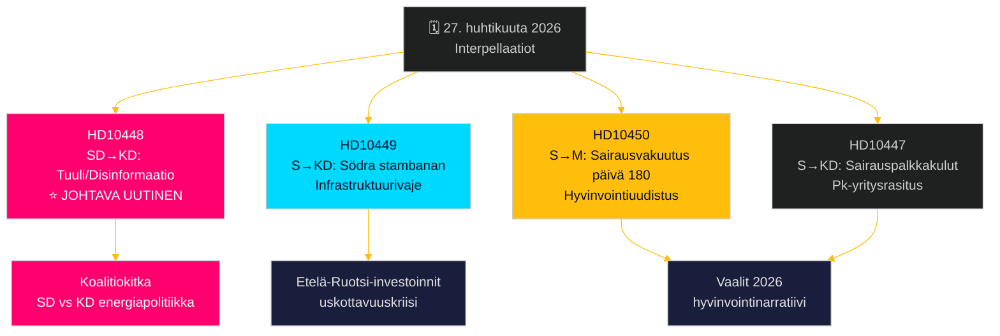

# Oppositio haastaa laajalla rintamalla: Rautatiet, sairausvakuutus ja energiadisinformaatio

**Author**: James Pether Sörling  
**Date**: 2026-04-27  
**Classification**: UNCLASSIFIED // PUBLIC  
**Confidence**: MEDIUM-HIGH [B2]

---

## 🎯 BLUF

Ruotsin riksdag sai 27. huhtikuuta 2026 kaksi uutta interpellaatiota – rautatieinvestointien viivästymisestä ja sairausvakuutusuudistuksesta – samaan aikaan kun jo ilmoitettuihin debatointikelpoisiin interpellaatioihin sisältyy SD:n poliittisesti latautunut hyökkäys energiaministeri Ebba Buschia (KD) vastaan tuulivoimadisinformaatiosta. Hallitseva kaava on sosiaalidemokraattinen vastuullisuuskampanja, joka kohdistuu Tidö-koalition uskottavuuteen infrastruktuuri-investoinneissa, työllistymisessä ja energiapolitiikassa, ja SD:n KD:n energiapolitiikkaan kohdistuva interpellaatio ironian ja provokaation keinoin paljastaa koalition sisäisen epätavallisen rintamalinjan. Hallitus kohtaa aikapaineita useilla rintamilla ennen vuoden 2026 vaaleja.

## 🧭 3 Päätöstä, joita tämä tiedote tukee

1. **Mediakattavuuden priorisointi**: SD:n tuulienergia/desinformaatio-interpellaatio (HD10448) on johtava uutinen – se on poliittisesti räjähdysherkin, yhdistäen energiapolitiikan informaatiosodankäynnin kehykseen ja potentiaalisesti koalitiota rasittavaan dynamiikkaan SD:n ja KD:n välillä.
2. **Vaalien seuranta**: Sosiaalidemokraatit käyttävät interpellaatioita ennakkovaalien vastuullisuusvälineenä – viisi seitsemästä tällä viikolla kohdistuu ministereille konkreettisilla vaatimuksilla politiikan muuttamiseksi.
3. **Investointitunnelman arviointi**: HD10449-interpellaatio Södra stambanasta kiteyttää laajemman infrastruktuuri-uskottavuusvajeen, joka voi vaikuttaa yritysinvesterointipäätöksiin Etelä-Ruotsissa (Kronoberg/Skåne) ennen vaaleja.

## ⚡ 60 sekunnin tiedusteluyhteenveto

- **HD10448 (SD → KD)**: Josef Fransson (SD) käyttää Windeuropen raporttia "Wind Energy Dis- and Misinformation" – joka väittää ruotsalaisten fossiili-ystävällisten ryhmien levittävän Venäjän tukemaa disinformaatiota – perusteena sarkastisesti kyseenalaistaa, onko energiaministeri Busch itse disinformaation uhri vai välittäjä, haastaen hänet tarkastelemaan energiapoliittisia päätöksiä. **Merkitys**: L2+ Prioriteetti – paljastaa SD-KD-koalitiokitkan energiasta; median vahvistuminen Sveriges Radion kautta on jo tapahtunut.
- **HD10449 (S → KD)**: Robert Olesen (S) haastaa infrastruktuuriministeri Carlsonin Södra stambanaan investointien poistamisesta Hässleholmin pohjoispuolelta ja Alvesta–Växjö-kaksoisraiteesta Trafikverketin uudesta suunnitelmasta vedoten alueellisten kehityssitoumusten romahtamiseen. **Merkitys**: L2 Strateginen – 3 miljoonaa asukasta Etelä-Ruotsissa.
- **HD10450 (S → M)**: Jessica Rodén (S) kyseenalaistaa sosiaaliturvaministeri Anna Tenjen mahdollisesta sairausvakuutuksen 180. päivän poikkeuksen poistamisesta (ns. "S-poikkeus", joka mahdollistaa paluun omalle työnantajalle) viitaten Riksrevisionenin näyttöön sen toimivuudesta. **Merkitys**: L2 Strateginen – hyvinvointivaltio-uudistusnarratiivi.
- **HD10447 (S → KD)**: Patrik Lundqvist (S) painostaa Buschia lakkautetusta korkeasta sairauspalkkakulukorvauksesta (poistettu 2024) väittäen sen rajoittavan pk-yritysten työllistymistä ja Ruotsin jälkeenjäänyttä BKT-kasvua.

## 🔭 Tärkein tulevaisuuden laukaisin

Seuraa Ebba Buschin vastausta HD10448:aan – jos hän käsittelee SD:n provokaatiota vakavana poliittisena kysymyksenä, se viestii koalition kurinalaisuudesta; jos hän torjuu sen, se voi kiteyttää julkisen SD-KD-riidan energiapolitiikasta ennen kesäbudjetin käsittelyä.

## 📊 Merkittävyysluokitus

| Sija | dok_id | Aihe | DIW-paino |
|------|--------|------|-----------|
| 1 | HD10448 | Tuulienergia/disinformaatio/koalitio | L2+ Prioriteetti |
| 2 | HD10449 | Södra stambanan/infrastruktuuri | L2 Strateginen |
| 3 | HD10450 | Sairausvakuutus päivä 180 | L2 Strateginen |
| 4 | HD10447 | Sairauspalkkakulut/pk-yritykset | L2 |
| 5 | HD10446 | Virheelliset kuolemanselvitykset | L1 |
| 6 | HD10444 | Työnantajamaksut/nuoret | L1 |
| 7 | HD10443 | Sosiaalinen dumppaus kunnat | L1 |

<!-- source-sha: 0d5ca67103600cd49fb8373d7e028558be2d04d5 -->
