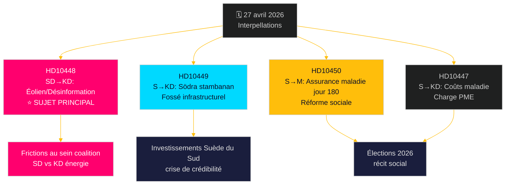

# L'opposition lance un défi sur plusieurs fronts : ferroviaire, assurance maladie et désinformation énergétique

**Author**: James Pether Sörling  
**Date**: 2026-04-27  
**Classification**: UNCLASSIFIED // PUBLIC  
**Confidence**: MEDIUM-HIGH [B2]

---

## 🎯 BLUF

Le 27 avril 2026, le Riksdag suédois a reçu deux nouvelles interpellations – sur les retards des investissements ferroviaires et la réforme de l'assurance maladie – tandis que les interpellations déjà annoncées pour débat comprennent une attaque politiquement chargée du SD contre la ministre de l'Énergie Ebba Busch (KD) sur la « désinformation » éolienne. Le schéma dominant est une campagne social-démocrate de responsabilisation ciblant la crédibilité de la coalition Tidö en matière d'investissements infrastructurels, d'emploi et de politique énergétique, avec une fracture intra-coalitionnelle inhabituelle exposée par l'interpellation du SD sur la politique énergétique de KD avec ironie et provocation. Le gouvernement est sous pression temporelle sur plusieurs fronts avant les élections de 2026.

## 🧭 3 Décisions que ce briefing soutient

1. **Priorisation de la couverture médiatique** : L'interpellation du SD sur l'énergie éolienne/désinformation (HD10448) est le sujet principal — c'est le plus politiquement explosif, combinant la politique énergétique avec un cadre de guerre informationnelle et une dynamique potentiellement dommageable pour la coalition entre SD et KD.
2. **Suivi électoral** : Les sociaux-démocrates utilisent les interpellations comme instrument de responsabilisation pré-électorale — cinq sur sept cette semaine s'adressent à des ministres avec des demandes concrètes de revirements politiques.
3. **Évaluation de la confiance des investisseurs** : L'interpellation HD10449 sur Södra stambanan cristallise un fossé plus large de crédibilité infrastructurelle susceptible d'affecter les décisions d'investissement des entreprises dans le sud de la Suède (Kronoberg/Skåne) avant les élections.

## ⚡ Résumé de renseignement en 60 secondes

- **HD10448 (SD → KD)** : Josef Fransson (SD) utilise le rapport de Windeurope « Wind Energy Dis- and Misinformation » — qui affirme que des groupes suédois pro-fossiles diffusent de la désinformation soutenue par la Russie — comme base pour questionner sarcastiquement si la ministre de l'Énergie Busch est elle-même victime ou vecteur de désinformation, la défiant de réviser ses décisions de politique énergétique. **Importance** : L2+ Priorité — expose les frictions au sein de la coalition SD-KD sur l'énergie ; l'amplification médiatique via Sveriges Radio a déjà eu lieu.
- **HD10449 (S → KD)** : Robert Olesen (S) interpelle le ministre des Infrastructures Carlson sur le retrait des investissements de Södra stambanan au nord de Hässleholm et de la double voie Alvesta–Växjö du nouveau plan de Trafikverket, citant l'effondrement des engagements de développement régional. **Importance** : L2 Stratégique — 3 millions d'habitants touchés dans le sud de la Suède.
- **HD10450 (S → M)** : Jessica Rodén (S) interroge la ministre de l'Assurance sociale Anna Tenje sur la suppression potentielle de l'exception au jour 180 de l'assurance maladie (la dite « exception S » permettant le retour chez son propre employeur), citant les preuves de Riksrevisionen de son efficacité. **Importance** : L2 Stratégique — récit de réforme de l'État-providence.
- **HD10447 (S → KD)** : Patrik Lundqvist (S) presse Busch sur la suppression de la compensation élevée des coûts de congé maladie (supprimée en 2024), arguant qu'elle freine l'emploi dans les PME et la croissance du PIB suédois à la traîne.

## 🔭 Principal déclencheur prospectif

Surveiller la réponse d'Ebba Busch à HD10448 — si elle traite la provocation du SD comme une question politique sérieuse, cela signale la discipline de coalition ; si elle la rejette, cela pourrait cristalliser une rupture publique SD-KD sur la politique énergétique avant le budget de juin.

## 📊 Classement de signification

| Rang | dok_id | Sujet | Poids DIW |
|------|--------|-------|-----------|
| 1 | HD10448 | Énergie éolienne/désinformation/coalition | L2+ Priorité |
| 2 | HD10449 | Södra stambanan/infrastructure | L2 Stratégique |
| 3 | HD10450 | Assurance maladie jour 180 | L2 Stratégique |
| 4 | HD10447 | Coûts maladie/PME | L2 |
| 5 | HD10446 | Fausses déclarations de décès | L1 |
| 6 | HD10444 | Cotisations patronales/jeunesse | L1 |
| 7 | HD10443 | Dumping social communes | L1 |

<!-- source-sha: 0d5ca67103600cd49fb8373d7e028558be2d04d5 -->
