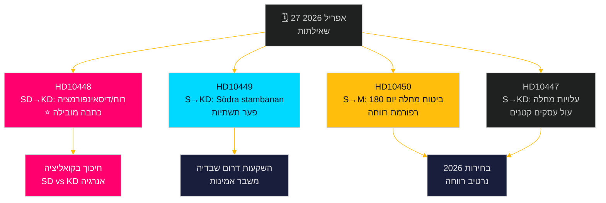

# האופוזיציה מציבה אתגר רב-חזיתי: רכבות, ביטוח מחלה ודיסאינפורמציה בתחום האנרגיה

**Author**: James Pether Sörling  
**Date**: 2026-04-27  
**Classification**: UNCLASSIFIED // PUBLIC  
**Confidence**: MEDIUM-HIGH [B2]

---

## 🎯 תמצית מנהלים

ב-27 באפריל 2026 קיבל הריקסדאג השבדי שתי שאילתות חדשות — על עיכובים בהשקעות ברכבות ורפורמה בביטוח המחלה — בעוד שאילתות שכבר הוכרזו לדיון כוללות מתקפה פוליטית טעונה של SD על שרת האנרגיה אבה בוש (KD) בנוגע ל"דיסאינפורמציה" בתחום הרוח. הדפוס השולט הוא מסע ה"חשבון" של הסוציאל-דמוקרטים כנגד אמינות קואליציית טידו בהשקעות תשתיות, תעסוקה ומדיניות אנרגיה, כאשר קו שבר יוצא דופן בתוך הקואליציה נחשף דרך שאילתת SD על מדיניות האנרגיה של KD באמצעות אירוניה ופרובוקציה. הממשלה עומדת בפני לחץ לוחות זמנים על מספר חזיתות לקראת בחירות 2026.

## 🧭 3 החלטות שמוזכר זה תומך בהן

1. **תעדוף כיסוי תקשורתי**: שאילתת SD על אנרגיית רוח/דיסאינפורמציה (HD10448) היא הכתבה המובילה — היא פוליטית המתפוצצת ביותר, משלבת מדיניות אנרגיה עם מסגרת מלחמת מידע ודינמיקה שעלולה לפגוע בקואליציה בין SD לKD.
2. **מעקב בחירות**: הסוציאל-דמוקרטים משתמשים בשאילתות ככלי אחריות לפני בחירות — חמישה מתוך שבעה השבוע מופנים לשרים עם דרישות קונקרטיות להיפוך מדיניות.
3. **הערכת אמון משקיעים**: שאילתת HD10449 על Södra stambanan מגלמת פער רחב יותר באמינות התשתיות שעלול להשפיע על החלטות השקעה עסקיות בדרום שבדיה (Kronoberg/Skåne) לפני הבחירות.

## ⚡ סיכום מודיעיני ב-60 שניות

- **HD10448 (SD → KD)**: יוזף פרנסון (SD) משתמש בדוח Windeurope "Wind Energy Dis- and Misinformation" — הטוען שקבוצות שבדיות הסברה לפחמן מפיצות דיסאינפורמציה בגיבוי רוסי — כבסיס לתהייה סרקסטית האם שרת האנרגיה בוש היא עצמה קורבן או נשא של דיסאינפורמציה, ומאתגר אותה לבחון מחדש את החלטות מדיניות האנרגיה. **חשיבות**: L2+ עדיפות — חושפת חיכוכים בקואליציה SD-KD בנושא אנרגיה; הגברה תקשורתית דרך Sveriges Radio כבר התרחשה.
- **HD10449 (S → KD)**: רוברט אולסן (S) מאתגר את שר התשתיות קרלסון על הסרת השקעות Södra stambanan צפונית לHässleholm ומסלול הכפול Alvesta–Växjö מתוכנית Trafikverket החדשה, מצטט את קריסת התחייבויות הפיתוח האזורי. **חשיבות**: L2 אסטרטגי — 3 מיליון תושבים מושפעים בדרום שבדיה.
- **HD10450 (S → M)**: ג'סיקה רודן (S) מטילה ספק בשרת הביטוח הסוציאלי אנה טניה לגבי ביטול פוטנציאלי של חריג יום 180 בביטוח מחלה (ה"חריג S" המאפשר חזרה למעסיק עצמו), תוך ציטוט ראיות של Riksrevisionen ליעילותו. **חשיבות**: L2 אסטרטגי — נרטיב רפורמת מדינת הרווחה.
- **HD10447 (S → KD)**: פטריק לונדקוויסט (S) לוחץ על בוש לגבי ביטול הפיצוי הגבוה לעלויות דמי מחלה (בוטל 2024), בטענה שהוא מגביל תעסוקה בעסקים קטנים ובינוניים ואת צמיחת התמ"ג השבדי הפגורה.

## 🔭 הטריגר המוביל לעתיד

עקוב אחר תגובת אבה בוש לHD10448 — אם תטפל בפרובוקציה של SD כשאלת מדיניות רצינית, זה מסמן משמעת קואלנציה; אם תדחה אותה, עשוי להתגבש פיצול SD-KD פומבי על מדיניות אנרגיה לפני תקציב יוני.

## 📊 דירוג חשיבות

| דירוג | dok_id | נושא | משקל DIW |
|--------|--------|------|----------|
| 1 | HD10448 | אנרגיית רוח/דיסאינפורמציה/קואליציה | L2+ עדיפות |
| 2 | HD10449 | Södra stambanan/תשתיות | L2 אסטרטגי |
| 3 | HD10450 | ביטוח מחלה יום 180 | L2 אסטרטגי |
| 4 | HD10447 | עלויות מחלה/עסקים קטנים | L2 |
| 5 | HD10446 | תעודות פטירה שגויות | L1 |
| 6 | HD10444 | דמי מעביד/נוער | L1 |
| 7 | HD10443 | השפלה חברתית עיריות | L1 |

<!-- source-sha: 0d5ca67103600cd49fb8373d7e028558be2d04d5 -->

