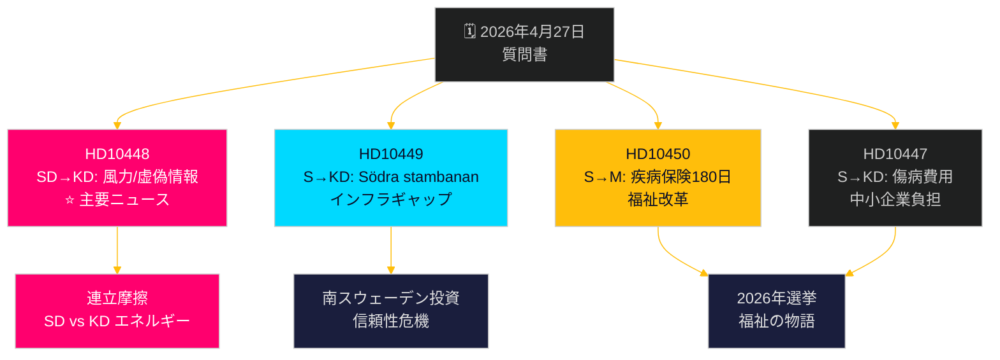

# 野党が多面的挑戦：鉄道、疾病保険、エネルギー虚偽情報

**Author**: James Pether Sörling  
**Date**: 2026-04-27  
**Classification**: UNCLASSIFIED // PUBLIC  
**Confidence**: MEDIUM-HIGH [B2]

---

## 🎯 要約

2026年4月27日、スウェーデン国会（リクスダーグ）は2件の新たな質問書を受理した。鉄道投資の遅延と疾病保険改革に関するものである。また、既に告知された討議対象の質問書には、エネルギー大臣エッバ・ブッシュ（KD）の風力エネルギー「虚偽情報」に対するSDの政治的に重大な攻撃が含まれている。主要なパターンはインフラ投資、雇用、エネルギー政策におけるティドー連立政権の信頼性を標的とした社会民主党による説明責任キャンペーンであり、皮肉と挑発を用いたSDによるKDのエネルギー政策への質問書が連立内の異例の断層線を露わにしている。政府は2026年選挙を前に複数の面で期限的プレッシャーに直面している。

## 🧭 このブリーフィングが支援する3つの決定

1. **メディア報道の優先順位付け**：SD風力エネルギー/虚偽情報質問書（HD10448）が主要ニュースである。エネルギー政策と情報戦フレームおよびSDとKDの間の潜在的連立負荷ダイナミクスを組み合わせた最も政治的に爆発的な案件。
2. **選挙追跡**：社会民主党は事前選挙説明責任ツールとして質問書を活用している。今週の7件中5件が具体的な政策転換要求とともに大臣に向けられている。
3. **投資信頼評価**：HD10449のSödra stambananに関する質問書は、選挙前に南スウェーデン（クロノベリ/スコーネ）の企業投資決定に影響を与えかねないより広範なインフラ信頼性ギャップを明確化している。

## ⚡ 60秒インテリジェンスサマリー

- **HD10448 (SD → KD)**：ヨーゼフ・フランソン（SD）はWindeurope報告書「Wind Energy Dis- and Misinformation」を利用する。この報告書はスウェーデンの化石燃料支持グループがロシア支援の虚偽情報を拡散していると主張している。エネルギー大臣ブッシュ自身が虚偽情報の被害者なのか伝播者なのかを皮肉を込めて問い、エネルギー政策決定の見直しを迫る。**重要度**：L2+ 優先 — エネルギーに関するSD-KD連立摩擦を露呈；Sveriges Radioを通じたメディア増幅は既に発生済み。
- **HD10449 (S → KD)**：ロベルト・オレセン（S）はTrafikverketの新計画からHässleholm以北のSödra stambanan投資とAlvesta-Växjö複線が削除されたことについて、地域発展コミットメントの崩壊を引用しつつインフラ大臣カールソンに挑戦。**重要度**：L2 戦略的 — 南スウェーデンで300万人が影響を受ける。
- **HD10450 (S → M)**：ジェシカ・ロデン（S）は疾病保険180日目例外（自分の雇用主への復帰を可能にする「S例外」）の廃止可能性についてアンナ・テニェ社会保険大臣に問い、その有効性についてのRiksrevisionenの証拠を引用。**重要度**：L2 戦略的 — 福祉国家改革の物語。
- **HD10447 (S → KD)**：パトリック・ルンドクビスト（S）は廃止された高額傷病手当費用補償（2024年廃止）についてブッシュを追及し、中小企業雇用とスウェーデンの低迷するGDP成長を抑制すると主張。

## 🔭 主要な将来のトリガー

HD10448に対するエッバ・ブッシュの反応を監視する。SDの挑発を真剣な政策問題として扱えば連立規律を示す。拒否すれば6月予算前のSD-KDエネルギー政策をめぐる公的な亀裂を結晶化させる可能性がある。

## 📊 重要度ランキング

| 順位 | dok_id | 問題 | DIW重み |
|------|--------|------|---------|
| 1 | HD10448 | 風力エネルギー/虚偽情報/連立 | L2+ 優先 |
| 2 | HD10449 | Södra stambanan/インフラ | L2 戦略的 |
| 3 | HD10450 | 疾病保険180日 | L2 戦略的 |
| 4 | HD10447 | 傷病費用/中小企業 | L2 |
| 5 | HD10446 | 誤った死亡診断 | L1 |
| 6 | HD10444 | 雇用者拠出/青少年 | L1 |
| 7 | HD10443 | 社会的ダンピング自治体 | L1 |

<!-- source-sha: 0d5ca67103600cd49fb8373d7e028558be2d04d5 -->
