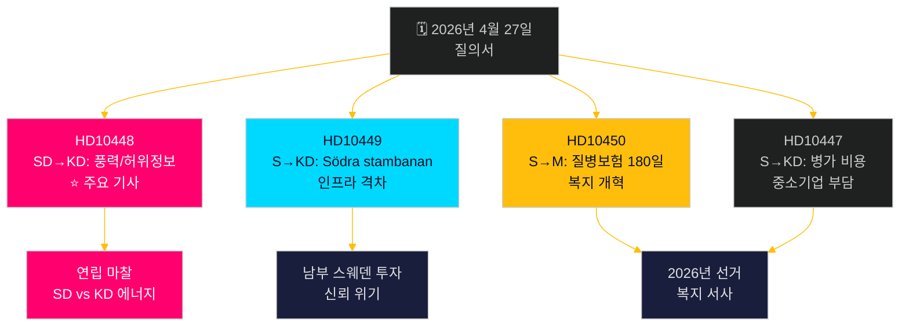

# 야당, 다방면 도전: 철도, 질병보험, 에너지 허위정보

**Author**: James Pether Sörling  
**Date**: 2026-04-27  
**Classification**: UNCLASSIFIED // PUBLIC  
**Confidence**: MEDIUM-HIGH [B2]

---

## 🎯 요약

2026년 4월 27일 스웨덴 릭스다그는 철도 투자 지연과 질병보험 개혁에 관한 두 건의 새로운 질의서를 접수했다. 또한 이미 토론 예고된 질의서에는 에너지 장관 에바 부시(KD)에 대한 풍력 에너지 "허위정보"를 둘러싼 SD의 정치적으로 격한 공격이 포함되어 있다. 주요 패턴은 인프라 투자, 고용, 에너지 정책에서 티데 연립 정부의 신뢰성을 겨냥한 사회민주당의 책임 캠페인으로, 아이러니와 도발을 이용한 SD의 KD 에너지 정책 질의서가 연립 내 이례적인 균열선을 드러냈다. 정부는 2026년 선거를 앞두고 여러 전선에서 시간적 압박을 받고 있다.

## 🧭 이 브리핑이 지원하는 3가지 결정

1. **언론 보도 우선순위**: SD 풍력에너지/허위정보 질의서(HD10448)가 주요 기사다. 에너지 정책과 정보전 프레임, 그리고 SD와 KD 간 잠재적으로 연립을 부담시키는 역학을 결합한 가장 정치적으로 폭발적인 사안이다.
2. **선거 추적**: 사회민주당은 사전선거 책임 도구로 질의서를 활용하고 있다. 이번 주 7건 중 5건이 구체적인 정책 전환 요구와 함께 장관들을 향하고 있다.
3. **투자 신뢰 평가**: HD10449 Södra stambanan 질의서는 선거 전 남부 스웨덴(크로노베리/스코네)의 기업 투자 결정에 영향을 미칠 수 있는 더 광범위한 인프라 신뢰 격차를 구체화한다.

## ⚡ 60초 인텔리전스 요약

- **HD10448 (SD → KD)**: 요제프 프란손(SD)은 스웨덴 친화석 그룹들이 러시아 지원 허위정보를 유포한다고 주장하는 Windeurope 보고서 "Wind Energy Dis- and Misinformation"을 이용해 에너지 장관 부시가 허위정보의 피해자인지 전달자인지를 냉소적으로 의문시하며 에너지 정책 결정 재검토를 촉구했다. **중요도**: L2+ 우선 — 에너지에 관한 SD-KD 연립 마찰을 드러냄; Sveriges Radio를 통한 언론 증폭이 이미 발생했다.
- **HD10449 (S → KD)**: 로베르트 올레센(S)은 Trafikverket의 새 계획에서 Hässleholm 북쪽의 Södra stambanan 투자와 Alvesta-Växjö 복선 제거에 대해 지역 개발 약속 붕괴를 인용하며 인프라 장관 칼손에게 도전했다. **중요도**: L2 전략적 — 남부 스웨덴 300만 명 영향.
- **HD10450 (S → M)**: 제시카 로덴(S)은 질병보험 180일 예외(자신의 고용주로 복귀를 가능하게 하는 "S 예외") 폐지 가능성에 대해 안나 테니에 사회보험 장관에게 Riksrevisionen의 효과 증거를 인용하며 질문했다. **중요도**: L2 전략적 — 복지국가 개혁 서사.
- **HD10447 (S → KD)**: 파트리크 룬드크비스트(S)는 폐지된 높은 병가 비용 보상(2024년 폐지)에 대해 부시를 압박하며 중소기업 고용과 스웨덴의 뒤처진 GDP 성장을 제약한다고 주장했다.

## 🔭 주요 미래 촉발 요인

HD10448에 대한 에바 부시의 반응을 주시하라. SD의 도발을 진지한 정책 문제로 다루면 연립 규율을 의미하고, 거부하면 6월 예산 전 에너지 정책을 둘러싼 SD-KD 공개 균열을 결정화시킬 수 있다.

## 📊 중요도 순위

| 순위 | dok_id | 사안 | DIW 가중치 |
|------|--------|------|-----------|
| 1 | HD10448 | 풍력에너지/허위정보/연립 | L2+ 우선 |
| 2 | HD10449 | Södra stambanan/인프라 | L2 전략적 |
| 3 | HD10450 | 질병보험 180일 | L2 전략적 |
| 4 | HD10447 | 병가 비용/중소기업 | L2 |
| 5 | HD10446 | 오류 사망 진단 | L1 |
| 6 | HD10444 | 고용주 기여/청년 | L1 |
| 7 | HD10443 | 사회적 덤핑 지방자치체 | L1 |

<!-- source-sha: 0d5ca67103600cd49fb8373d7e028558be2d04d5 -->
