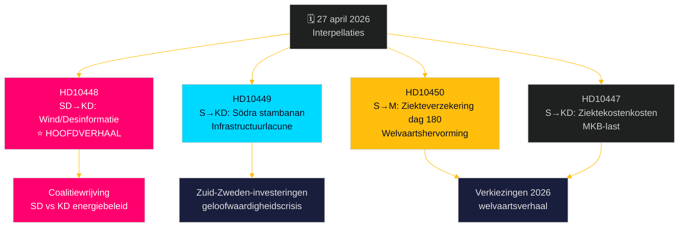

# Oppositie voert uitdaging op meerdere fronten: spoorwegen, ziekteverzekering en energiedesinformatie

**Author**: James Pether Sörling  
**Date**: 2026-04-27  
**Classification**: UNCLASSIFIED // PUBLIC  
**Confidence**: MEDIUM-HIGH [B2]

---

## 🎯 BLUF

Op 27 april 2026 ontving het Zweedse Riksdag twee nieuwe interpellaties – over vertragingen in spoorweginvesteringen en hervorming van de ziekteverzekering – terwijl al aangekondigde interpellaties voor debat een politiek geladen SD-aanval op energieminister Ebba Busch (KD) over windenergie-"desinformatie" bevatten. Het dominante patroon is een sociaaldemocrataische verantwoordingscampagne gericht op de geloofwaardigheid van de Tidö-coalitie op het gebied van infrastructuurinvesteringen, werkgelegenheid en energiebeleid, met een ongebruikelijke intracoalitionaire breuklijn blootgelegd door de SD-interpellatie over KD's energiebeleid met ironie en provocatie. De regering staat voor tijdsdruk op meerdere fronten voor de verkiezingen van 2026.

## 🧭 3 Beslissingen die dit briefing ondersteunt

1. **Prioritering van mediadekking**: De SD-interpellatie over windenergie/desinformatie (HD10448) is het hoofdverhaal – het is politiek het meest explosief, combineert energiebeleid met een informatieoorlogs-kader en potentieel coalitiebelastende dynamiek tussen SD en KD.
2. **Verkiezingsmonitoring**: Sociaaldemocraten gebruiken interpellaties als pre-verkiezings-verantwoordingsinstrument – vijf van de zeven deze week zijn gericht aan ministers met concrete eisen voor beleidsomkeringen.
3. **Beoordeling van investeringsvertrouwen**: De HD10449-interpellatie over Södra stambanan kristalliseert een bredere infrastructuur-geloofwaardigheidslacune die investeringsbeslissingen van bedrijven in Zuid-Zweden (Kronoberg/Skåne) voor de verkiezingen kan beïnvloeden.

## ⚡ 60-secondensamenvattingen voor inlichtingen

- **HD10448 (SD → KD)**: Josef Fransson (SD) gebruikt het Windeurope-rapport "Wind Energy Dis- and Misinformation" — dat beweert dat Zweedse pro-fossiele groepen door Rusland gesteunde desinformatie verspreiden — als basis om sarcastisch te betwijfelen of energieminister Busch zelf slachtoffer of verspreider van desinformatie is, en daagt haar uit om energiebeleidsbesluiten te herzien. **Betekenis**: L2+ Prioriteit — legt SD-KD-coalitiewrijving over energie bloot; mediaversterking via Sveriges Radio heeft al plaatsgevonden.
- **HD10449 (S → KD)**: Robert Olesen (S) daagt infrastructuurminister Carlson uit over het verwijderen van de Södra stambanan-investeringen ten noorden van Hässleholm en het Alvesta–Växjö-dubbelspoor uit Trafikverkets nieuwe plan, verwijzend naar het ineenstorten van regionale ontwikkelingsverplichtingen. **Betekenis**: L2 Strategisch — 3 miljoen getroffen inwoners in Zuid-Zweden.
- **HD10450 (S → M)**: Jessica Rodén (S) ondervraagt minister van Sociale Verzekering Anna Tenje over de mogelijke afschaffing van de ziekteverzekerings-dag-180-uitzondering (de zogenaamde "S-uitzondering" die terugkeer naar de eigen werkgever mogelijk maakt), citerend bewijs van Riksrevisionen dat het werkt. **Betekenis**: L2 Strategisch — hervorming verzorgingsstaat-narratief.
- **HD10447 (S → KD)**: Patrik Lundqvist (S) dringt bij Busch aan op de afgeschafte hoge ziektekostenkostenvergoeding (afgeschaft 2024) en stelt dat dit MKB-werkgelegenheid en Zweden's achtergebleven BBP-groei belemmert.

## 🔭 Belangrijkste voorwaartse trigger

Let op Ebba Buschs reactie op HD10448 – als ze de SD-provocatie als een serieuze beleidskwestie behandelt, signaleert dat coalitiediscipline; als ze het afwijst, kan dat een publieke SD-KD-breuklijn over energiebeleid voor het junibudget kristalliseren.

## 📊 Significantieranking

| Rang | dok_id | Onderwerp | DIW-gewicht |
|------|--------|-----------|-------------|
| 1 | HD10448 | Windenergie/desinformatie/coalitie | L2+ Prioriteit |
| 2 | HD10449 | Södra stambanan/infrastructuur | L2 Strategisch |
| 3 | HD10450 | Ziekteverzekering dag 180 | L2 Strategisch |
| 4 | HD10447 | Ziektekostenkosten/MKB | L2 |
| 5 | HD10446 | Foutieve overlijdensverklaringen | L1 |
| 6 | HD10444 | Werkgeversbijdragen/jeugd | L1 |
| 7 | HD10443 | Sociale dumping gemeenten | L1 |

<!-- source-sha: 0d5ca67103600cd49fb8373d7e028558be2d04d5 -->
