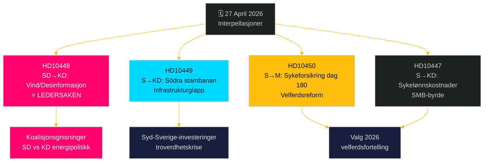

# Opposisjonen utfordrer på bred front: Jernbaner, sykeforsikring og energidesinformasjon

**Author**: James Pether Sörling  
**Date**: 2026-04-27  
**Classification**: UNCLASSIFIED // PUBLIC  
**Confidence**: MEDIUM-HIGH [B2]

---

## 🎯 BLUF

Den 27. april 2026 mottok det svenske Riksdag to nye interpellasjoner – om forsinkede jernbaneinvesteringer og reform av sykeforsikringen – mens allerede kunngjorte interpellasjoner til debatt inkluderer et politisk ladet SD-angrep på energiminister Ebba Busch (KD) om vindkraft-"desinformasjon". Det dominerende mønsteret er en sosialdemokratisk ansvarskampanje rettet mot Tidö-koalisjonens troverdighet på infrastrukturinvesteringer, sysselsetting og energipolitikk, med en uvanlig intra-koalisjonsbrytning eksponert av SDs interpellasjon om KDs energipolitikk med ironi og provokasjon. Regjeringen er under tidspress på flere fronter foran valget i 2026.

## 🧭 3 Beslutninger dette briefet støtter

1. **Prioritering av mediedekning**: SD-interpellasjonen om vindenergi/desinformasjon (HD10448) er ledersaken – den er den mest politisk eksplosive, som kombinerer energipolitikk med et informasjonskrigsnøkkelperspektiv og potensielt koalisjonsbelastende dynamikk mellom SD og KD.
2. **Valgoppfølging**: Sosialdemokratene bruker interpellasjoner som et forvalgsinstrument for ansvarlighet – fem av syv denne uken retter seg mot statsråder med konkrete krav om politiske omvendinger.
3. **Vurdering av investeringstillit**: HD10449-interpellasjonen om Södra stambanan tydeliggjør et bredere infrastruktur-troverdighetsgap som kan påvirke næringsinvesteringsbeslutninger i Sør-Sverige (Kronoberg/Skåne) foran valget.

## ⚡ 60-sekunders etterretningssammendrag

- **HD10448 (SD → KD)**: Josef Fransson (SD) bruker Windeuropes rapport "Wind Energy Dis- and Misinformation" – som hevder at svenske pro-fossile grupper sprer russiskstøttet desinformasjon – som grunnlag for sarkastisk å stille spørsmål ved om energiminister Busch selv er offer eller formidler av desinformasjon, og utfordrer henne til å gjennomgå energipolitiske beslutninger. **Betydning**: L2+ Prioritet – avslører SD-KD-koalisjonsgnisninger om energi; medieforsterkelse via Sveriges Radio har allerede skjedd.
- **HD10449 (S → KD)**: Robert Olesen (S) utfordrer infrastrukturminister Carlson om fjerningen av Södra stambanans investeringer nord for Hässleholm og Alvesta–Växjö dobbeltsporet fra Trafikverkets nye plan, med referanse til sammenbruddet av regionale utviklingsforpliktelser. **Betydning**: L2 Strategisk – 3 millioner berørte innbyggere i Syd-Sverige.
- **HD10450 (S → M)**: Jessica Rodén (S) stiller spørsmål til sosialforsikringsminister Anna Tenje om potensiell fjerning av dag-180-unntaket i sykeforsikringen (det såkalte "S-unntaket" som muliggjør retur til egen arbeidsgiver), og viser til Riksrevisjonens bevis for at det fungerer. **Betydning**: L2 Strategisk – velferdsstatsreformfortelling.
- **HD10447 (S → KD)**: Patrik Lundqvist (S) presser Busch om avskaffet høy sykelønnskostnadserkstatning (fjernet 2024) og argumenterer for at det begrenser SMB-sysselsetting og Sveriges etterslepende BNP-vekst.

## 🔭 Viktigste fremadrettede trigger

Følg med på Ebba Buschs svar på HD10448 – hvis hun behandler SD-provokasjonen som et seriøst politisk spørsmål, signaliserer det koalisjonsdisiplin; hvis hun avviser den, kan det krystallisere en offentlig SD-KD-splid om energipolitikk foran junibudsjettet.

## 📊 Signifikanskrangering

| Rang | dok_id | Sak | DIW-vekt |
|------|--------|-----|----------|
| 1 | HD10448 | Vindenergi/desinformasjon/koalisjon | L2+ Prioritet |
| 2 | HD10449 | Södra stambanan/infrastruktur | L2 Strategisk |
| 3 | HD10450 | Sykeforsikring dag 180 | L2 Strategisk |
| 4 | HD10447 | Sykelønnskostnader/SMB | L2 |
| 5 | HD10446 | Feilaktige dødserklæringer | L1 |
| 6 | HD10444 | Arbeidsgiveravgift/ungdom | L1 |
| 7 | HD10443 | Sosial dumping kommuner | L1 |

<!-- source-sha: 0d5ca67103600cd49fb8373d7e028558be2d04d5 -->
