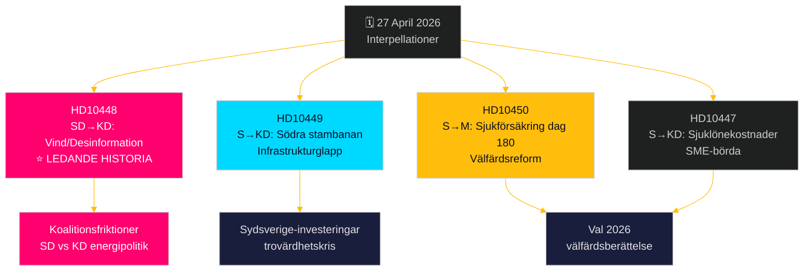

# Oppositionen utmanar på bred front: Järnvägar, sjukförsäkring och energidesinformation

**Author**: James Pether Sörling  
**Date**: 2026-04-27  
**Classification**: UNCLASSIFIED // PUBLIC  
**Confidence**: MEDIUM-HIGH [B2]

---

## 🎯 BLUF

Den 27 april 2026 fick svenska riksdagen in två nya interpellationer – om försenade järnvägsinvesteringar och reform av sjukförsäkringen – medan redan aviserade interpellationer inför debatt inkluderar en politiskt laddad attack från SD mot energiminister Ebba Busch (KD) om vindkraftens "desinformation". Det dominerande mönstret är en socialdemokratisk ansvarskampanj riktad mot Tidökoalitionens trovärdighet i frågor om infrastrukturinvesteringar, sysselsättning och energipolitik, med en ovanlig spricka inom koalitionen som exponeras av SDs interpellation om KDs energipolitik med ironi och provokation. Regeringen möter tidspressen på flera fronter inför valet 2026.

## 🧭 3 Beslut som detta briefing stöder

1. **Prioritering av medierapportering**: SDs interpellation om vindenergi/desinformation (HD10448) är den ledande historien – den är den mest politiskt explosiva och kombinerar energipolitik med ett informationskrigsramverk och potentiellt koalitionsstörande dynamik mellan SD och KD.
2. **Valbevakning**: Socialdemokraterna använder interpellationer som ett förelektionsansvarighetsinstrument – fem av sju denna vecka riktar sig mot statsråd med begäran om konkreta politikomvändningar.
3. **Bedömning av investeringsklimat**: Interpellationen om Södra stambanan (HD10449) tydliggör ett bredare infrastrukturkredibilitetsglapp som kan påverka affärsinvesteringsbeslut i södra Sverige (Kronoberg/Skåne) inför valet.

## ⚡ 60-sekunders underrättelsesammanfattning

- **HD10448 (SD → KD)**: Josef Fransson (SD) använder Windeuropes rapport "Wind Energy Dis- and Misinformation" – som hävdar att svenska pro-fossila grupper sprider ryskstödd desinformation – som grund för att sarkastiskt ifrågasätta om energiminister Busch själv är offer eller spridare av desinformation och utmanar henne att se över energipolitiska beslut. **Betydelse**: L2+ Prioritet – exponerar SD-KD-koalitionsfriktioner om energi; medieförstärkning via Sveriges Radio har redan skett.
- **HD10449 (S → KD)**: Robert Olesen (S) utmanar infrastrukturminister Carlson om borttagningen av Södra stambanans investeringar norr om Hässleholm och Alvesta–Växjö dubbelspår från Trafikverkets nya plan, med hänvisning till kollapsen av regionala utvecklingsåtaganden. **Betydelse**: L2 Strategisk – 3 miljoner berörda invånare i Sydsverige.
- **HD10450 (S → M)**: Jessica Rodén (S) ifrågasätter socialförsäkringsminister Anna Tenje om potentiellt borttagande av sjukförsäkringens dag 180-undantag (det s.k. "S-undantaget" som möjliggör återgång till egen arbetsgivare), med hänvisning till Riksrevisionens bevis att det fungerar. **Betydelse**: L2 Strategisk – välfärdsreformberättelse.
- **HD10447 (S → KD)**: Patrik Lundqvist (S) pressar Busch om avskaffad hög sjuklönekostnadsersättning (borttagen 2024), och argumenterar att det begränsar SME-sysselsättning och Sveriges eftersläpande BNP-tillväxt.

## 🔭 Viktigaste framåtblickande trigger

Bevaka Ebba Buschs svar på HD10448 – om hon behandlar SDs provokation som en seriös policyfråga signalerar det koalitionsdisciplin; om hon avvisar den kan det kristallisera en offentlig SD-KD-spricka om energipolitik inför junibud geten.

## 📊 Signifikansranking

| Ranking | dok_id | Fråga | DIW-vikt |
|---------|--------|-------|-----------|
| 1 | HD10448 | Vindenergi/desinformation/koalition | L2+ Prioritet |
| 2 | HD10449 | Södra stambanan/infrastruktur | L2 Strategisk |
| 3 | HD10450 | Sjukförsäkring dag 180 | L2 Strategisk |
| 4 | HD10447 | Sjuklönekostnader/SME | L2 |
| 5 | HD10446 | Felaktiga dödförklaringar | L1 |
| 6 | HD10444 | Arbetsgivaravgifter/ungdomar | L1 |
| 7 | HD10443 | Social dumpning kommuner | L1 |

<!-- source-sha: 0d5ca67103600cd49fb8373d7e028558be2d04d5 -->
