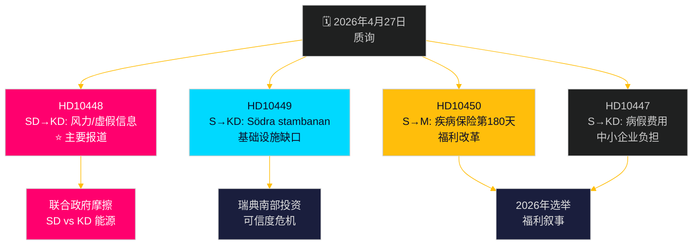

# 反对派发起多线挑战：铁路、疾病保险和能源虚假信息

**Author**: James Pether Sörling  
**Date**: 2026-04-27  
**Classification**: UNCLASSIFIED // PUBLIC  
**Confidence**: MEDIUM-HIGH [B2]

---

## 🎯 简报摘要

2026年4月27日，瑞典议会（Riksdag）收到两份新的质询——关于铁路投资延误和疾病保险改革——同时，已宣布待辩的质询中包括SD对能源部长埃巴·布什（KD）就风力发电"虚假信息"发起的政治上充满火药味的攻击。主导模式是社会民主党针对提德联合政府在基础设施投资、就业和能源政策上的可信度发起的追责运动，SD就KD能源政策提出的质询以讽刺和挑衅的方式揭示了联合政府内部不寻常的裂痕。政府在2026年大选前在多个方面面临时间压力。

## 🧭 本简报支持的3项决策

1. **媒体报道优先级**：SD关于风力能源/虚假信息的质询（HD10448）是主要报道——它是政治上最具爆炸性的，将能源政策与信息战框架以及SD与KD之间潜在的联合政府压力动态结合起来。
2. **选举追踪**：社会民主党将质询用作选前追责工具——本周七份中的五份针对政府大臣，提出具体的政策转向要求。
3. **投资信心评估**：HD10449关于Södra stambanan的质询具体体现了更广泛的基础设施可信度缺口，可能在选举前影响瑞典南部（Kronoberg/Skåne）的企业投资决策。

## ⚡ 60秒情报摘要

- **HD10448 (SD → KD)**：约瑟夫·弗兰森（SD）利用Windeurope报告"Wind Energy Dis- and Misinformation"——该报告声称瑞典亲化石燃料团体正在传播俄罗斯支持的虚假信息——作为讽刺性地质疑能源部长布什自己是否是虚假信息的受害者或传播者的依据，挑战她审查能源政策决定。**重要性**：L2+ 优先——揭示SD-KD联合政府在能源方面的摩擦；通过Sveriges Radio的媒体放大已经发生。
- **HD10449 (S → KD)**：罗伯特·奥莱森（S）就Trafikverket新计划中删除Hässleholm以北的Södra stambanan投资和Alvesta–Växjö双线挑战基础设施部长卡尔森，引用区域发展承诺的崩溃。**重要性**：L2 战略性——瑞典南部300万居民受影响。
- **HD10450 (S → M)**：杰西卡·罗登（S）就可能废除疾病保险第180天例外（允许返回原雇主的"S例外"）向社会保险部长安娜·特尼叶质询，援引Riksrevisionen关于其有效性的证据。**重要性**：L2 战略性——福利国家改革叙事。
- **HD10447 (S → KD)**：帕特里克·伦德克维斯特（S）就废除的高病假费用补偿（2024年废除）向布什施压，认为这抑制了中小企业就业和瑞典落后的GDP增长。

## 🔭 主要前瞻触发因素

关注埃巴·布什对HD10448的回应——如果她将SD的挑衅视为严肃的政策问题，这表明联合政府纪律；如果她拒绝，可能在六月预算前将SD-KD关于能源政策的公开裂痕具体化。

## 📊 重要性排名

| 排名 | dok_id | 议题 | DIW权重 |
|------|--------|------|--------|
| 1 | HD10448 | 风力能源/虚假信息/联合政府 | L2+ 优先 |
| 2 | HD10449 | Södra stambanan/基础设施 | L2 战略性 |
| 3 | HD10450 | 疾病保险第180天 | L2 战略性 |
| 4 | HD10447 | 病假费用/中小企业 | L2 |
| 5 | HD10446 | 错误死亡声明 | L1 |
| 6 | HD10444 | 雇主缴费/青年 | L1 |
| 7 | HD10443 | 地方政府社会倾销 | L1 |

<!-- source-sha: 0d5ca67103600cd49fb8373d7e028558be2d04d5 -->
