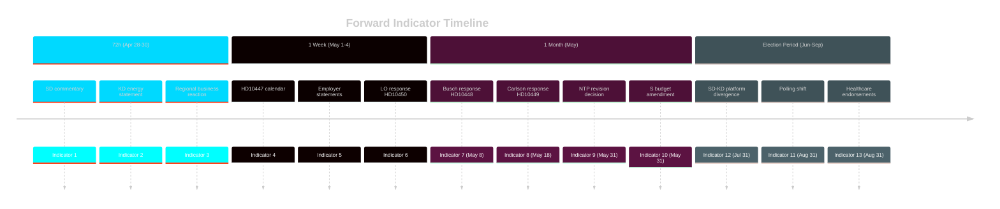

# Forward Indicators

**Date**: 2026-04-27  
**Author**: James Pether Sörling  
**Method**: ≥10 dated indicators across 4 horizons (72h / week / month / election)

---

## Indicator Framework

Forward indicators are observable, dateable events whose occurrence would update our scenario probabilities. Each indicator is assigned a horizon, a directional signal (government risk / opposition opportunity), and a scenario impact.

---

## 72-Hour Horizon (by 2026-04-30)

**Indicator 1** — SD media commentary on HD10448  
*Observable*: Josef Fransson or SD energy spokesperson issues social media or press statement about the interpellation outcome.  
*Direction*: If SD emphasizes the interpellation: → Scenario B (coalition stress accumulation). If SD is silent: → Scenario A (managed).  
*Deadline*: 2026-04-30

**Indicator 2** — KD response preview  
*Observable*: KD communications team or Ebba Busch makes any public statement about energy policy debate quality.  
*Direction*: If Busch emphasizes "disinformation" framing broadly: → Scenario C risk. If Busch emphasizes policy substance: → Scenario A or B.  
*Deadline*: 2026-04-30

**Indicator 3** — Kronoberg regional business reaction  
*Observable*: Sydsvenskan or regional news outlets quote business associations responding to HD10449 filing.  
*Direction*: If business associations demand government commitment: → railway narrative escalates. If silent: → interpellation remains parliamentary procedure.  
*Deadline*: 2026-04-30

---

## One-Week Horizon (by 2026-05-04)

**Indicator 4** — HD10447 parliamentary calendar scheduling  
*Observable*: Riksdag calendar posts date for HD10447 (sjuklönekostnader) debate.  
*Direction*: Early scheduling indicates government managing the calendar proactively. Late scheduling suggests deprioritization.  
*Deadline*: 2026-05-04

**Indicator 5** — Employer organization statements on HD10447  
*Observable*: Företagarna, Almega, or Teknikföretagen issue public statements about sick-pay employer costs.  
*Direction*: Sustained employer criticism escalates the S narrative; employer silence reduces political salience.  
*Deadline*: 2026-05-04

**Indicator 6** — LO response to HD10450  
*Observable*: LO (central trade union) issues statement on day-180 exception policy.  
*Direction*: LO statement with Riksrevisionen citation: → high-salience attack vector. LO silence: → interpellation remains parliamentary.  
*Deadline*: 2026-05-04

---

## One-Month Horizon (by 2026-05-27)

**Indicator 7** — HD10448 government response quality (Busch → Fransson)  
*Observable*: Minister Busch delivers written and oral response to HD10448 by 2026-05-08.  
*Direction*: Response that acknowledges Fransson's procedural concern without endorsing anti-wind position → Scenario A. Dismissive response → Scenario C risk.  
*Deadline*: 2026-05-08

**Indicator 8** — HD10449 government response quality (Carlson → Olesen)  
*Observable*: Minister Carlson delivers response to HD10449 by 2026-05-18.  
*Direction*: Any specific timeline or process commitment: → reduces railway narrative risk. Vague response: → narrative sustains.  
*Deadline*: 2026-05-18

**Indicator 9** — National transport plan revision announcement  
*Observable*: Government or Trafikverket announces any revision to the national transport plan affecting southern Sweden.  
*Direction*: Any positive revision: → significantly reduces railway vulnerability. Confirmation of removal: → HD10449 becomes campaign centerpiece.  
*Deadline*: 2026-05-31

**Indicator 10** — S budget amendment on sick insurance  
*Observable*: Social Democrats include sick insurance day-180 exception in their budget amendment for 2027.  
*Direction*: S budget inclusion confirms this is a sustained campaign priority. Absence suggests deprioritization.  
*Deadline*: 2026-05-31

---

## Election-Period Horizon (by September 2026)

**Indicator 11** — Polling shift in Kronoberg and Skåne  
*Observable*: Regional polls (Demoskop, Novus) show movement in M or SD support in southern Swedish constituencies.  
*Direction*: 2+ point movement toward S/C: → railway narrative is cutting. No movement: → narrative is background, not decisive.  
*Deadline*: 2026-08-31

**Indicator 12** — SD-KD energy policy published  
*Observable*: SD and/or KD publishes updated energy policy position ahead of 2026 election manifesto period.  
*Direction*: Divergent energy positions in published platforms: → HD10448 coalface becomes campaign divide. Convergent or silent: → managed.  
*Deadline*: 2026-07-31

**Indicator 13** — Healthcare professional endorsements  
*Observable*: Swedish Medical Association (Läkarförbundet) or nursing associations make election recommendations citing social insurance policy.  
*Direction*: Negative assessment of current sick insurance policy: → amplifies HD10450 significance. No statement: → remains parliamentary.  
*Deadline*: 2026-08-31

---

## Indicator Summary Table

| # | Indicator | Horizon | Deadline | Government Risk Level |
|---|---|---|---|---|
| 1 | SD Fransson commentary | 72h | 2026-04-30 | MEDIUM |
| 2 | KD/Busch energy statement | 72h | 2026-04-30 | MEDIUM |
| 3 | Kronoberg business reaction | 72h | 2026-04-30 | MEDIUM |
| 4 | HD10447 calendar scheduling | 1 week | 2026-05-04 | LOW |
| 5 | Employer organization statements | 1 week | 2026-05-04 | MEDIUM |
| 6 | LO response to HD10450 | 1 week | 2026-05-04 | HIGH |
| 7 | HD10448 Busch response quality | 1 month | 2026-05-08 | HIGH |
| 8 | HD10449 Carlson response quality | 1 month | 2026-05-18 | HIGH |
| 9 | NTP revision announcement | 1 month | 2026-05-31 | HIGH |
| 10 | S budget amendment inclusion | 1 month | 2026-05-31 | MEDIUM |
| 11 | Kronoberg/Skåne polling shift | Election | 2026-08-31 | HIGH |
| 12 | SD-KD energy platforms | Election | 2026-07-31 | HIGH |
| 13 | Healthcare endorsements | Election | 2026-08-31 | MEDIUM |

