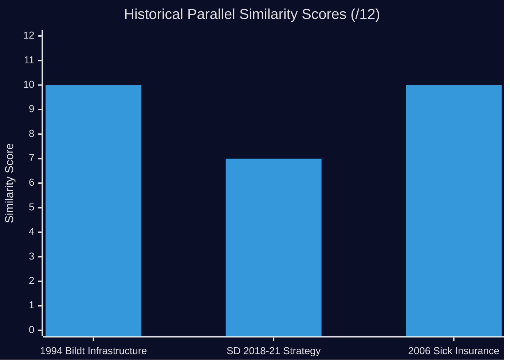

# Historical Parallels

**Date**: 2026-04-27  
**Author**: James Pether Sörling  
**Method**: Historical case analysis with similarity scoring

---

## Framework

Each parallel is assessed against the current situation on four dimensions:
- **Policy domain match** (0–3): How similar is the policy area?
- **Coalition dynamics match** (0–3): How similar is the coalition stress pattern?
- **Electoral context match** (0–3): How similar is the electoral timing?
- **Outcome relevance** (0–3): How instructive is the historical outcome?

**Total similarity score**: /12 (≥8 = high similarity, ≥6 = moderate, <6 = weak)

---

## Parallel 1 — The 1994 Bildt Government Infrastructure Rollback

**Historical Case**: The Carl Bildt government (1991–1994) faced significant criticism for infrastructure investment deferrals amid fiscal consolidation. Regional parties and the Social Democrats used interpellations and motions to document specific investment postponements.

**Similarity to 2026-04-27 situation**:
- Policy domain (infrastructure rollback): 3/3
- Coalition dynamics (right-of-center government managing regional commitments): 2/3
- Electoral context (approaching election, opposition using infrastructure as campaign tool): 3/3
- Outcome relevance: The Bildt government lost the 1994 election; infrastructure credibility was one of many factors: 2/3

**Similarity score**: 10/12 — **HIGH similarity**

**Lesson**: Infrastructure commitment failures in the 1993–94 period contributed to the "right-wing government broke regional promises" narrative that aided S's return to power in 1994. The pattern is directly analogous to the current Carlson/Södra stambanan situation.

---

## Parallel 2 — SD-M Policy Tension in 2018–2021 (January Agreement Era)

**Historical Case**: After the 2018 election, the January Agreement (S+MP+C+L) left SD out of government for the second consecutive term. SD's response was systematic use of interpellations and committee work to challenge the minority government on policy.

**Similarity**:
- Policy domain (interpellation-based opposition by junior coalition/support parties): 2/3
- Coalition dynamics (party using interpellations to mark policy distance from governing partners): 2/3
- Electoral context (mid-Riksmöte positioning, not election-year finale): 1/3
- Outcome relevance: SD's sustained pressure contributed to the narrative that led to their stronger 2022 result: 2/3

**Similarity score**: 7/12 — **MODERATE similarity**

**Lesson**: Parties using interpellations to mark policy distance from partners — even when they support the government — can successfully use this tool to differentiate their brand without triggering coalition collapse.

---

## Parallel 3 — 2006 Work Capability Reform (Sjukförsäkring)

**Historical Case**: The first Reinfeldt government (M-led 2006–2010) implemented major sick insurance reforms including stricter work capability assessments and reduced long-term benefits. The S opposition used extensively interpellations and parliamentary questions to document individual cases and systemic failures.

**Similarity**:
- Policy domain (sick insurance reform, benefit reversal, medical professional criticism): 3/3
- Coalition dynamics (governing party defending politically costly but ideologically committed reform): 2/3
- Electoral context (reforms implemented mid-term, interpellation pressure throughout): 2/3
- Outcome relevance: The Reinfeldt government survived two terms but sick insurance policy became one of the most sustained points of political attack throughout: 3/3

**Similarity score**: 10/12 — **HIGH similarity**

**Lesson**: Sick insurance reforms (both ways — tightening and relaxing) generate sustained interpellation pressure throughout the full term. The current HD10450/HD10447 pattern is consistent with a multi-year campaign that will persist through 2026.

---

## Summary Similarity Matrix

| Historical Parallel | Score | Key Lesson |
|---|---|---|
| 1994 Bildt infrastructure rollback | 10/12 | Infrastructure promises matter in southern Sweden |
| SD interpellation strategy 2018-21 | 7/12 | Intra-coalition interpellations are brand differentiation, not existential threats |
| 2006 sick insurance reform cycle | 10/12 | Sick insurance interpellations persist through full terms |

