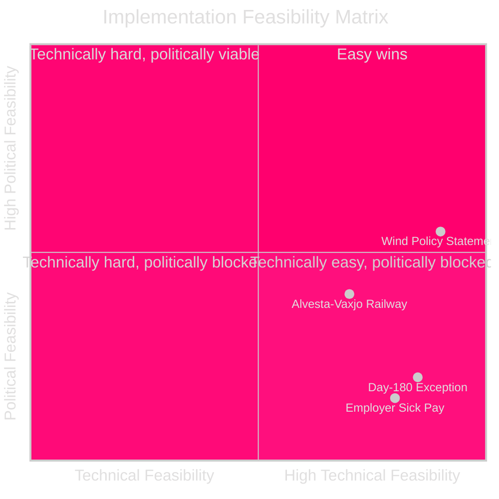

# Implementation Feasibility Analysis

**Date**: 2026-04-27  
**Author**: James Pether Sörling  
**Method**: Delivery risk view per interpellation demand

---

## Framework

Each interpellation implicitly demands a policy action or explanation. This analysis assesses the feasibility of the demanded action and the political cost of non-compliance.

---

## HD10449 — Railway Infrastructure: What Would Implementation Require?

**Interpellation demand**: Restore Södra stambanan / Alvesta–Växjö double-track to the national transport plan.

**Implementation pathway**:
1. Government instruction to Trafikverket to revise national transport plan
2. Trafikverket cost-benefit review (typically 12–18 months)
3. Government decision to include in plan
4. Budget allocation (estimated SEK 4–8 billion for full Alvesta–Växjö)
5. Procurement and construction (10+ years)

**Feasibility assessment**:
- **Technical feasibility**: HIGH — the corridor has been designed, surveyed, and planned before
- **Financial feasibility**: LOW in current fiscal framework — would require budget reallocation or new spending
- **Political feasibility**: MEDIUM — requires coalition agreement and Trafikverket process
- **Timeline feasibility**: Construction by 2035+ is the earliest realistic scenario even if decision made in 2026

**Delivery risk**: HIGH — even if government commits, actual delivery is a decade away, making commitment statements difficult to verify in electoral timeframe.

---

## HD10450 — Day-180 Exception: What Would Implementation Require?

**Interpellation demand**: Reinstate the day-180 exception to the sjukförsäkring full labor market test.

**Implementation pathway**:
1. Government proposes legislative amendment to SFB (Socialförsäkringsbalken)
2. Riksdag vote (requires Tidö coalition agreement)
3. Försäkringskassan administrative update
4. Implementation (immediate upon law change)

**Feasibility assessment**:
- **Technical feasibility**: HIGH — straightforward regulatory amendment
- **Financial feasibility**: MEDIUM — modest cost; Riksrevisionen positive evaluation suggests long-term cost-savings
- **Political feasibility**: LOW — M government abolished this; reversal would be significant face-loss
- **Timeline feasibility**: Could be implemented within 6 months if political will exists

**Delivery risk**: LOW from technical standpoint, HIGH from political standpoint. Government would need strong pressure to reverse.

---

## HD10447 — Sick Pay Employer Support: What Would Implementation Require?

**Interpellation demand**: Address the increase in employer sick-pay costs following abolition of the support scheme.

**Implementation pathway**:
1. Government proposes new employer sick-pay support scheme or modification
2. Budget allocation
3. Legislative amendment
4. Implementation via Försäkringskassan or tax agency

**Feasibility assessment**:
- **Technical feasibility**: HIGH — previous scheme exists as template
- **Financial feasibility**: LOW-MEDIUM — costs several billion SEK per year
- **Political feasibility**: LOW — government has made this a work-capacity reform priority
- **Timeline feasibility**: Next budget (2027) is earliest realistic reinstatement

---

## HD10448 — Wind Disinformation: What Would Implementation Require?

**Interpellation demand**: Clarify government's position on the Windeurope "disinformation" report and Sweden's energy mix policy.

**Implementation pathway**: 
- This is a clarification/explanation demand, not a policy change demand
- Busch can respond within current policy framework
- No legislative change required

**Feasibility assessment**:
- **Technical feasibility**: VERY HIGH — policy statement
- **Political feasibility**: HIGH for measured response, LOW for response that fully satisfies SD's position
- **Delivery risk**: LOW for response delivery, MEDIUM for response content managing all stakeholders

---

## Delivery Risk Matrix

| Policy Action | Technical | Financial | Political | Timeline | Overall Risk |
|---|---|---|---|---|---|
| Restore Alvesta–Växjö to NTP | HIGH feas. | LOW feas. | MEDIUM feas. | LOW feas. | 🔴 HIGH |
| Reinstate day-180 exception | HIGH feas. | MEDIUM feas. | LOW feas. | HIGH feas. | 🔴 HIGH |
| Restore employer sick-pay support | HIGH feas. | LOW feas. | LOW feas. | LOW feas. | 🔴 HIGH |
| Issue policy statement on wind | HIGH feas. | HIGH feas. | MEDIUM feas. | HIGH feas. | 🟡 MEDIUM |

