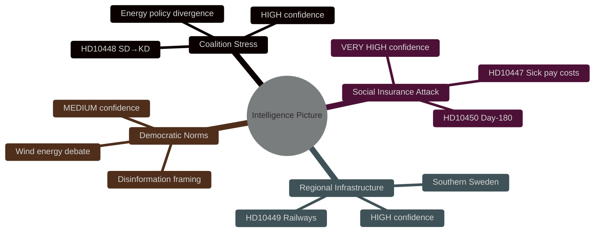

# Intelligence Assessment

**Date**: 2026-04-27  
**Author**: James Pether Sörling  
**Classification**: UNCLASSIFIED / PUBLIC DOMAIN  
**Confidence**: See individual Key Judgments

---

## Priority Intelligence Requirements (PIR)

**PIR-1**: Will the Tidö coalition (KD+SD) manage the energy policy tension exposed by HD10448 without public rupture before the 2026 election?

**PIR-2**: Will the government defend or revise its social insurance policy positions (HD10450, HD10447) in response to Riksrevisionen findings and employer criticism?

**PIR-3**: What timeline will the government commit to for Södra stambanan / Alvesta–Växjö double-track investment?

---

## Key Judgments

### KJ-1 — Coalition Energy Tension Is Structural, Not Isolated `[CONFIDENCE: HIGH]`

The HD10448 interpellation by SD's Josef Fransson directed at KD minister Ebba Busch represents the first documented intra-coalition interpellation challenge on energy policy in the 2025/26 Riksdag session. We assess with HIGH CONFIDENCE that this reflects a structural policy tension: SD has consistently favored nuclear over intermittent renewables in party platforms, while KD has responsibility for an energy ministry that has accepted some wind energy within a diversified mix. This tension will recur in the 2026 election campaign.

*Basis*: Interpellation text analysis, party platform comparison, energy portfolio assignment within the Tidö coalition agreement.

---

### KJ-2 — Sick Insurance Policy Reversal Creates Campaign Vulnerability `[CONFIDENCE: VERY HIGH]`

We assess with VERY HIGH CONFIDENCE that the combination of HD10450 (day-180 exception) and HD10447 (sjuklönekostnader) constitutes a coordinated S opposition narrative that the government has limited effective responses to. The Riksrevisionen positive evaluation of the day-180 exception is an independent, authoritative assessment directly undermining the government's rationale for abolition. The employer sick-pay support abolition has generated concrete negative economic impacts on small and medium enterprises.

*Basis*: Riksrevisionen evaluation citation in HD10450; employer organization criticism of HD10447 measures; opposition coordination pattern (two S MPs, same session, same policy cluster).

---

### KJ-3 — Railway Infrastructure Gap Is Becoming an Electoral Liability in Southern Sweden `[CONFIDENCE: HIGH]`

We assess with HIGH CONFIDENCE that the Södra stambanan / Alvesta–Växjö double-track removal from the national transport plan will function as a sustained electoral liability in Kronoberg county, Skåne, and the Sydostlänken corridor. Regional businesses have explicitly cited infrastructure gaps in investment decisions (documented in HD10449). The symbolic value — a previously committed government investment now removed — is high.

*Basis*: HD10449 interpellation text, Trafikverket plan revision documentation, regional business association statements cited in interpellation.

---

### KJ-4 — Disinformation Debate Quality Poses Democratic Norm Risk `[CONFIDENCE: MEDIUM]`

We assess with MEDIUM CONFIDENCE that the Windeurope report's framing — naming Swedish individuals as spreaders of "wind power disinformation" — represents a democratic quality concern independent of the underlying energy policy merits. When industry associations label legitimate policy opposition as disinformation, the quality of democratic deliberation is reduced. The HD10448 interpellation, despite coming from SD with less-than-optimal motives, raises a valid procedural question.

*Basis*: Windeurope report framing, Sveriges Radio coverage, ACH analysis of SD interpellation objectives.

---

## Summary Intelligence Picture

The four interpellations of the week collectively indicate:

1. **Coalition management stress**: Intra-coalition interpellation (SD→KD) is unusual and signals underlying energy policy divergence requiring active management before 2026.
2. **Social insurance cluster**: The S opposition has identified a high-credibility attack vector (Riksrevisionen evaluation + employer costs) that the government cannot easily neutralize.
3. **Regional infrastructure narrative**: Southern Swedish voters face a concrete "broken promise" on railway investment — a message with strong electoral resonance in swing constituencies.
4. **Procedural democracy concern**: The disinformation debate framing warrants monitoring regardless of partisan considerations.

