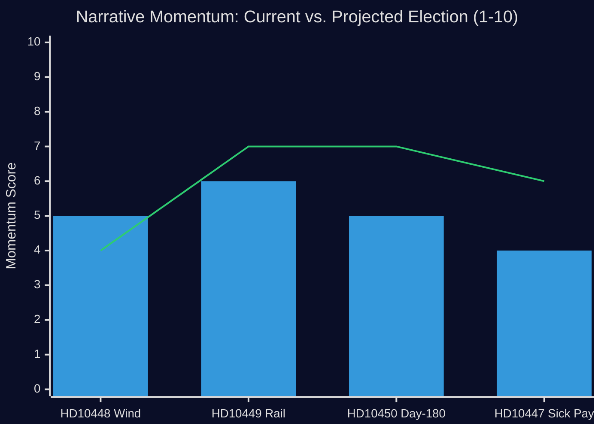

# Media Framing Analysis

**Date**: 2026-04-27  
**Author**: James Pether Sörling  
**Method**: Per-party framing + press quadrant analysis

---

## Framing Overview

Political actors present the same policy reality through different narrative frames. This analysis examines how each party/actor would likely frame the four interpellations in their communications.

---

## Per-Party Framing Analysis

### HD10448 — Disinformation and Wind Power

| Actor | Frame | Key Message | Media Channel |
|---|---|---|---|
| SD (Fransson) | "Information suppression" | "The government is calling legitimate policy criticism Russian disinformation" | SD.se, social media, Avpixlat |
| KD (Busch) | "Security of supply" | "Energy reliability requires all sources; we will not be distracted by disinformation about disinformation" | Press releases, TV debates |
| S (Opposition) | "Coalition fracture" | "The government's own support partner doesn't trust the energy minister" | Aftonbladet, SVT |
| Windeurope | "Facts vs. disinformation" | "Our report documents Russian-linked campaigns — this is not about domestic policy debate" | EU media, industry press |

### HD10449 — Södra stambanan / Railways

| Actor | Frame | Key Message | Media Channel |
|---|---|---|---|
| S (Olesen) | "Broken promise" | "The government promised infrastructure, removed it — businesses have already lost" | Regional media (Kronoberg), Expressen |
| M/Carlson | "Responsible prioritization" | "We are managing a constrained budget; all regions get their fair share over time" | Sydsvenskan, government press |
| Regional business | "Investment uncertainty" | "We can't plan for growth when the state changes infrastructure commitments every planning cycle" | Skånskt Näringsliv, Chamber of Commerce |

### HD10450+HD10447 — Social Insurance

| Actor | Frame | Key Message | Media Channel |
|---|---|---|---|
| S (Rodén, Lundqvist) | "Punishing the sick" | "The government repealed a program that independent experts said works, to pay for tax cuts" | LO media, Aftonbladet, SVT |
| M (Tenje) | "Work-first policy" | "We believe in work capacity, not extended passive absence; costs must be managed" | Government press releases, GP |
| Employer associations | "Increased burden" | "Government said they would reduce employer obligations; sick-pay costs went the other way" | DI, Veckans Affärer |
| Healthcare professionals | "Clinical judgment overridden" | "We know when patients can return to work; bureaucratic rules ignore medical expertise" | Läkartidningen, SR Ekot |

---

## Press Quadrant Analysis

Classification of likely media outlets by partisan lean and audience:

```
                    Pro-Government ←→ Pro-Opposition
                                |
                    Broadsheet  |  Broadsheet
                    ↑           |           ↑
         Svenska Dagbladet      |       Aftonbladet
         (right-center)         |       (left-center)
         Dagens Industri        |       Expressen (varies)
                                |
         ----------------Tabloid|Tabloid-------------------
                                |
         Kvällsposten (SD-lean)  |       Metro (left-lean)
         ↓                      |           ↓
                    Partisan    |  Partisan
```

**HD10448 Press Quadrant**: SD-leaning tabloid media will amplify the "information suppression" frame; left-broadsheet will use the "coalition fracture" frame; mainstream broadsheet will report on Windeurope findings.

**HD10449 Press Quadrant**: Regional southern Swedish media (Sydsvenskan, Kvällsposten) will give highest prominence; both may be critical of infrastructure removal. National media treats as regional story unless Carlson's response is surprising.

**HD10450/HD10447 Press Quadrant**: Left-leaning media will amplify with personal stories; employer associations provide DI/business press angle. Healthcare professional voices will gain SR/public broadcaster coverage.

---

## Narrative Momentum Assessment

| Interpellation | Current Momentum | Trajectory | Trigger for Escalation |
|---|---|---|---|
| HD10448 | MEDIUM | Declining unless response escalates | Busch dismisses SD concerns explicitly |
| HD10449 | MEDIUM | Sustained through election | Any additional infrastructure removal |
| HD10450 | LOW-MEDIUM | Growing with Riksrevisionen citations | Government rejects Riksrevisionen findings |
| HD10447 | LOW | Sustained by employer criticism | Business association sustained campaign |



*Bar = current momentum. Line = projected election-period momentum.*
