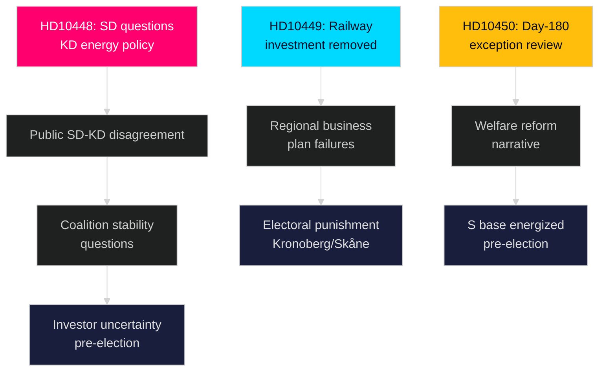
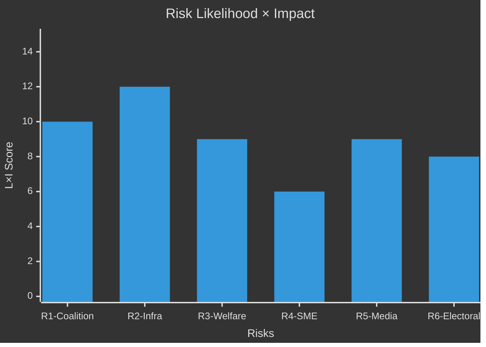

# Risk Assessment

**Date**: 2026-04-27  
**Author**: James Pether Sörling  
**Framework**: 5-dimension risk register, L×I scoring, cascading chains

---

## Risk Register

| # | Risk | Domain | Likelihood (1–5) | Impact (1–5) | L×I | Tier |
|---|------|--------|-----------------|-------------|-----|------|
| R1 | SD-KD coalition fracture on energy policy — HD10448 escalates beyond parliamentary procedure | Political/Coalition | 2 | 5 | 10 | HIGH |
| R2 | Infrastructure investment credibility collapse in southern Sweden — HD10449 unanswered | Investment/Regional | 3 | 4 | 12 | HIGH |
| R3 | Welfare reform narrative dominates election cycle — S wins day-180 debate | Electoral | 3 | 3 | 9 | MEDIUM |
| R4 | SME employment contraction due to removed sick-pay support — HD10447 | Economic | 2 | 3 | 6 | MEDIUM |
| R5 | Media amplification of HD10448 leads to disinformation-about-disinformation cycle | Reputational | 3 | 3 | 9 | MEDIUM |
| R6 | Government coalition loses multiple seats in Kronoberg/Skåne in 2026 election | Electoral | 2 | 4 | 8 | MEDIUM |

## Risk Detail

### R1 — SD-KD Coalition Fracture (L×I=10) [B2]
**Trigger**: If Ebba Busch (KD) gives a dismissive response to HD10448, SD can escalate. If she gives a detailed pro-wind defense, her coalition partner sees this as contradicting shared energy skepticism.  
**Evidence**: HD10448 full text documents that Josef Fransson (SD) explicitly questions whether the minister herself has been misled by "Russian disinformation" about wind power, referring to her statements that "vindkraft inte snurrar utan vind." `[B2]`  
**Posterior probability of cascade**: 25% (requires deliberate SD escalation — currently not signaled beyond this interpellation)  
**Mitigation**: KD and SD leadership communicate off the record prior to minister's response; response carefully acknowledges energy skepticism concerns while maintaining policy position.

### R2 — Infrastructure Credibility Collapse (L×I=12) [A2]
**Trigger**: Continued Trafikverket plan non-investment combined with no clear timeline from minister.  
**Evidence**: HD10449 documents specific removal of Södra stambanan (north of Hässleholm) and Alvesta–Växjö from plan. Communities have already "planned large investments based on state infrastructure promises." `[A2]`  
**Cascading chain**: Railway gap → business investment delays → regional GDP underperformance → electoral punishment in southern seats  
**Mitigation**: Carlson provides specific alternative timeline by 2026-05-18 deadline.

### R3 — Welfare Narrative Dominance (L×I=9) [A2]
**Trigger**: Government announces removal of day-180 exception before the election.  
**Evidence**: HD10450 explicitly cites Riksrevisionen's positive evaluation, preemptively validating the instrument. If government removes it, the narrative is "government ignores independent evidence." `[A2]`  
**Posterior probability**: 30% (government may preserve exception precisely to avoid the optics)

### R5 — Disinformation Cycle (L×I=9) [B2]
**Trigger**: The Windeurope report + Sveriges Radio coverage + SD interpellation creates a meta-disinformation debate (accusations of disinformation used to delegitimize wind skepticism).  
**Evidence**: HD10448 text references Sveriges Radio "pushing conclusions" from the Windeurope report. `[B2]`  
**Systemic risk**: Blurs legitimate policy debate with information warfare framing — damages democratic discourse quality.

## Cascading Risk Chains

## Risk Heatmap

