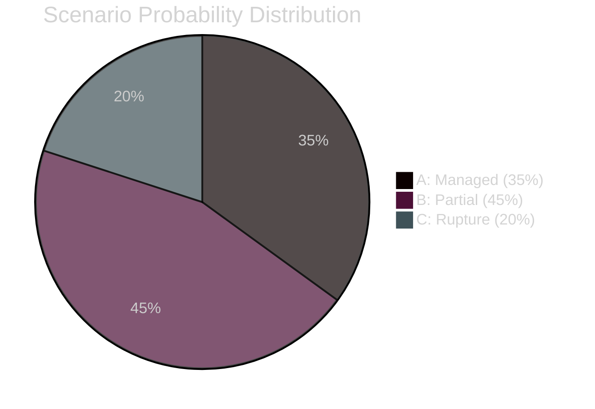
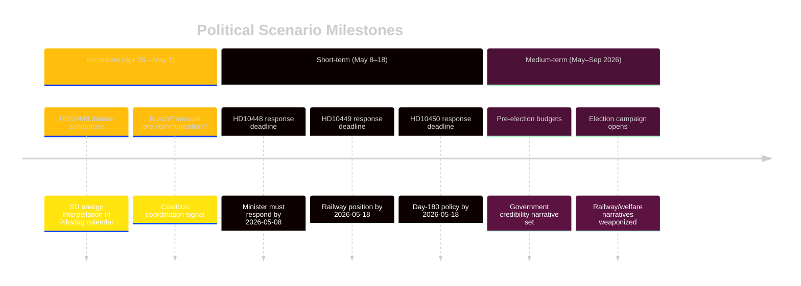

# Scenario Analysis

**Date**: 2026-04-27  
**Author**: James Pether Sörling  
**Method**: Three-scenario probability analysis with leading indicators

---

## Scenario Framework

Scenarios are structured around the government's response to the HD10448 (SD-KD energy) and HD10449 (infrastructure) interpellations, which jointly determine the political trajectory for the next 6–8 weeks.

---

## Scenario A — Coalition Manages Energy Divide, Infrastructure Timeline Clarified (35%)

**Description**: Busch delivers a measured response to HD10448 that acknowledges legitimate concerns about energy reliability without endorsing SD's anti-wind framing. Carlson provides a specific alternative timeline for southern railway investment. Government maintains unified public face.

**Pathway**:  
1. Busch response (by 2026-05-08): acknowledges energy mix diversity, cites security of supply rationale, avoids direct challenge to SD's position.
2. Carlson response (by 2026-05-18): offers revised Trafikverket review process for Alvesta–Växjö with a 2028–2029 indicative timeline.
3. Media narrative: government shows "steady hand" amid opposition pressure.

**Leading indicators**:  
- Busch pre-announces response substance in party communications before the Riksdag debate
- KD and SD whip offices communicate off-record
- Government transport press release references Sydsverige investments

**Probability**: 35% — requires active communication management, which the government has shown capacity for.

---

## Scenario B — Partial Response, Narratives Stabilize but Accumulate (45%)

**Description**: Busch gives a technically correct but politically unsatisfying response to HD10448 — defending energy policy without addressing SD's provocation. Carlson deflects on railways. Both responses are adequate but fuel opposition talking points.

**Pathway**:  
1. Busch: standard defense of energy policy priorities, no specific SD-tailored language.
2. Carlson: general infrastructure investment talking points, no specific Alvesta–Växjö timeline.
3. S uses responses in campaign material; SD does not escalate.

**Leading indicators**:  
- No unusual KD-SD leadership meetings before response dates
- Media coverage is moderate (news brief, not lead story)
- Social Democrats issue press releases citing responses as unsatisfactory

**Probability**: 45% — most likely baseline given government communication patterns.

---

## Scenario C — Coalition Rupture Signal, S Capitalizes (20%)

**Description**: Busch's response to HD10448 is read as dismissive of SD's concerns. SD leadership publicly escalates beyond interpellation — signals on energy policy divergence. Simultaneously, no railway timeline offered. Election narrative shifts to "divided government, broken promises."

**Pathway**:  
1. Busch: dismisses wind energy criticism as "disinformation" — directly invalidating SD's interpellation framing.
2. SD leadership: issues public statement distancing from KD energy position.
3. Carlson: vague response on railways.
4. S-led media campaign on "government breaks regional promises."

**Leading indicators**:  
- SD Fransson issues public commentary before Busch's response
- KD party communication uses "information warfare" framing that lumps SD critics with Russian disinformation
- Polls show coalition voter preference shifting by >2% in southern constituencies

**Probability**: 20% — requires miscommunication or deliberate escalation by one party.

---

## Scenario Probability Summary

| Scenario | Probability | Outcome for Tidö | Leading Indicator Window |
|----------|------------|-----------------|--------------------------|
| A — Managed | 35% | Stabilization | 2026-05-01 to 05-08 (Busch response) |
| B — Partial | 45% | Narrative accumulation | 2026-05-08 to 05-18 |
| C — Rupture | 20% | Coalition damage | 2026-04-28 to 05-08 |

