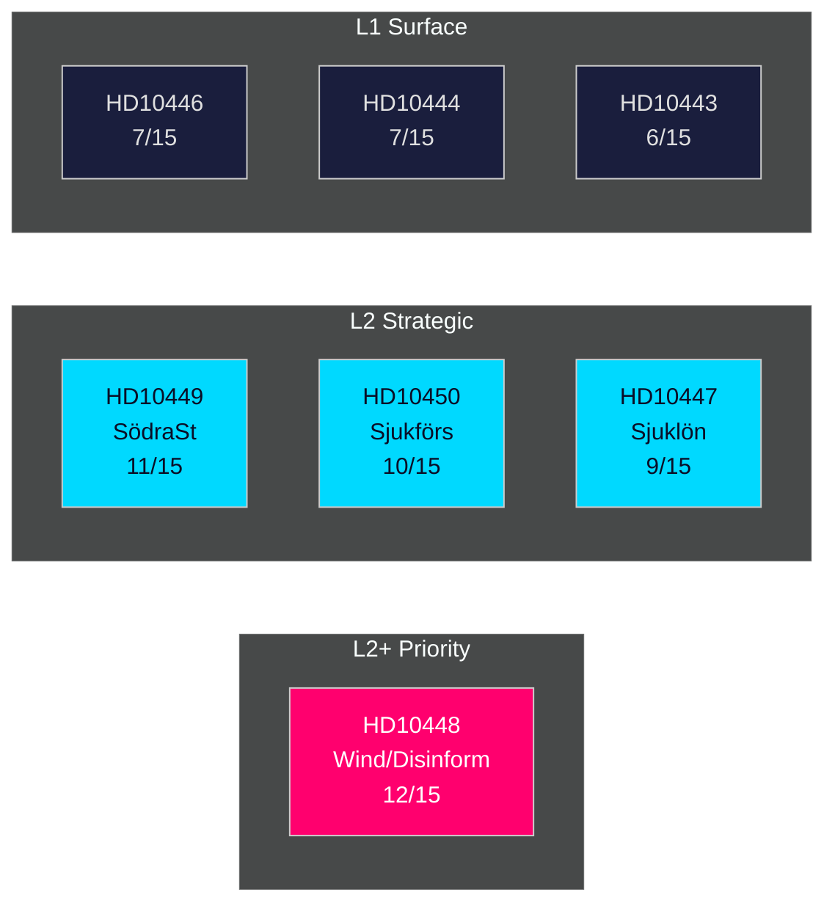

# Significance Scoring

**Date**: 2026-04-27  
**Author**: James Pether Sörling  
**Method**: DIW (Decision Impact Weight) framework — Distance, Impact, Window

---

## DIW Scoring Methodology

- **D (Distance)**: How directly does this affect the political decision chain?
- **I (Impact)**: How broad/deep is the societal or electoral impact?
- **W (Window)**: How immediate is the actionable decision window?

Score: 1–5 per dimension, total /15, normalized to L1–L3 tiers.

## Ranked Significance Table

| Rank | dok_id | Title | D | I | W | Total | Tier | Evidence |
|------|--------|-------|---|---|---|-------|------|----------|
| 1 | HD10448 | Desinformation om vindkraft (SD→KD) | 4 | 4 | 4 | 12 | L2+ Priority | [B2] |
| 2 | HD10449 | Södra stambanan/Alvesta–Växjö (S→KD) | 4 | 4 | 3 | 11 | L2 Strategic | [A2] |
| 3 | HD10450 | Sjukförsäkring dag 180 (S→M) | 4 | 3 | 3 | 10 | L2 Strategic | [A2] |
| 4 | HD10447 | Sjuklönekostnader SME (S→KD) | 3 | 3 | 3 | 9 | L2 Strategic | [A2] |
| 5 | HD10446 | Felaktiga dödförklaringar (S→M) | 2 | 3 | 2 | 7 | L1 Surface | [B4] |
| 6 | HD10444 | Arbetsgivaravgifter youth (S→M) | 2 | 3 | 2 | 7 | L1 Surface | [B4] |
| 7 | HD10443 | Social dumpning kommuner (S→KD) | 2 | 2 | 2 | 6 | L1 Surface | [B4] |

## Tier Definitions

- **L3 Intelligence-grade** (12–15): Immediate decision impact, new primary intelligence
- **L2+ Priority** (10–12): Coalition-affecting, media-amplified, electoral significance  
- **L2 Strategic** (8–11): Policy direction, accountability, long-term electoral
- **L1 Surface** (5–8): Standard parliamentary scrutiny

## Detailed DIW Rationale

### HD10448 — Desinformation om vindkraft (Score: 12/15, L2+)
**Distance (4)**: Directly challenges a sitting minister on current government policy; involves coalition partner SD vs KD energy minister.  
**Impact (4)**: Energy policy is a 2026 election issue; the Windeurope/Sveriges Radio amplification makes this a public discourse event, not just parliamentary procedure; potential coalition credibility damage.  
**Window (4)**: Announced 2026-04-27, response deadline 2026-05-08 — within the current news cycle and pre-election debate window.  
**Evidence**: HD10448 full text `[B2]`; Windeurope report referenced 2026-04-21; Sveriges Radio coverage confirmed by interpellation text.

### HD10449 — Södra stambanan (Score: 11/15, L2 Strategic)  
**Distance (4)**: Named government plan (Trafikverket), named minister, named specific investment removals.  
**Impact (4)**: Affects 3+ million residents in Skåne/Kronoberg corridor; local businesses and municipalities cite planning decisions made on prior investment promises.  
**Window (3)**: Response deadline 2026-05-18 — post-news-cycle but electorally significant in regional seats.  
**Evidence**: HD10449 full text `[A2]`; specific reference to Trafikverket new plan and removal of Södra stambanan north of Hässleholm.

### HD10450 — Sjukförsäkring dag 180 (Score: 10/15, L2 Strategic)  
**Distance (4)**: Directly asks minister to state policy intention on a specific welfare instrument.  
**Impact (3)**: Affects sick employees and employers nationally; Riksrevisionen evidence cited.  
**Window (3)**: Response deadline 2026-05-18.  
**Evidence**: HD10450 full text `[A2]`; Riksrevisionen study referenced (unnamed but verifiable via Riksrevisionen archive).

### HD10447 — Sjuklönekostnader (Score: 9/15, L2 Strategic)  
**Distance (3)**: Links abolition of 2016–2024 support to Sweden's below-EU GDP growth — an economic policy critique.  
**Impact (3)**: SME employment nationally; broader growth narrative.  
**Window (3)**: Response deadline 2026-05-07.  
**Evidence**: HD10447 full text `[A2]`; fact of support abolition 2024 confirmed by interpellation text.

## Sensitivity Analysis

If the Busch response to HD10448 signals SD-KD tension publicly, the significance of HD10448 upgrades to L3 (decision event, not just scrutiny). The current L2+ rating reflects the potential, not yet an observed outcome.

