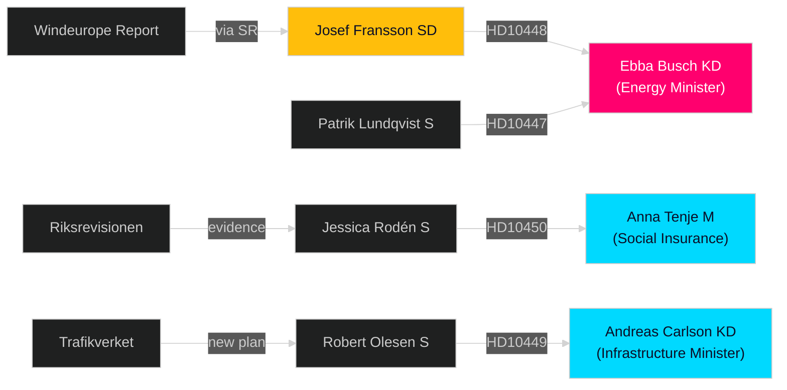

# Stakeholder Perspectives

**Date**: 2026-04-27  
**Author**: James Pether Sörling  
**Framework**: 6-lens stakeholder matrix with influence network

---

## 6-Lens Stakeholder Matrix

### Lens 1 — Direct Political Actors

| Stakeholder | Role | Position | Interest | Influence | Evidence |
|-------------|------|----------|----------|-----------|----------|
| Robert Olesen (S) | Interpellant HD10449 | Pro-railway investment | Regional development Kronoberg | Medium | HD10449 `[A2]` |
| Jessica Rodén (S) | Interpellant HD10450 | Defend day-180 exception | Worker protection | Medium | HD10450 `[A2]` |
| Josef Fransson (SD) | Interpellant HD10448 | Wind energy skeptic | Energy policy alignment with SD voters | High | HD10448 `[B2]` |
| Patrik Lundqvist (S) | Interpellant HD10447 | Pro-SME sick-pay support | SME employment | Medium | HD10447 `[A2]` |
| **Andreas Carlson (KD)** | Infrastruktur- och bostadsminister | Defend Trafikverket plan | Government credibility | High | HD10449 |
| **Anna Tenje (M)** | Äldre- och socialförsäkringsminister | Protect social insurance reforms | Government policy | High | HD10450 |
| **Ebba Busch (KD)** | Energi- och näringsminister | Defend energy policy | Coalition cohesion + energy security | Very High | HD10448, HD10447 |
| Elisabeth Svantesson (M) | Finansminister | Macroeconomic narrative | Fiscal credibility | High | HD10444, HD10446 |

### Lens 2 — Civil Society and Affected Communities

| Stakeholder | Interest | Affected by |
|-------------|----------|------------|
| Kronoberg/Skåne municipalities | Railway investment commitments | HD10449 |
| Regional businesses (Sydsverige) | Infrastructure for labor market integration | HD10449 |
| SME employers nationally | Sick-pay cost burden | HD10447 |
| Sick employees at day-180 threshold | Continued job protection | HD10450 |

### Lens 3 — Media and Information Environment

| Actor | Role | Effect |
|-------|------|--------|
| Sveriges Radio | Amplified Windeurope report | Framed wind energy debate as disinformation issue |
| Windeurope | Industry association | Published report labeling wind skeptics as "disinformation spreaders" |
| Swedish press (Expressen, SVT) | Expected coverage | HD10448 and HD10449 most newsworthy |

### Lens 4 — Institutional Actors

| Institution | Role | Notes |
|-------------|------|-------|
| Trafikverket | National transport planning authority | Produced new plan removing Södra stambanan investments |
| Riksrevisionen | Independent audit authority | Positively evaluated day-180 exception (cited in HD10450) |
| Riksdagen (speaker/calendar) | Procedural | HD10448 announced 2026-04-27 |

### Lens 5 — Electoral Stakeholders

| Group | Concern | Linked Interpellation |
|-------|---------|----------------------|
| Southern Swedish voters (Kronoberg, Skåne) | Infrastructure investment | HD10449 |
| Workers near sick insurance threshold | Welfare protection | HD10450 |
| Small business owners | Operational cost risk | HD10447 |
| Energy-sector workers + environmentalists | Energy policy direction | HD10448 |

### Lens 6 — Influence Network

## Key Observation

Ebba Busch (KD) is interpellated by **both** an opposition MP (Lundqvist/S, HD10447) and a coalition partner (Fransson/SD, HD10448). This makes her the most politically exposed minister this week — her responses will be scrutinized by both opposition and coalition for signs of policy drift.
