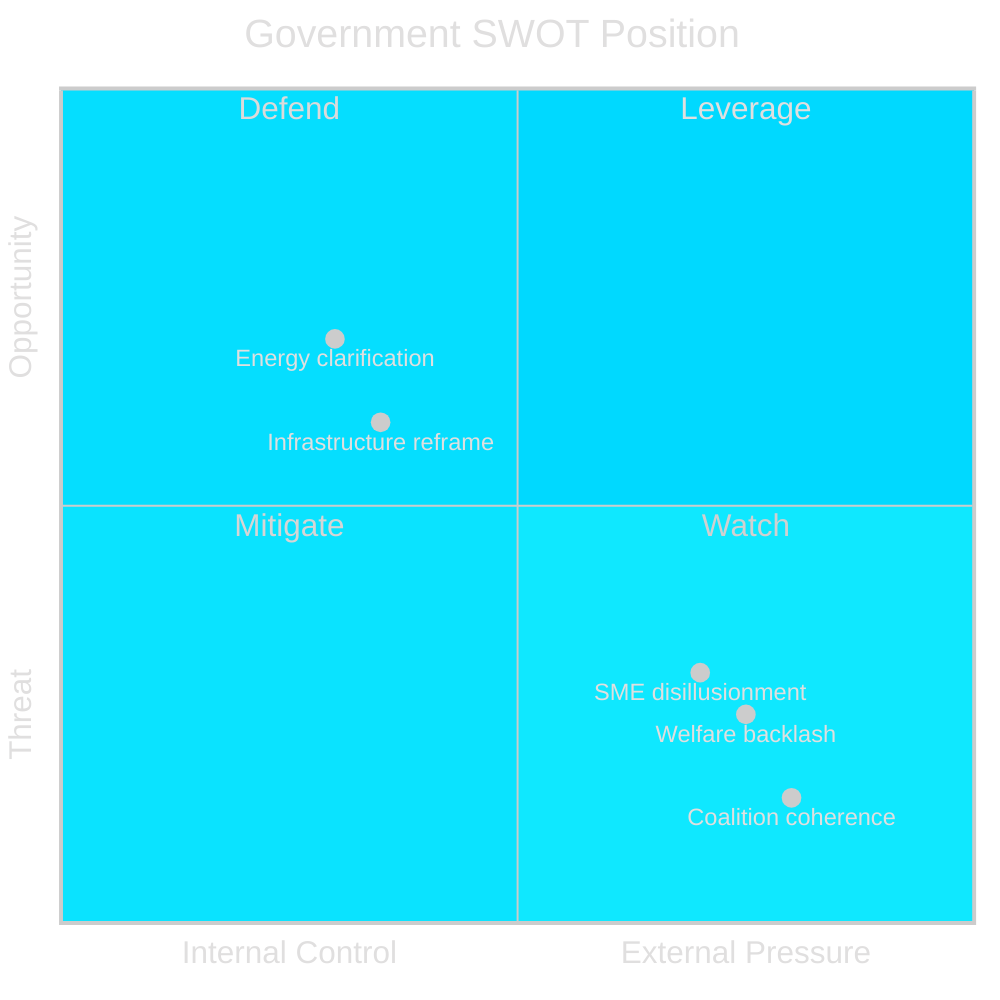

# SWOT Analysis: Interpellation Week 27 April 2026

**Date**: 2026-04-27  
**Author**: James Pether Sörling  
**Framework**: Political SWOT with TOWS matrix

---

## SWOT Matrix — Government Position

### Strengths [A2]

- **Fiscal consolidation narrative**: The government can cite its track record of managing the 2023–2025 fiscal consolidation; the abolition of sick-pay support (HD10447) can be framed as business normalization, not cost-shifting.  
  *Evidence*: HD10447 text — government stated rationale in 2024 was that employers bear responsibility for workplace health. [A2]
- **Infrastructure investment volume**: Despite Trafikverket plan changes, the government can point to other national transport investments as evidence of commitment.  
  *Evidence*: HD10449 — minister's future response will likely cite total infrastructure budget. [B3]
- **Riksrevisionen compliance posture**: On HD10450, the government may argue it is actively reviewing the day-180 exception — not eliminating it, simply studying it. [B3]

### Weaknesses [A2]

- **Infrastructure credibility gap** (HD10449): The specific removal of Södra stambanan and Alvesta–Växjö from Trafikverket's plan is documented fact. Communities made investments based on prior commitments. `dok_id=HD10449 [A2]`
- **Intra-coalition vulnerability** (HD10448): SD's interpellation targeting KD minister Busch on energy policy is publicly on the record. Any non-answer or dismissive response exposes SD-KD fault lines. `dok_id=HD10448 [B2]`
- **Welfare reform optics** (HD10450): The day-180 sick insurance exception was demonstrably effective per Riksrevisionen — eliminating it would mean the government overriding independent evaluation. `dok_id=HD10450 [A2]`
- **SME economic signal** (HD10447): If Sweden's GDP growth is consistently below EU average (asserted, not verified independently here), the link to sick-pay cost removal becomes a credible opposition narrative.

### Opportunities [B2]

- **Energy policy clarification**: Busch's response to HD10448 can be used to articulate a coherent energy policy narrative that addresses both affordability and reliability concerns — which the Windeurope report does not directly address. `dok_id=HD10448`
- **Infrastructure reframing**: Carlson can use the HD10449 response to explain the new prioritization logic and offer a concrete timeline, transforming an accountability session into a communication opportunity. `dok_id=HD10449`
- **Riksrevisionen co-option**: On HD10450, the government could commit to preserving the day-180 exception while adding efficiency measures — outflanking the opposition. `dok_id=HD10450`

### Threats [B2]

- **Coalition coherence damage**: SD publicly questioning KD energy policy via a parliamentary instrument signals ideological divergence that will be amplified. `dok_id=HD10448`
- **Electoral geography loss**: Failure to address Södrasto stambanan could cost coalition votes in Kronoberg, Skåne and surrounding constituencies in 2026. `dok_id=HD10449`
- **Welfare reform backlash**: Any perceived attack on social insurance will energize S's voter base ahead of the election. `dok_id=HD10450`
- **SME disillusionment**: If SMEs believe the government is increasing their cost burden (sick-pay) while reducing benefits (employer tax cuts offset by sick-pay removal), business confidence could fall. `dok_id=HD10447`

## TOWS Strategic Matrix

| | **Strengths** | **Weaknesses** |
|---|---|---|
| **Opportunities** | **SO**: Use infrastructure budget volume to justify Trafikverket plan changes, offer revised timeline for Alvesta–Växjö | **WO**: Proactively announce Riksrevisionen compliance on day-180 — preserve exception to neutralize S attack |
| **Threats** | **ST**: Busch must respond to SD interpellation with specific policy defense, not dismissal — coalition discipline requires visible KD-SD alignment | **WT**: Most dangerous scenario: SD escalates energy disagreement + S wins welfare/infrastructure narratives simultaneously ahead of election |

## Cross-SWOT Analysis

The most significant SWOT intersection is **W2 × T1** (coalition vulnerability + coalition damage threat). The SD interpellation (HD10448) is not just parliamentary procedure — it is a public statement of policy disagreement within the governing bloc. The government's ability to manage this interaction will signal coalition cohesion strength for the remaining pre-election period.

