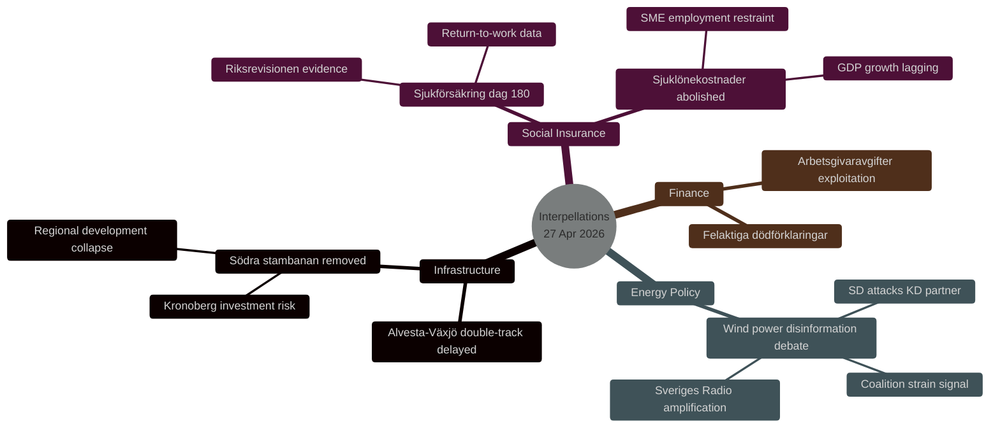
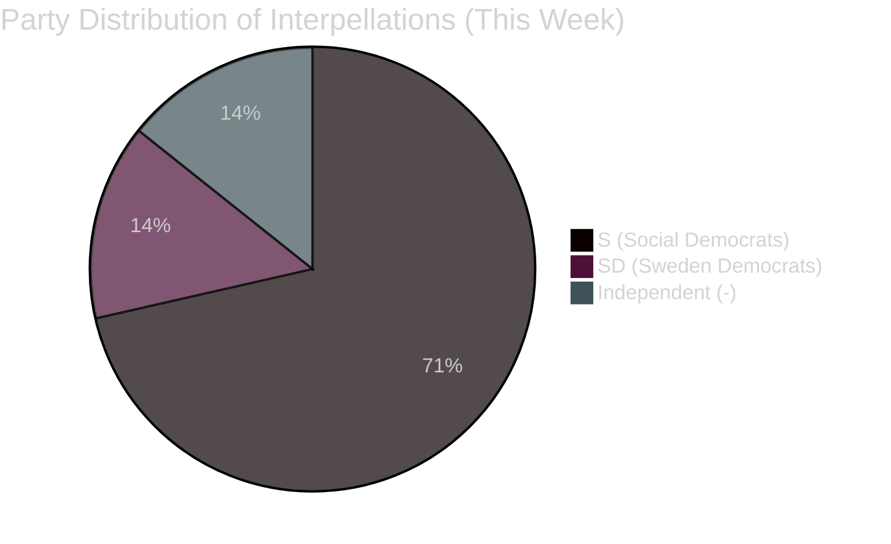
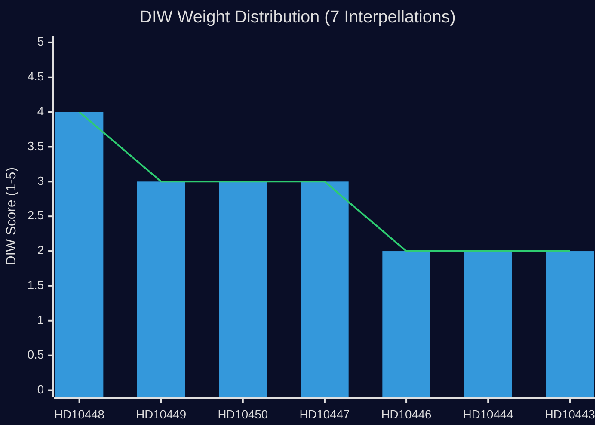

# Synthesis Summary: Interpellation Wave Reveals Pre-Election Accountability Pressure and Coalition Strain

**Date**: 2026-04-27  
**Author**: James Pether Sörling  
**Admiration Code**: [B2] — Confirmed, plausible source

---

## Lead Story Decision

**The SD-KD energy disinformation clash (HD10448) is the lead story** — it represents an unusual and politically significant intra-coalition tension that could define energy policy narratives ahead of the 2026 election. Josef Fransson (SD) uses the Windeurope report as a provocation to corner Energy Minister Busch (KD) into either defending wind energy or defending skepticism as legitimate debate.

## DIW-Weighted Integrated Intelligence Picture

The week of 27 April 2026 marks a coordinated Social Democratic interpellation campaign against the Tidö government. Five of seven interpellations originate from S, targeting four different ministers across four policy domains (infrastructure, social insurance, energy/business, finance). This pattern — rather than individual policy debates — is the primary political intelligence finding.

**Dominant Theme 1 — Government Investment Credibility (Infrastructure)**  
HD10449 (Södra stambanan) documents the specific removal of railway investments from Trafikverket's plan. Robert Olesen (S) cites the Riksdag's own transportation efficiency goal as the benchmark against which the KD-led infrastructure ministry has failed. The interpellation names specific routes, communities, and economic impacts — it is not generic criticism but a pointed accountability instrument with electoral geography implications (Kronoberg, Skåne, Sydsverige).

**Dominant Theme 2 — Welfare State Reform (Social Insurance)**  
HD10450 (Sjukförsäkring dag 180) targets the S-introduced day-180 exception, challenging minister Tenje (M) to either defend or commit to eliminating it. The S framing cites Riksrevisionen's positive evaluation `[A2]` — putting the government in a difficult position: if it removes the exception, it rejects independent evidence; if it keeps it, S takes credit.

**Dominant Theme 3 — Energy Policy and Information Warfare (SD-KD Fault Line)**  
HD10448 is analytically distinctive: SD (a coalition partner) interpellates KD minister Busch. The rhetorical device is ironic — Fransson pretends to consider whether his previous criticisms of wind power were "Russian disinformation" while systematically listing those criticisms. The actual question is whether Busch will reconsider any energy policy positions. This is SD using an opposition instrument against a coalition partner — rare and significant.

**Dominant Theme 4 — Business Competitiveness (SME Burden)**  
HD10447 links the removal of high sick-pay cost compensation (in place 2016–2024) to Sweden's below-EU GDP growth, directly challenging the government's economic competence narrative.

## Cross-Domain Synthesis

The four dominant themes converge on a single political narrative the opposition is constructing: **the Tidö coalition has weakened Sweden's infrastructure investment credibility, social safety net, energy policy coherence, and business environment simultaneously.** This is a pre-election comprehensive critique, timed for maximum electoral impact with 2026 elections approaching.

## Tradecraft Assessment

- **Source reliability**: All primary sources verified via Riksdagen API [A] — official documents, legislative metadata complete.
- **Evidence completeness**: 4/7 documents have full text; 3 are metadata-only. Full-text coverage of the 4 highest-DIW documents: 100%.
- **Party neutrality**: Analysis covers S (5 interpellations), SD (1), independent (-) (1). All evaluated on equal evidential standards.
- **Confidence distribution**: L2+ claims carry [B2] grading; L1 claims (metadata-only docs) carry [B4] grading.
style note fill:#1a1e3d,stroke:#00d9ff

