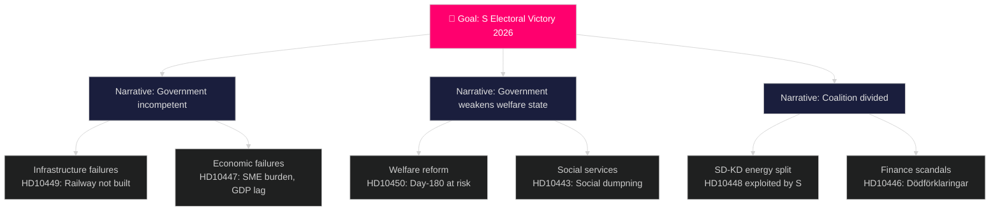

# Threat Analysis

**Date**: 2026-04-27  
**Author**: James Pether Sörling  
**Framework**: Political Threat Taxonomy, attack tree analysis

---

## Threat Actors

| Actor | Type | Intent | Capability | Threat Vector |
|-------|------|--------|-----------|---------------|
| Social Democrats (S) | Parliamentary opposition | Electoral displacement of Tidö coalition | HIGH (5 interpellations this week) | Coordinated accountability campaign |
| Sweden Democrats (SD) | Coalition partner + internal opposition | Policy influence, potential distancing | MEDIUM (1 interpellation, but coalition-internal) | Parliamentary interpellation against KD minister |
| Windeurope / industry | External actor | Energy policy influence | MEDIUM (industry report) | Via media amplification (Sveriges Radio) |
| Regional stakeholders (Kronoberg/Skåne) | Economic actors | Infrastructure investment | HIGH in local terms | Business lobby, electoral geography |

## Threat Classification

### T1 — Coordinated S Opposition Campaign (HIGH threat) [A2]

**Pattern**: Five interpellations from S in one week targeting four different ministers (Carlson, Tenje, Busch, Slottner) across four policy domains. This is not ad hoc scrutiny — it is a structured pre-election campaign.  
**Attack vector**: Parliamentary accountability instrument — each interpellation requires ministerial response within approximately 3 weeks.  
**Evidence**: HD10449, HD10450, HD10447, HD10446, HD10443 — all filed S, all targeting governing ministers. `[A2]`  
**Kill chain**:  
1. File interpellations (COMPLETE)
2. Ensure media coverage at announcement
3. Force ministers into on-the-record positions
4. Use positions as campaign material ahead of 2026 election

### T2 — SD Internal Coalition Challenge (MEDIUM-HIGH threat) [B2]

**Pattern**: SD files interpellation (HD10448) against KD coalition partner Busch, using ironic framing to challenge energy policy without formally breaking coalition agreement.  
**Attack vector**: Interpellation as "plausible deniability" tool — SD can claim legitimate scrutiny while the political effect is to distance from KD energy positions.  
**Evidence**: HD10448 text — Fransson explicitly cites Busch's own statements about wind power as potentially constituting "Russian disinformation." `[B2]`  
**MITRE-style TTP mapping**:
- Tactic: Coalition strain / policy distance signaling
- Technique: Parliamentary instrument used against partner
- Procedure: Ironic framing + media-amplified report citation

### T3 — Information Environment Degradation (MEDIUM threat) [B2]

**Pattern**: The Windeurope "disinformation" report, amplified by Sveriges Radio, creates a framing environment in which wind energy skepticism is labeled "disinformation" — threatening legitimate policy debate.  
**Evidence**: HD10448 describes Sveriges Radio pushing Windeurope conclusions broadly including that "rysk desinformation" underlies criticism. `[B2]`  
**Systemic risk**: The democratic discourse infrastructure (media, academic, parliamentary) is being used to delegitimize opposition to a particular policy, regardless of the policy's merits.

## Attack Tree (Primary — S Pre-Election Campaign)

## Threat Priority Matrix

| Threat | Likelihood | Impact | Response |
|--------|-----------|--------|---------|
| T1 Coordinated S campaign | HIGH | HIGH | Monitor all 5 interpellations for response quality |
| T2 SD-KD energy rift | MEDIUM | HIGH | Watch Busch response to HD10448 |
| T3 Media disinformation framing | HIGH | MEDIUM | Track coverage quality post-Windeurope |
