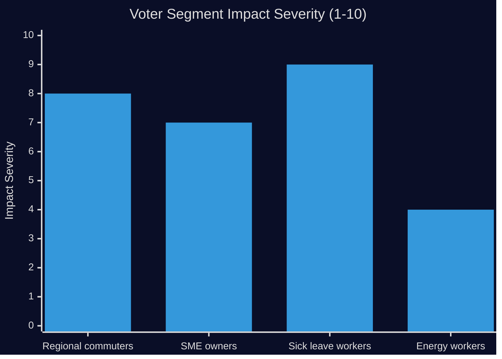

# Voter Segmentation Analysis

**Date**: 2026-04-27  
**Author**: James Pether Sörling  
**Method**: Demographic + regional + ideological impact segmentation

---

## Segmentation Framework

The four interpellations address policy domains with different voter-segment impacts. This analysis segments by: (1) geographic/regional, (2) economic/occupational, (3) party-affiliation risk exposure, (4) issue-salience group.

---

## Regional Segmentation

### Södra Sverige — Railway Infrastructure (HD10449)

**Affected region**: Kronoberg county (Hässleholm–Alvesta corridor), Skåne (Hässleholm–Malmö line), Blekinge (Sydostlänken connection point).

**Voter impact**: 
- Regional commuters: direct impact on daily travel time and reliability
- Business community: location-decision calculus affected by infrastructure expectations
- Municipal politicians: credibility tied to infrastructure commitments

**Electoral weight**: ~15 seats in southern Riksdag constituencies.

### National — Social Insurance (HD10450, HD10447)

**Affected population**: Workers with extended sick leave periods; employers paying sick-day 15+ costs; small/medium businesses in labor-intensive sectors.

**Voter impact**:
- Workers: tangible benefit reversal; can be communicated with personal stories
- Employers: cost increase documented and attributable to government decision
- Healthcare workers: professional judgment about patient return-to-work overridden

---

## Occupational/Economic Segmentation

| Voter Segment | Interpellation | Impact Type | Party Vulnerability |
|---|---|---|---|
| Regional commuters (Kronoberg/Skåne) | HD10449 | Direct infrastructure | M, SD (southern seats) |
| Small business owners | HD10447 | Cost increase | M, C |
| Workers with extended sick leave | HD10450 | Benefit reduction | M overall |
| Energy sector workers (wind, grid) | HD10448 | Policy uncertainty | KD, SD |
| Rural voters | HD10448, HD10449 | Energy reliability + infrastructure | SD, KD |

---

## Party-Affiliation Risk Exposure

### M Voters
- **Risk**: Sick insurance reversal (HD10450) + employer cost increases (HD10447). M positioned as "punishing workers" and "increasing costs for employers." Both core M message failures.
- **Severity**: HIGH — both attack vectors undermine M's competence-in-government narrative.

### KD Voters
- **Risk**: SD challenging KD energy policy (HD10448). Christian democratic voters expect government ministers to maintain principled policy positions. Being challenged by a coalition partner on energy policy raises questions about KD's ministerial authority.
- **Severity**: MEDIUM — affects KD's distinctiveness within the coalition.

### SD Voters
- **Risk**: HD10448 could cut both ways. SD base voters who are skeptical of wind energy will support the interpellation. But some SD voters may read the interpellation as excessive coalition friction.
- **Severity**: LOW for now — interpellation is consistent with SD energy platform.

### S Voters (Opposition)
- **Mobilization opportunity**: All four interpellations provide evidence for opposition narrative. Sick insurance cluster (HD10450/HD10447) is particularly strong for S's traditional electorate (LO-affiliated workers, healthcare workers).
- **Risk**: None — interpellations strengthen S's position.

---

## Issue-Salience Groups

### High-Salience Infrastructure Voters
- Identity: Regular rail commuters, regional businesses in Södra Sverige
- Size: ~100,000–200,000 affected directly by Alvesta–Växjö corridor
- HD10449 relevance: HIGH — specific investment removal
- Behavior: Will prioritize infrastructure promises in 2026 candidate evaluation

### High-Salience Healthcare/Sick Leave Voters
- Identity: Workers with chronic conditions, caregivers, healthcare professionals
- Size: ~300,000–500,000 affected by day-180 exception removal
- HD10450 relevance: HIGH — reversal of a positively evaluated program
- Behavior: Will trust Riksrevisionen evaluation framing over government spin

### Small Business Owners
- Identity: SME owners employing 1-49 workers in labor-intensive sectors
- Size: ~200,000–400,000 affected by employer sick-pay cost change
- HD10447 relevance: HIGH — concrete cost increase
- Behavior: Traditionally M/C, cost increases may reduce enthusiasm or swing votes

### Energy Opinion Leaders
- Identity: Industry workers, environmental activists, rural landowners
- Size: ~50,000–100,000 with strong energy policy views
- HD10448 relevance: MEDIUM — primarily about debate quality, not immediate impact

