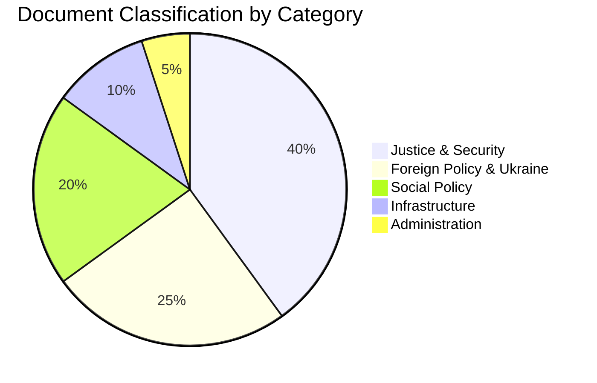

# Classification Results — May 2026 Documents

**Author**: James Pether Sörling  
**Date**: 2026-04-27  
**Framework**: 7-Dimension Political Classification

## Classification Matrix

| dok_id | Ideological | Sectoral | Procedural | Temporal | Geopolitical | Electoral | Impact |
|--------|------------|---------|-----------|---------|------------|---------|--------|
| HD01JuU10 | Centre-right (M-KD-L-SD) | Justice/Security | Legislative: Final reading | Immediate (June 2026) | Domestic | HIGH electoral salience | P0 |
| HD03231 | All-party | Foreign Policy | Legislative: Ratification | Strategic (2026+) | Europe/NATO | MEDIUM | P1 |
| HD03232 | All-party | Foreign Policy | Legislative: Ratification | Strategic | Europe/NATO | MEDIUM | P1 |
| HD10449 | S (opposition) | Infrastructure/Transport | Interpellation | Medium-term (2026-2030) | Domestic/Regional | HIGH (electoral battleground) | P1 |
| HD10450 | S (opposition) | Social Insurance | Interpellation | Immediate | Domestic | HIGH (welfare state narrative) | P1 |
| HD01CU25 | M-KD (government) | Justice/Civil | Legislative | Short-term (July 2026) | Domestic | MEDIUM | P2 |
| HD01SfU23 | M-KD (government) | Migration/Research | Legislative | Short-term (June 2026) | EU/Nordic | MEDIUM | P2 |
| HD10451 | S (opposition) | Justice/Economics | Interpellation | Immediate | Domestic | MEDIUM | P2 |
| HD11753 | SD/cross-party | Foreign Policy/Security | Motion | Immediate | EU/Russia | MEDIUM-HIGH | P3 |
| HD11752 | Cross-party | Foreign Policy | Motion | Immediate | Russia/NATO | MEDIUM | P3 |
| HD01CU40 | Government | Civil/Digital | Legislative | Long-term | Domestic | LOW | P3 |
| HD024099 | S/opposition | Justice | Motion | Medium-term | Domestic | MEDIUM | P3 |

## Priority Tier Summary

| Tier | Count | Description |
|------|-------|-------------|
| P0 | 1 | Landmark legislation: weapons law |
| P1 | 4 | Strategic: Ukraine ratifications, key interpellations |
| P2 | 3 | Significant: Prison construction, researcher migration, corporate crime |
| P3 | 4 | Tactical: Russia motions, lantmäteri, tjänstemannaansvar |

## Retention & Access Classification

All documents: PUBLIC (publicly made statements, GDPR Art. 9(2)(e)) — standard Riksdagsmonitor publication classification. No special handling required.

