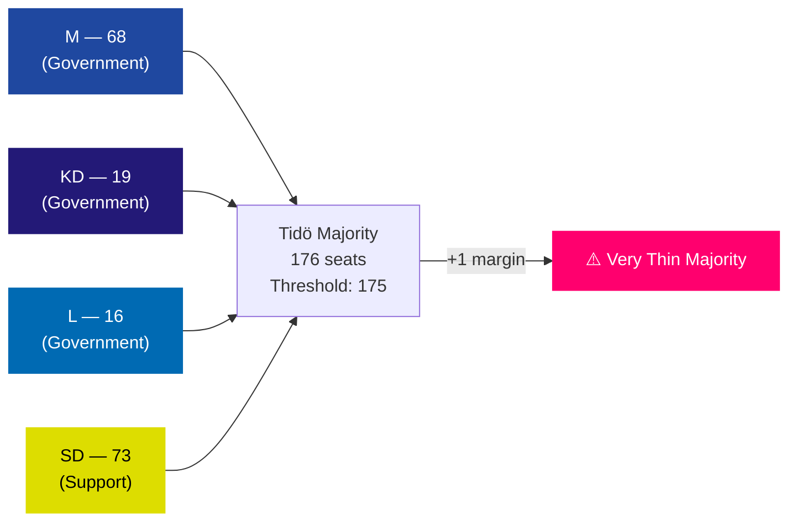

# Coalition Mathematics — May 2026 Month Ahead

**Author**: James Pether Sörling  
**Date**: 2026-04-27

## Current Parliamentary Arithmetic (349 seats)

Tidö coalition: M(68) + KD(19) + L(16) = 103 + SD(73) support = 176 working majority
Opposition: S(107) + V(24) + MP(18) = 149

**Majority threshold**: 175 seats

## Voting Analysis by Key Document

### HD01JuU10 — Weapons Law

| Party | Expected Vote | Seats | Notes |
|-------|--------------|-------|-------|
| M | Ja | 68 | Coalition discipline |
| KD | Ja | 19 | Coalition discipline |
| L | Ja | 16 | Coalition discipline |
| SD | Ja | 73 | Strong support |
| S | Nej/Avstår | 107 | Opposition questioning scope |
| V | Nej | 24 | Principled opposition |
| C | Ja/Avstår | 24 | Generally supportive |
| MP | Nej | 18 | Opposition |

**Projected result**: ~196 Ja vs ~149 Nej → PASSES (safe majority)

### HD03231/HD03232 — Ukraine Ratification (Joint)

| Party | Expected Vote | Seats | Notes |
|-------|--------------|-------|-------|
| M | Ja | 68 | Strong Ukraine support |
| KD | Ja | 19 | Consistent Ukraine support |
| L | Ja | 16 | Strong Ukraine support |
| SD | Ja/Avstår | 73 | Supportive but may signal reservations |
| S | Ja | 107 | Bipartisan |
| V | Ja/Avstår | 24 | Mixed signals on ICC/ICJ issues |
| C | Ja | 24 | Strong NATO/Ukraine aligned |
| MP | Ja | 18 | Generally supportive |

**Projected result**: ~340–349 Ja (near-consensus) → PASSES (bipartisan)

### HD10450 — Sick Pay Day-180 (Interpellation, no vote)

This is an interpellation, not a vote. However, if a related lagstiftningsärende comes to vote:

**Projected coalition**: M+KD+L+SD = 176 (marginal majority). If 2+ SD members defect on social insurance (rare but possible), majority narrows to 174 — below threshold. Coalition risk: LOW in practice as SD has shown strong voting discipline on Tidö agreement items.

## Tidö Coalition Stability Index

## Assessment

The Tidö coalition operates at a +1 majority margin. This makes every vote technically at risk, but in practice Swedish parliamentary discipline is strong and coalition agreements binding. The Ukraine ratifications will pass with near-consensus. The justice cluster will pass on coalition votes. The real parliamentary risk is a surprise defection or absence — manageable but a standing operational concern for the government.
