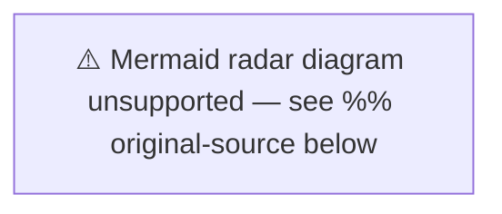

# Comparative International Analysis — May 2026

**Author**: James Pether Sörling  
**Date**: 2026-04-27  
**Comparator Set**: Nordic-Baltic + EU + NATO

## Comparator Matrix

| Issue | Sweden | Norway | Denmark | Finland | Germany | EU Benchmark |
|-------|--------|--------|---------|---------|---------|-------------|
| Criminal justice expansion | Weapons law + prison construction peak | Stable, no major reform | Justice reform post-2025 | Post-reform stabilisation | Coalition justice reform ongoing | Varied |
| Infrastructure investment | Södra stambanan gap — contested | High rail investment | Copenhagen metro expansion | Regional investment strong | Deutschlandticket + rail expansion | EU TEN-T targets |
| Social insurance reform | Sick-pay day-180 debate | Generous welfare stable | Active labour market reform | Strong activation policy | Bürgergeld debate | OECD activation model |
| Russia policy | Ukraine tribunals + visa restrictions | NATO aligned | NATO aligned | Heightened Russia concern | Strong Russia sanctions | EU unified |
| Energy transition | Wind disinformation debate (SD) | Offshore wind expansion | Wind energy dominant | Nuclear + wind mix | Energiewende ongoing | EU Green Deal |

## Nordic Comparison: Criminal Justice

Sweden is in an unusually concentrated legislative phase for criminal justice. Norway and Denmark have had more stable criminal justice environments. Finland's post-reform period offers a cautionary parallel: rapid implementation of prison expansion strains correctional services. The HD01CU25 emergency prison construction legislation parallels challenges seen in England/Wales prison capacity crises — suggesting Sweden should study British implementation lessons.

## Ukraine Context: Nordic Solidarity

Sweden joins Norway, Denmark, Finland and Germany in the international reparations commission (HD03231) and aggression tribunal (HD03232). Finland and Estonia have been the most vocal Baltic/Nordic advocates for strong accountability mechanisms. Sweden's ratification solidifies the Nordic-Baltic front on Ukraine accountability — significant as Sweden is a newer NATO member still establishing its strategic identity. Source: riksdagen.se propositions HD03231, HD03232.

## Energy Policy: Nordic Contrast

Sweden's wind energy cultural conflict (HD10448, SD framing) contrasts sharply with Denmark where wind energy is broadly accepted across parties. Norway's oil wealth creates a different energy politics. Finland has moved forward with nuclear (Olkiluoto 3). Sweden's SD-driven skepticism of wind energy is regionally exceptional and creates friction with EU Green Deal commitments.

## Assessment

Sweden's May 2026 parliamentary agenda is unusually security-heavy compared to Nordic peers. The criminal justice cluster is exceptional in scope and speed. Ukraine solidarity instruments align Sweden with the Nordic-Baltic consensus. The energy culture war is a Swedish-specific phenomenon driven by SD's political positioning — a risk to Sweden's EU energy relationship that has no direct Nordic parallel.
