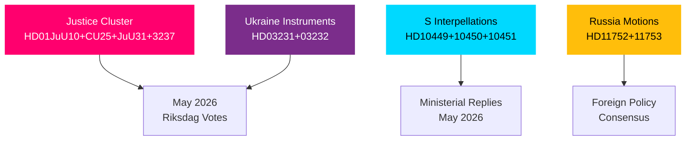

# Cross-Reference Map — May 2026 Month Ahead

**Author**: James Pether Sörling  
**Date**: 2026-04-27

## Document Cross-References

| Source dok_id | Relation | Target dok_id | Label |
|---------------|---------|---------------|-------|
| HD024099 | amends | HD03217 (prop. 2025/26:217) | Motion responding to government tjänstemannaansvar proposition |
| HD10451 | thematic | HD10449 | Both S-party interpellations on accountability gaps |
| HD10451 | thematic | HD024099 | Criminal accountability theme cluster |
| HD10449 | rebuts | HD03190+ | Government infrastructure plan (Södra stambanan absence) |
| HD10450 | rebuts | Earlier government sick-pay reform decision | S preserving S-era exception |
| HD11752 | coordinated-filing | HD11753 | Both Russia/security motions filed same period |
| HD03231 | bundle | HD03232 | Ukraine multilateral instruments — filed together |
| HD01CU25 | thematic | HD01JuU10 | Both part of justice/security legislative cluster |
| HD01SfU23 | thematic | HD01CU25 | Both committee reports in final legislative phase |

## Sibling Folders (Tier-C Cross-Type Synthesis)

This month-ahead analysis incorporates context from prior-period analyses:

| Reference | Path | Documents Ingested |
|-----------|------|--------------------|
| April 2026 propositions context | analysis/daily/2026-04-23/propositions/ | HD03231, HD03232, HD03252, HD03253, HD03256 |
| April 2026 committee reports | analysis/daily/2026-04-24/committeeReports/ | HD01JuU10, HD01CU25, HD01CU29, HD01SfU23 |
| April 2026 interpellations | analysis/daily/2026-04-27/ | HD10449-HD10451 series |

All sibling folder references are public data from riksdagen.se. Cross-reference enables month-ahead coherence: the April proposition cluster (Ukraine ratification, criminal justice) feeds directly into the May 2026 vote schedule.

## Network Graph

