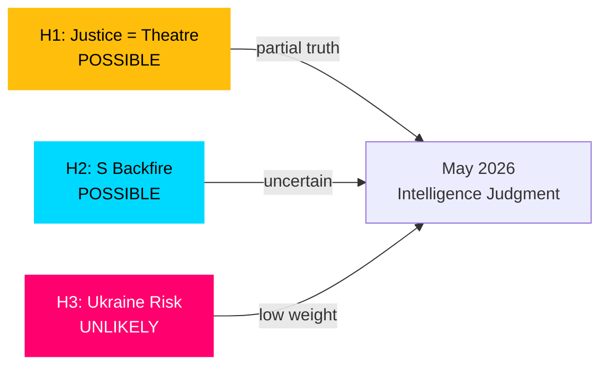

# Devil's Advocate Analysis — May 2026 Month Ahead

**Author**: James Pether Sörling  
**Date**: 2026-04-27  
**Framework**: ACH — Alternative Competing Hypotheses

## Competing Hypotheses

### Hypothesis 1 (H1): Government Justice Cluster Is Electoral Performance, Not Policy
**ACH Evidence Against Conventional View**

The conventional analysis holds that the May 2026 justice cluster (weapons law, prison construction, youth offenders) represents genuine policy delivery. The devil's advocate challenge: this is primarily performative legislation timed for electoral effect, with implementation challenges deliberately deferred beyond the election.

**Evidence for H1**:
- HD01CU25 emergency prison construction relies on temporary building regulation exemptions — a bureaucratic workaround rather than systemic capacity solution
- HD03237 paid police training is an announced proposition but faces Polismyndigheten recruitment infrastructure questions flagged in HD01JuU31
- The weapons law (HD01JuU10) ban on certain semi-automatic hunting rifles is narrowly framed — critics in hunting communities say it creates more confusion than clarity

**Counter-evidence**: Riksdag committee scrutiny (JuU, CU) has produced substantive betänkanden with specific provisions. Not mere optics.

**Assessment**: POSSIBLE as a partial truth — electoral timing is real, but underlying policy substance is also present. H1 is a useful corrective against uncritical acceptance of government narrative.

### Hypothesis 2 (H2): S Interpellation Campaign May Backfire
**ACH Evidence Against Conventional View**

The conventional analysis treats S's coordinated interpellations as effective opposition. The devil's advocate challenge: a saturation campaign of 6+ interpellations simultaneously may exhaust media bandwidth and voter attention, reducing each interpellation's impact.

**Evidence for H2**:
- Swedish media can only sustain focus on 1-2 parliamentary stories simultaneously
- Minister replies to interpellations are routinely formulaic — rarely generate sustained news cycles
- S's simultaneous targeting of four ministers (Carlson, Tenje, Strömmer, Svantesson) may fragment rather than concentrate the opposition narrative

**Counter-evidence**: HD10449 (Södra stambanan) has clear regional resonance; HD10450 (sick pay) has trade union backing. Both have constituencies beyond parliamentary media coverage.

**Assessment**: POSSIBLE — interpellation effectiveness is uncertain. The strategy has high effort-to-impact uncertainty.

### Hypothesis 3 (H3): Sweden's Ukraine Commitment Carries Unacknowledged Escalation Risk
**ACH Evidence Against Conventional View**

Ratification of HD03231/HD03232 (Ukraine tribunal and reparations commission) is framed as cost-free multilateral solidarity. The devil's advocate challenge: these instruments may draw Sweden deeper into an accountability process with uncertain Russian escalatory responses.

**Evidence for H3**:
- Russia has threatened consequences against states joining Ukraine accountability mechanisms
- Sweden's NATO membership, while providing security umbrella, also makes Sweden a higher-value target for Russian hybrid operations
- The instruments' enforcement mechanisms depend on future geopolitical developments that cannot be modelled

**Counter-evidence**: All Nordic states are supporting the same instruments. The consensus reduces individual Swedish risk. Legal commitments are non-military. [riksdagen.se HD03231, HD03232]

**Assessment**: UNLIKELY as a primary risk but worth tracking. The escalation risk is shared across the Nordic-EU community.

## ACH Summary Matrix

| Evidence | H1 (Electoral Performance) | H2 (S Backfire) | H3 (Ukraine Risk) |
|---------|--------------------------|----------------|------------------|
| Justice cluster substance | Inconsistent | N/A | N/A |
| S interpellation saturation | N/A | Consistent | N/A |
| Nordic consensus on Ukraine | N/A | N/A | Inconsistent |
| Media cycle dynamics | Consistent | Consistent | N/A |

