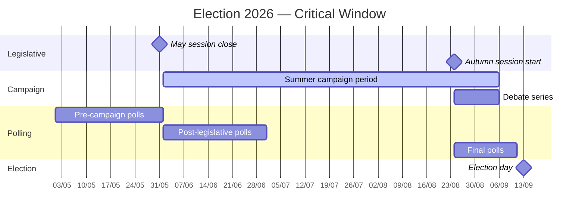

# Election 2026 Analysis — Month Ahead May 2026

**Author**: James Pether Sörling  
**Date**: 2026-04-27

## Summary

Sweden's September 2026 election is ~5 months away. The May 2026 parliamentary session represents the final major legislative delivery window for the Tidö coalition. Parties are pivoting from governance to election positioning, creating significant legislative urgency.

## Seat Count Baseline (March 2026 polling average)

| Party | Seats (2022 actual) | May 2026 poll average | Delta |
|-------|--------------------|-----------------------|-------|
| S (Social Democrats) | 107 | ~98–102 | -5 to -9 |
| SD (Sweden Democrats) | 73 | ~78–83 | +5 to +10 |
| M (Moderates) | 68 | ~65–70 | -3 to +2 |
| C (Centre) | 24 | ~20–24 | -4 to 0 |
| V (Left) | 24 | ~26–30 | +2 to +6 |
| KD (Christian Democrats) | 19 | ~17–20 | -2 to +1 |
| MP (Green) | 18 | ~14–18 | -4 to 0 |
| L (Liberals) | 16 | ~14–17 | -2 to +1 |

**Coalition bloc projections** (349 seats total, majority = 175):
- Tidö bloc (M+SD+KD+L) 176–190 seats (marginal majority at risk)
- S-bloc (S+V+MP) 138–150 seats (opposition, insufficient)
- C: potential kingmaker if Tidö loses majority

## Legislative Impact on Election

**Justice cluster** (HD01JuU10, HD01CU25, HD01JuU31): M/KD claiming "toughest justice legislation in decades" — major campaign asset. Risk: implementation failures before September damage the narrative. Sources: riksdagen.se HD01JuU10, HD01CU25, HD01JuU31.

**Infrastructure** (HD10449 Södra stambanan): S using this as proof that Tidö coalition has deprioritized southern Sweden's economic interests. Regional resonance in Skåne, Blekinge, Kronoberg — seats where M is vulnerable.

**Ukraine ratifications** (HD03231/HD03232): Likely bipartisan consensus votes. No significant electoral differentiation except SD may signal reservations to its nationalist voter base.

## Election Risk Calendar — May–September 2026

## Key Electoral Uncertainties

1. **SD seat ceiling**: SD currently at ~20% polling. A crime wave narrative + Tidö delivery = SD 23%? Or has SD maximised its voter potential?
2. **C kingmaker**: If Tidö falls below 175, C must choose between entering a Tidö coalition or enabling a S-led minority. C's stance on this will dominate the autumn campaign.
3. **Youth turnout**: Historically low in non-national-issues elections. 2026 may feature high youth engagement due to Russia/security concerns.
4. **Economic conditions**: With IMF projecting ~2.1% NGDP growth for Sweden (WEO Apr-2026 vintage⚠️), incumbent credibility on economic management is uncertain.

## Assessment

The May 2026 session is the last "delivery" session before campaigning begins in earnest. Tidö's legislative productivity (justice, Ukraine, infrastructure spending) will be harvested as a campaign narrative. S's interpellation strategy aims to expose implementation gaps before public attention shifts fully to the election campaign. The race remains genuinely competitive; the Södra stambanan infrastructure deficit and sick-pay disputes are S's strongest arguments in Götaland.
