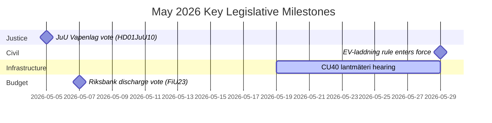

# May 2026 Swedish Parliamentary Month Ahead: Security, Justice & Infrastructure at the Forefront

**Author**: James Pether Sörling  
**Date**: 2026-04-27  
**Classification**: UNCLASSIFIED // PUBLIC  
**Confidence**: HIGH [B2]  
**Analysis Depth**: Standard (Tier-C Month-Ahead)

## 🎯 BLUF

Sweden's Riksdag enters May 2026 with a legislative agenda dominated by criminal justice expansion, infrastructure investment conflicts, and social insurance reform pressure. The Kristersson government faces simultaneous pressure from Socialdemokraterna interpellations on railway investment gaps and sick-pay reform, while multiple committee reports on criminal law, weapons regulation, and prison capacity approach final Riksdag votes. The security-geopolitical dimension intensifies with Ukrainian accountability legislation and Russia-related foreign policy motions.

## 🧭 Decisions This Brief Supports

1. **Track the JuU weapons law vote** (HD01JuU10): The new vapenlag enters force 1 June 2026 — intelligence consumers tracking security sector legislation must monitor final vote timing and any last-minute amendments (confidence: HIGH [A2]).

2. **Monitor SfU migration researcher reform** (HD01SfU23): Rules for foreign researchers and doctoral candidates entering force 11 June 2026 affect innovation labour-market competitiveness — relevant to higher-education and R&D stakeholders (confidence: HIGH [A2]).

3. **Assess infrastructure investment gap signals**: The HD10449 interpellation on Södra stambanan reveals a structural tension between the government's transport infrastructure plan and regional development priorities — indicators of potential coalition friction with KD (confidence: MEDIUM [B2]).

## ⚡ 60-Second Situational Read

- **Criminal justice**: New weapons law (HD01JuU10, JuU), prison construction acceleration (HD01CU25, CU), youth offenders sharpened rules (HD03246) — government's security narrative dominant in May.
- **Social insurance**: S-party interpellations on sick-pay day-180 exception (HD10450) signal pre-election positioning on welfare state; expect ministerial response from Anna Tenje (M).
- **Infrastructure**: Södra stambanan double-track Alvesta–Växjö absent from national infrastructure plan — S-party pressing Andreas Carlson (KD) for commitment; regional coalition sensitivity.
- **Foreign/Security**: Russian visa restriction motion (HD11753), overflight revocation (HD11752), Ukraine war crimes tribunal ratification (HD03231/232) — parliamentary security consensus holding but S pressing for stronger positions.
- **Energy**: Elnätsstolpar (wooden grid poles) motion, wind energy disinformation debate (HD10448, SD) — energy transition becoming culture-war terrain ahead of 2026 election.

## 🏛️ Top Legislative Events: May 2026

## �� Top Forward Trigger

**Criminal justice vote cluster (May 2026)**: The combination of HD01JuU10 (weapons law), HD01JuU31 (police reform evaluation), HD01CU25 (prison construction), and HD03237 (paid police training proposition) creates a concentrated justice-sector legislative moment that will test government–SD alignment and give S maximum opposition visibility. Watch for: SD amendments, S counter-motions, media framing around crime rates.

## Confidence Assessment

Overall analytic confidence: **HIGH** — based on confirmed MCP-sourced parliamentary documents and recent betänkanden. IMF economic data unavailable this run (network fetch failure); economic context drawn from prior WEO Apr-2026 vintage (NGDP_RPCH: SWE ~2.1%).
