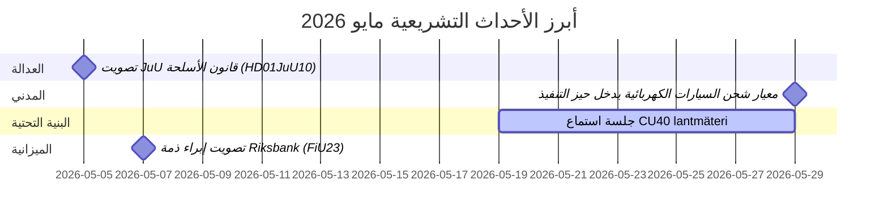

# مايو 2026 – نظرة شهرية على البرلمان السويدي: الأمن والعدالة والبنية التحتية في المقدمة

**المؤلف**: James Pether Sörling  
**التاريخ**: 2026-04-27  
**التصنيف**: غير سري // عام  
**الثقة**: عالية [B2]  
**عمق التحليل**: قياسي (Tier-C Month-Ahead)

## 🎯 الخلاصة التنفيذية

يدخل البرلمان السويدي (Riksdag) شهر مايو 2026 بجدول تشريعي تهيمن عليه توسعة منظومة العدالة الجنائية، ونزاعات استثمار البنية التحتية، والضغط لإصلاح التأمين الاجتماعي. تواجه حكومة كريسترسون ضغوطاً متزامنة من استجوابات الاشتراكيين الديمقراطيين حول ثغرات استثمار السكك الحديدية وإصلاح إجازة المرض، فيما تقترب عدة تقارير لجان بشأن التشريعات الجنائية وتنظيم الأسلحة والطاقة الاستيعابية للسجون من تصويتات نهائية في البرلمان. يتصاعد البعد الجيوسياسي الأمني مع تشريعات المساءلة الأوكرانية ومقترحات السياسة الخارجية المرتبطة بروسيا.

## 🧭 القرارات التي يدعمها هذا الإحاطة

1. **متابعة تصويت JuU على قانون الأسلحة** (HD01JuU10): يدخل قانون الأسلحة الجديد (vapenlag) حيز التنفيذ في 1 يونيو 2026 — يجب على متابعي تشريعات قطاع الأمن رصد موعد التصويت النهائي وأي تعديلات في اللحظة الأخيرة (الثقة: عالية [A2]).

2. **رصد إصلاح SfU للباحثين المهاجرين** (HD01SfU23): تدخل قواعد الباحثين الأجانب والدارسين في الدكتوراه حيز التنفيذ في 11 يونيو 2026 وتؤثر على تنافسية سوق العمل في مجال الابتكار — ذات صلة بالجهات العاملة في التعليم العالي والبحث والتطوير (الثقة: عالية [A2]).

3. **تقييم إشارات فجوة استثمار البنية التحتية**: يكشف استجواب HD10449 حول Södra stambanan عن توتر هيكلي بين خطة البنية التحتية للنقل الحكومية وأولويات التنمية الإقليمية — مؤشرات على احتكاك ائتلافي محتمل مع KD (الثقة: متوسطة [B2]).

## ⚡ تقرير الموقف في 60 ثانية

- **العدالة الجنائية**: قانون الأسلحة الجديد (HD01JuU10، JuU)، بناء سجون مسرّع (HD01CU25، CU)، قواعد مشددة للجانحين الشباب (HD03246) — يهيمن سرد الأمن الحكومي في مايو.
- **تأمين المرض**: تشير استجوابات S بشأن استثناء اليوم 180 من تأمين المرض (HD10450) إلى تموضع ما قبل الانتخابات حول دولة الرفاه؛ يُتوقع رد وزاري من Anna Tenje (M).
- **البنية التحتية**: يغيب مسار Södra stambanan المزدوج بين Alvesta وVäxjö عن الخطة الوطنية للبنية التحتية — يضغط S على Andreas Carlson (KD) للالتزام؛ حساسية ائتلافية إقليمية.
- **الشؤون الخارجية/الأمن**: مقترح تقييد التأشيرات الروسية (HD11753)، إلغاء حقوق التحليق (HD11752)، التصديق على محكمة جرائم الحرب الأوكرانية (HD03231/232) — يتمسك التوافق البرلماني الأمني لكن S يضغط لمواقف أشد.
- **الطاقة**: مقترح حول أعمدة خطوط الكهرباء (أعمدة خشبية)، نقاش حول معلومات مضللة بشأن الرياح (HD10448، SD) — تتحول طاقة التحول إلى ساحة حرب ثقافية قبيل انتخابات 2026.

## 🏛️ أبرز الأحداث التشريعية: مايو 2026

## 🔭 المحفز المستقبلي الرئيسي

**حزمة التصويتات القضائية (مايو 2026)**: يخلق مزيج HD01JuU10 (قانون الأسلحة)، وHD01JuU31 (تقييم إصلاح الشرطة)، وHD01CU25 (بناء السجون)، وHD03237 (مقترح تدريب الشرطة المدفوع) لحظة تشريعية مركّزة للقطاع القضائي ستختبر تلاحم الحكومة وSD، وستتيح لـS أقصى قدر من الظهور المعارض. ما يجب مراقبته: تعديلات SD، ومقترحات S المضادة، والإطار الإعلامي حول معدلات الجريمة.

## تقييم الثقة

الثقة التحليلية الإجمالية: **عالية** — مستندة إلى وثائق برلمانية مؤكدة قائمة على MCP وبيتانكاندن (betänkanden) حديثة. البيانات الاقتصادية لصندوق النقد الدولي غير متوفرة في هذه التشغيلة (خطأ شبكي)؛ السياق الاقتصادي مستخلص من إصدار WEO أبريل 2026 السابق (NGDP_RPCH: SWE ~2.1%).

<!-- source-sha: 0d5ca67103600cd49fb8373d7e028558be2d04d5 -->
