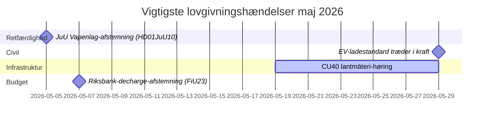

# Maj 2026 – Dansk oversigt over det svenske Riksdag: Sikkerhed, retfærdighed og infrastruktur i fokus

**Author**: James Pether Sörling  
**Date**: 2026-04-27  
**Classification**: UNCLASSIFIED // PUBLIC  
**Confidence**: HIGH [B2]  
**Analysis Depth**: Standard (Tier-C Month-Ahead)

## 🎯 BLUF

Sveriges Riksdag træder ind i maj 2026 med en lovgivningsmæssig dagsorden domineret af udvidelse af strafferetsplejen, investeringskonflikter inden for infrastruktur og pres for social­forsikringsreformer. Kristersson-regeringen møder samtidige pres fra Socialdemokraternes interpellationer om jernbaneinvesteringsgab og sygelønsreform, mens adskillige udvalgsrapporter om strafferetlig lovgivning, våbenregulering og fængselskapacitet nærmer sig endelige Riksdag-afstemninger. Den sikkerhedspolitisk-geopolitiske dimension intensiveres med ukrainsk ansvarighedslovgivning og Ruslands-relaterede udenrigspolitiske motioner.

## 🧭 Beslutninger dette briefing understøtter

1. **Følg JuU-afstemningen om våbenloven** (HD01JuU10): Den nye vapenlag træder i kraft 1. juni 2026 — efterretningsforbrugere, der sporer sikkerhedssektorlovgivning, skal overvåge tidspunktet for den endelige afstemning og eventuelle ændringer i sidste øjeblik (konfidens: HØJ [A2]).

2. **Overvåg SfU-migrationsreform for forskere** (HD01SfU23): Regler for udenlandske forskere og ph.d.-studerende træder i kraft 11. juni 2026 og påvirker innovationsarbejdsmarkedets konkurrenceevne — relevant for aktører inden for videregående uddannelse og FoU (konfidens: HØJ [A2]).

3. **Vurder infrastrukturinvesteringsgabsignaler**: HD10449-interpellationen om Södra stambanan afslører en strukturel spænding mellem regeringens transportinfrastrukturplan og regionale udviklingsprioriteter — indikatorer for potentielle koalitionsgnidninger med KD (konfidens: MEDIUM [B2]).

## ⚡ 60-sekunders situationsoversigt

- **Strafferet**: Ny våbenlov (HD01JuU10, JuU), accelereret fængselsbyggeri (HD01CU25, CU), skærpede regler for unge lovovertrædere (HD03246) — regeringens sikkerhedsfortælling er dominerende i maj.
- **Sygesikring**: S-partiets interpellationer om sygesikringsdag-180-undtagelsen (HD10450) signalerer forvalgpositionering om velfærdsstaten; forvent ministersvar fra Anna Tenje (M).
- **Infrastruktur**: Södra stambanans dobbeltspor Alvesta–Växjö mangler i den nationale infrastrukturplan — S-partiet presser Andreas Carlson (KD) for forpligtelse; regional koalitionsfølsomhed.
- **Udenrigs/Sikkerhed**: Russisk visumrestriktionsmotion (HD11753), tilbagekaldelse af overflyvning (HD11752), ratificering af Ukraines krigsforbrydertribunal (HD03231/232) — parlamentarisk sikkerhedskonsensus holder, men S presser for stærkere positioner.
- **Energi**: Elnætspæle (træpæle i elnettet) motion, vindenergi-desinformationsdebat (HD10448, SD) — energiomstillingen er ved at blive kulturkrigsterritorium forud for valget 2026.

## 🏛️ Vigtigste lovgivningsbegivenheder: maj 2026

## 🔭 Vigtigste fremadrettede trigger

**Strafferetsafstemningsklynge (maj 2026)**: Kombinationen af HD01JuU10 (våbenlov), HD01JuU31 (politireformevaluering), HD01CU25 (fængselsbyggeri) og HD03237 (lønnet politiuddannelseproposition) skaber et koncentreret lovgivningsøjeblik for retssektoren, der vil teste regerings- og SD-tilpasning og give S maksimal oppositionssynlighed. Overvåg: SD-ændringsforslag, S-modmotioner, medieindramning om kriminalitetsrater.

## Konfidensanalyse

Overordnet analytisk konfidens: **HØJ** — baseret på bekræftede MCP-baserede parlamentariske dokumenter og nylige betænkninger. IMF-økonomiske data ikke tilgængelige i dette kørslen (netværksproblem); økonomisk kontekst hentet fra tidligere WEO apr-2026-vintage (NGDP_RPCH: SWE ~2,1%).

<!-- source-sha: 0d5ca67103600cd49fb8373d7e028558be2d04d5 -->
