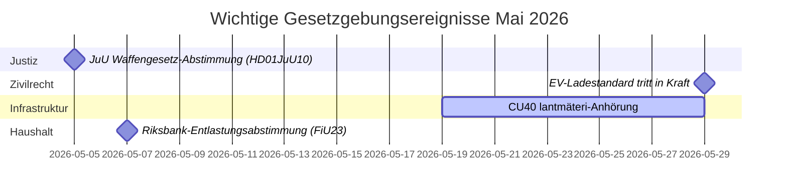

# Mai 2026 – Monatliche Übersicht des schwedischen Riksdag: Sicherheit, Justiz und Infrastruktur im Vordergrund

**Author**: James Pether Sörling  
**Date**: 2026-04-27  
**Classification**: UNCLASSIFIED // PUBLIC  
**Confidence**: HIGH [B2]  
**Analysis Depth**: Standard (Tier-C Month-Ahead)

## 🎯 BLUF

Schwedens Riksdag tritt in den Mai 2026 mit einer Gesetzgebungsagenda ein, die von der Ausweitung des Strafjustizsystems, Investitionskonflikten im Infrastrukturbereich und dem Druck auf Sozialversicherungsreformen dominiert wird. Die Kristersson-Regierung steht gleichzeitig unter Druck durch die Interpellationen der Sozialdemokraten zu Eisenbahninvestitionslücken und zur Krankengeldreform, während mehrere Ausschussberichte zur Strafgesetzgebung, Waffenregulierung und Gefängniskapazität auf abschließende Riksdag-Abstimmungen zusteuern. Die sicherheitspolitisch-geopolitische Dimension intensiviert sich mit ukrainischer Rechenschaftspflichtgesetzgebung und russlandbezogenen außenpolitischen Motionen.

## 🧭 Entscheidungen, die dieses Briefing unterstützt

1. **JuU-Abstimmung zum Waffengesetz verfolgen** (HD01JuU10): Das neue vapenlag tritt am 1. Juni 2026 in Kraft — Geheimdienstverbraucher, die Sicherheitssektorgesetzgebung verfolgen, müssen den Zeitpunkt der abschließenden Abstimmung und eventuelle Änderungen in letzter Minute überwachen (Konfidens: HOCH [A2]).

2. **SfU-Migrationsreform für Forscher überwachen** (HD01SfU23): Regeln für ausländische Forscher und Doktoranden treten am 11. Juni 2026 in Kraft und beeinflussen die Wettbewerbsfähigkeit des Innovationsarbeitsmarkts — relevant für Akteure in Hochschulbildung und F&E (Konfidens: HOCH [A2]).

3. **Infrastrukturinvestitionslückensignale bewerten**: Die HD10449-Interpellation zu Södra stambanan offenbart eine strukturelle Spannung zwischen dem Verkehrsinfrastrukturplan der Regierung und regionalen Entwicklungsprioritäten — Indikatoren potenzieller Koalitionsreibungen mit KD (Konfidens: MITTEL [B2]).

## ⚡ 60-Sekunden-Lagebericht

- **Strafrecht**: Neues Waffengesetz (HD01JuU10, JuU), beschleunigte Gefängnisbauten (HD01CU25, CU), verschärfte Regeln für jugendliche Straftäter (HD03246) — das Sicherheitsnarrativ der Regierung dominiert im Mai.
- **Krankenversicherung**: Die S-Partei-Interpellationen zur Krankenversicherungs-Tag-180-Ausnahme (HD10450) signalisieren wahlkampfvorbereitende Positionierung zum Wohlfahrtsstaat; Ministerantwort von Anna Tenje (M) erwartet.
- **Infrastruktur**: Södra stambanans Doppelgleis Alvesta–Växjö fehlt im nationalen Infrastrukturplan — die S-Partei drängt Andreas Carlson (KD) zur Verpflichtung; regionale Koalitionssensitivität.
- **Außen-/Sicherheit**: Russische Visumrestriktionsmotion (HD11753), Widerruf des Überflugs (HD11752), Ratifizierung des ukrainischen Kriegsverbrechertribunals (HD03231/232) — parlamentarischer Sicherheitskonsens hält, aber S drängt auf stärkere Positionen.
- **Energie**: Strommasten (Holzmasten) Motion, Windenergie-Desinformationsdebatte (HD10448, SD) — die Energiewende wird im Vorfeld der Wahl 2026 zum Kulturkampfterrain.

## 🏛️ Wichtigste Gesetzgebungsereignisse: Mai 2026

## 🔭 Wichtigster Vorwärtstrigger

**Strafrechts-Abstimmungscluster (Mai 2026)**: Die Kombination aus HD01JuU10 (Waffengesetz), HD01JuU31 (Polizeireformbewertung), HD01CU25 (Gefängnisbau) und HD03237 (bezahlte Polizeiausbildungsproposition) schafft einen konzentrierten Gesetzgebungsmoment für den Justizsektor, der die Ausrichtung von Regierung und SD testen und S maximale Oppositionssichtbarkeit verschaffen wird. Beobachten: SD-Änderungsanträge, S-Gegenmotionen, Medienrahmung um Kriminalitätsraten.

## Konfidenzanalyse

Gesamtanalytische Konfidenz: **HOCH** — basierend auf bestätigten MCP-basierten Parlamentsdokumenten und aktuellen Ausschussberichten. IMF-Wirtschaftsdaten in diesem Lauf nicht verfügbar (Netzwerkfehler); wirtschaftlicher Kontext aus früherem WEO Apr-2026-Vintage entnommen (NGDP_RPCH: SWE ~2,1%).

<!-- source-sha: 0d5ca67103600cd49fb8373d7e028558be2d04d5 -->
