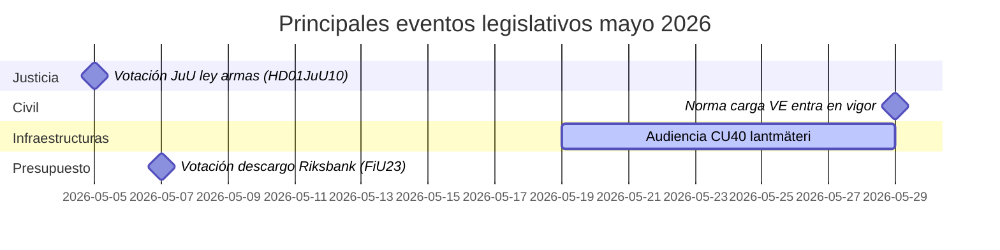

# Mayo 2026 – Resumen mensual del Riksdag sueco: Seguridad, justicia e infraestructuras en el centro

**Author**: James Pether Sörling  
**Date**: 2026-04-27  
**Classification**: UNCLASSIFIED // PUBLIC  
**Confidence**: HIGH [B2]  
**Analysis Depth**: Standard (Tier-C Month-Ahead)

## 🎯 BLUF

El Riksdag sueco entra en mayo de 2026 con una agenda legislativa dominada por la expansión del sistema de justicia penal, los conflictos de inversión en infraestructuras y la presión por las reformas del seguro social. El gobierno Kristersson enfrenta presiones simultáneas de las interpelaciones socialdemócratas sobre brechas de inversión ferroviaria y la reforma del subsidio de enfermedad, mientras varios informes de comisión sobre legislación penal, regulación de armas y capacidad penitenciaria se acercan a las votaciones finales del Riksdag. La dimensión de seguridad geopolítica se intensifica con legislación sobre responsabilidad ucraniana y mociones de política exterior relacionadas con Rusia.

## 🧭 Decisiones que este briefing apoya

1. **Seguir la votación de JuU sobre la ley de armas** (HD01JuU10): La nueva vapenlag entra en vigor el 1 de junio de 2026 — los consumidores de inteligencia que siguen la legislación del sector de seguridad deben monitorear el calendario de la votación final y los posibles cambios de último momento (confianza: ALTA [A2]).

2. **Monitorear la reforma migratoria SfU para investigadores** (HD01SfU23): Las reglas para investigadores extranjeros y doctorandos entran en vigor el 11 de junio de 2026 y afectan la competitividad del mercado laboral de innovación — relevante para actores en educación superior e I+D (confianza: ALTA [A2]).

3. **Evaluar señales de brecha de inversión en infraestructuras**: La interpelación HD10449 sobre Södra stambanan revela una tensión estructural entre el plan de infraestructura de transporte del gobierno y las prioridades de desarrollo regional — indicadores de posibles fricciones de coalición con KD (confianza: MEDIA [B2]).

## ⚡ Situación en 60 segundos

- **Justicia penal**: Nueva ley de armas (HD01JuU10, JuU), construcción de prisiones acelerada (HD01CU25, CU), reglas endurecidas para jóvenes infractores (HD03246) — el relato de seguridad del gobierno domina en mayo.
- **Seguro de enfermedad**: Las interpelaciones de S sobre la excepción del día 180 del seguro de enfermedad (HD10450) señalan un posicionamiento preelectoral sobre el Estado de bienestar; se espera respuesta ministerial de Anna Tenje (M).
- **Infraestructuras**: La doble vía de Södra stambanan Alvesta–Växjö está ausente del plan nacional de infraestructura — S presiona a Andreas Carlson (KD) para un compromiso; sensibilidad coalicionaria regional.
- **Asuntos exteriores/Seguridad**: Moción de restricción de visados rusos (HD11753), revocación de sobrevuelos (HD11752), ratificación del tribunal por crímenes de guerra de Ucrania (HD03231/232) — consenso parlamentario de seguridad manteniéndose pero S presiona por posiciones más firmes.
- **Energía**: Moción sobre postes de líneas eléctricas (postes de madera), debate sobre desinformación eólica (HD10448, SD) — la transición energética se convierte en terreno de guerra cultural ante las elecciones 2026.

## 🏛️ Principales eventos legislativos: Mayo 2026

## 🔭 Principal disparador prospectivo

**Clúster de votaciones judiciales (mayo 2026)**: La combinación de HD01JuU10 (ley de armas), HD01JuU31 (evaluación de reforma policial), HD01CU25 (construcción de prisiones) y HD03237 (proposición de formación policial remunerada) crea un momento legislativo concentrado para el sector judicial que pondrá a prueba la alineación del gobierno y SD, y dará a S visibilidad de oposición máxima. Vigilar: enmiendas SD, contramociones de S, encuadre mediático sobre tasas de criminalidad.

## Evaluación de confianza

Confianza analítica general: **ALTA** — basada en documentos parlamentarios confirmados basados en MCP y recientes betänkanden. Datos económicos del FMI no disponibles en esta ejecución (error de red); contexto económico extraído del vintage anterior WEO abr-2026 (NGDP_RPCH: SWE ~2,1%).

<!-- source-sha: 0d5ca67103600cd49fb8373d7e028558be2d04d5 -->
