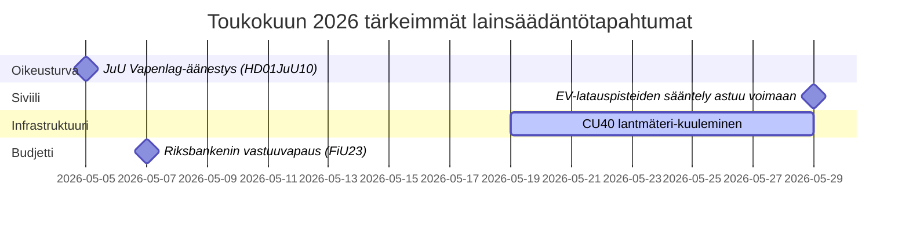

# Toukokuu 2026 – Ruotsin Riksdagin kuukausiyhteenveto: Turvallisuus, oikeudenmukaisuus ja infrastruktuuri etualalla

**Author**: James Pether Sörling  
**Date**: 2026-04-27  
**Classification**: UNCLASSIFIED // PUBLIC  
**Confidence**: HIGH [B2]  
**Analysis Depth**: Standard (Tier-C Month-Ahead)

## 🎯 BLUF

Ruotsin riksdag astuu toukokuuhun 2026 lainsäädäntöagendalla, jota hallitsevat rikosoikeuden laajentaminen, infrastruktuuri-investointien ristiriidat ja sosiaalivakuutusuudistuksen paine. Kristersson-hallitus kohtaa samanaikaiset paineet sosiaalidemokraattien interpellaatioista rautatieinvestointipuutteista ja sairauspalkkaisten uudistuksesta, samalla kun useat valiokuntakertomukset rikosoikeudellisesta lainsäädännöstä, asevalvonnasta ja vankilakapasiteetista lähestyvät lopullisia riksdagin äänestyksiä. Turvallisuuspoliittis-geopoliittinen ulottuvuus voimistuu ukrainalaisen vastuullisuuslainsäädännön ja Venäjä-aiheisten ulkopoliittisten liikehdusten myötä.

## 🧭 Päätökset, joita tämä tiedote tukee

1. **Seuraa JuU:n aselakiläänestystä** (HD01JuU10): Uusi vapenlag astuu voimaan 1. kesäkuuta 2026 — turvallisuussektorin lainsäädäntöä seuraavien tiedustelukuluttajien on seurattava lopullisen äänestyksen ajoitusta ja mahdollisia viime hetken muutoksia (konfidens: KORKEA [A2]).

2. **Seuraa SfU:n maahanmuuttajaturkijoiden uudistusta** (HD01SfU23): Ulkomaalaisten tutkijoiden ja väitöskirjatutkijoiden säännöt astuvat voimaan 11. kesäkuuta 2026 ja vaikuttavat innovaatiotyömarkkinoiden kilpailukykyyn — relevantti korkeakoulutuksen ja T&K-toimijoille (konfidens: KORKEA [A2]).

3. **Arvioi infrastruktuuri-investointipuuttesignaaleja**: HD10449-interpellaatio Södra stambanasta paljastaa rakenteellisen jännitteen hallituksen liikennettä infrastruktuurisuunnitelman ja alueellisten kehitysprioriteettien välillä — indikaattorit potentiaalisista koalitiohankauksista KD:n kanssa (konfidens: KOHTALAINEN [B2]).

## ⚡ 60 sekunnin tilannekatsaus

- **Rikosoikeus**: Uusi asesäädös (HD01JuU10, JuU), nopeutettu vankilarakentaminen (HD01CU25, CU), tiukennetut säännöt nuorille rikollisille (HD03246) — hallituksen turvallisuusnarratiivi hallitsee toukokuussa.
- **Sairausvakuutus**: S-puolueen interpellaatiot sairausvakuutuksen 180. päivän poikkeuksesta (HD10450) ennakoivat vaaliasemointia hyvinvointivaltiokysymyksessä; odota ministerivastaus Anna Tenjeltä (M).
- **Infrastruktuuri**: Södra stambanaan kaksoisraide Alvesta–Växjö puuttuu kansallisesta infrastruktuurisuunnitelmasta — S-puolue painostaa Andreas Carlsonia (KD) sitoumukseen; alueellinen koalitioherkkä.
- **Ulkopolitiikka/Turvallisuus**: Venäläinen viisumirajoitusliike (HD11753), ylilento-oikeuden peruuttaminen (HD11752), Ukrainan sotarikostribunaaliratifiointi (HD03231/232) — parlamentaarinen turvallisuuskonsensus pitää, mutta S painostaa vahvempiin kannanottoihin.
- **Energia**: Sähköverkon tolppat (puutolppat) liike, tuulienergian disinformaatiokeskustelu (HD10448, SD) — energiasiirtymä on muuttumassa kulttuurisotaterritoriumiksi vuoden 2026 vaalien alla.

## 🏛️ Tärkeimmät lainsäädäntötapahtumat: toukokuu 2026

## 🔭 Tärkein tulevaisuuden laukaisin

**Rikosoikeusäänestysrypäs (toukokuu 2026)**: HD01JuU10 (asesäädös), HD01JuU31 (poliisiuudistuksen arviointi), HD01CU25 (vankilarakentaminen) ja HD03237 (palkattu poliisikoulutuspropositio) yhdistelmä luo tiiviin oikeussektori-lainsäädäntöhetken, joka testaa hallituksen ja SD:n yhdenmukaistumista ja antaa S:lle maksimaalisen oppositionnäkyvyyden. Seuraa: SD-muutosehdotuksia, S-vastaliikkeitä, mediakehystämistä rikollisuuslukujen ympärillä.

## Konfidenssi-analyysi

Kokonaisanalyyttinen konfidens: **KORKEA** — perustuu vahvistettuihin MCP-pohjaisiin parlamentaarisiin asiakirjoihin ja viimeaikaisiin valiokuntakertomuksiin. IMF-taloudelliset tiedot eivät olleet saatavilla tässä ajossa (verkko-ongelma); taloudellinen konteksti haettu aiemmasta WEO huhtikuu-2026-vintagesta (NGDP_RPCH: SWE ~2,1%).

<!-- source-sha: 0d5ca67103600cd49fb8373d7e028558be2d04d5 -->
