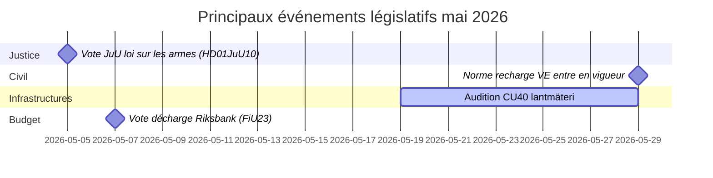

# Mai 2026 – Aperçu mensuel du Riksdag suédois : Sécurité, justice et infrastructures au premier plan

**Author**: James Pether Sörling  
**Date**: 2026-04-27  
**Classification**: UNCLASSIFIED // PUBLIC  
**Confidence**: HIGH [B2]  
**Analysis Depth**: Standard (Tier-C Month-Ahead)

## 🎯 BLUF

Le Riksdag suédois entre dans le mois de mai 2026 avec un programme législatif dominé par l'élargissement du système judiciaire pénal, les conflits d'investissements dans les infrastructures et la pression pour des réformes de l'assurance sociale. Le gouvernement Kristersson fait simultanément face aux pressions des interpellations sociales-démocrates sur les lacunes d'investissements ferroviaires et la réforme du congé maladie, tandis que plusieurs rapports de commissions sur la législation pénale, la réglementation des armes et les capacités pénitentiaires s'approchent des votes finaux au Riksdag. La dimension sécuritaire-géopolitique s'intensifie avec la législation sur la responsabilisation ukrainienne et les motions de politique étrangère liées à la Russie.

## 🧭 Décisions que ce briefing soutient

1. **Suivre le vote JuU sur la loi sur les armes** (HD01JuU10) : La nouvelle vapenlag entre en vigueur le 1er juin 2026 — les consommateurs de renseignements suivant la législation du secteur de la sécurité doivent surveiller le calendrier du vote final et les amendements de dernière minute (confiance : HAUTE [A2]).

2. **Surveiller la réforme SfU pour les chercheurs migrants** (HD01SfU23) : Les règles pour les chercheurs étrangers et les doctorants entrent en vigueur le 11 juin 2026 et affectent la compétitivité du marché du travail de l'innovation — pertinent pour les acteurs de l'enseignement supérieur et de la R&D (confiance : HAUTE [A2]).

3. **Évaluer les signaux d'écart d'investissement infrastructurel** : L'interpellation HD10449 sur Södra stambanan révèle une tension structurelle entre le plan d'infrastructure de transport du gouvernement et les priorités de développement régional — indicateurs de frictions potentielles au sein de la coalition avec KD (confiance : MOYEN [B2]).

## ⚡ Rapport de situation en 60 secondes

- **Justice pénale** : Nouvelle loi sur les armes (HD01JuU10, JuU), construction de prisons accélérée (HD01CU25, CU), règles renforcées pour les jeunes délinquants (HD03246) — le récit sécuritaire du gouvernement est dominant en mai.
- **Assurance maladie** : Les interpellations de S sur l'exception au jour 180 de l'assurance maladie (HD10450) signalent un positionnement pré-électoral sur l'État-providence ; réponse ministérielle d'Anna Tenje (M) attendue.
- **Infrastructures** : La double voie Södra stambanan Alvesta–Växjö est absente du plan national d'infrastructure — S presse Andreas Carlson (KD) pour un engagement ; sensibilité coalitionnelle régionale.
- **Affaires étrangères/Sécurité** : Motion de restriction des visas russes (HD11753), révocation des survols (HD11752), ratification du tribunal ukrainien pour crimes de guerre (HD03231/232) — consensus parlementaire sur la sécurité maintenu mais S presse pour des positions plus fermes.
- **Énergie** : Motion sur les poteaux de lignes électriques (poteaux en bois), débat sur la désinformation éolienne (HD10448, SD) — la transition énergétique devient un terrain de guerre culturelle avant les élections 2026.

## 🏛️ Principaux événements législatifs : Mai 2026

## 🔭 Principal déclencheur prospectif

**Cluster de votes judiciaires (mai 2026)** : La combinaison de HD01JuU10 (loi sur les armes), HD01JuU31 (évaluation de la réforme policière), HD01CU25 (construction de prisons) et HD03237 (proposition de formation policière rémunérée) crée un moment législatif concentré pour le secteur judiciaire qui testera l'alignement du gouvernement et de SD, et donnera à S une visibilité maximale pour l'opposition. Surveiller : les amendements SD, les contre-motions de S, le cadrage médiatique autour des taux de criminalité.

## Évaluation de la confiance

Confiance analytique globale : **HAUTE** — basée sur des documents parlementaires MCP confirmés et des rapports de commissions récents. Données économiques FMI non disponibles pour cette exécution (erreur réseau) ; contexte économique tiré du vintage WEO avr-2026 antérieur (NGDP_RPCH : SWE ~2,1%).

<!-- source-sha: 0d5ca67103600cd49fb8373d7e028558be2d04d5 -->
